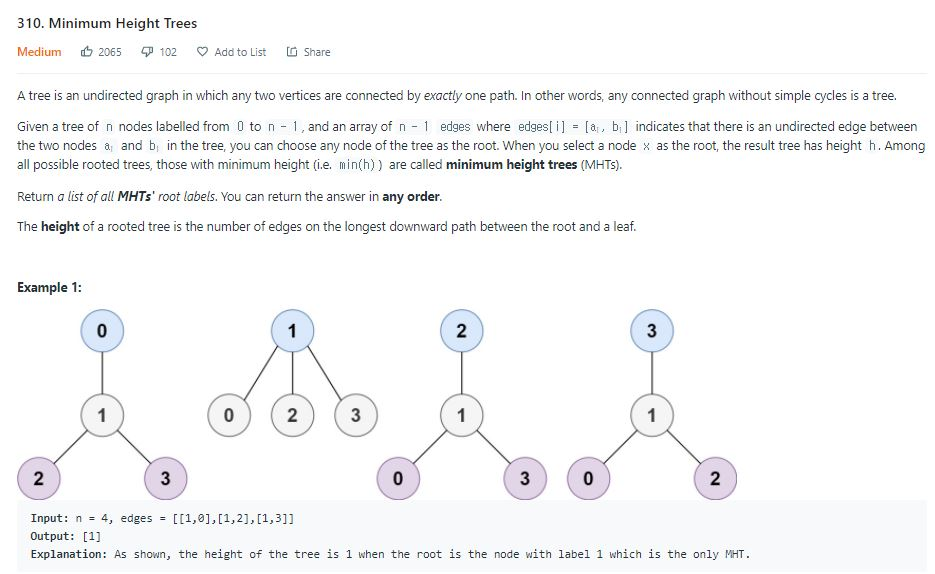

Q:



.JPG)


나의 솔루션:

```python 
class Solution:
    def findMinHeightTrees(self, n: int, edges: List[List[int]]) -> List[int]:
        if n == 1:
            return [0]
        
        trees = defaultdict(list)
        for edge in edges:
            trees[edge[0]].append(edge[1])
            trees[edge[1]].append(edge[0])
            
        depth = defaultdict(int)
        discorved = []
        def recursive_dfs(node):
            if node in discorved:
                return 0
            
            discorved.append(node)
            max_depth = 0
            for child in trees[node]:
                max_depth = max(max_depth, recursive_dfs(child))
            discorved.pop()
            return 1 + max_depth
        
        for i in range(n):
            depth[i] = recursive_dfs(i)-1
            
        min_depth = min(depth.values())
        return [key for key, value in depth.items() if value == min_depth]
```

브루트-포스로 각 노드를 루트로 했을때의 깊이를 계산하는 방법으로 모두 조사 후에 가장 낮은 높이를가진 노드를 리턴하는 방식으로 구현했는데 시간 초과. 


책의 솔루션:

무방향 그래프를 표현하는 데까지는 나와 비슷. 후에 DFS 탐색으로 Depth를 계산하는 방식이 아니라 리프 노드는 경로가 하나밖에 없다는 점을 이용해서 경로가 하나만 있는 노드들은 그래프에서 제거를 해주면서(그래프에서 상호 경로 제거) 그래프의 노드 갯수를 의미하는 n에서 빠진 노드만큼 뺀다. 그렇게 해서 n이 2이하로 남을 때까지 (가운데 노드는 2아니면 1이 남는다) 진행하고 남은 노드를 리턴.