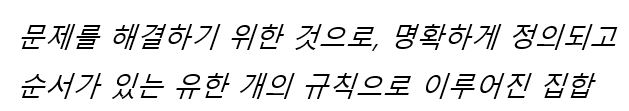
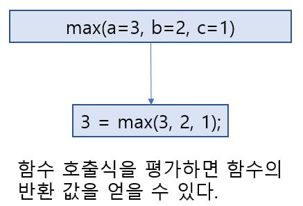
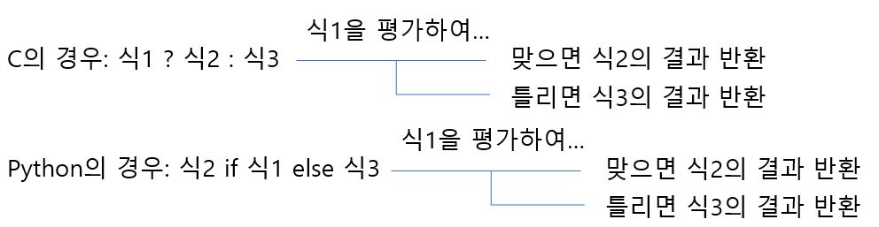
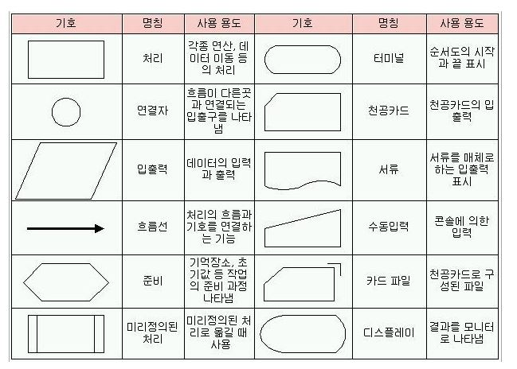
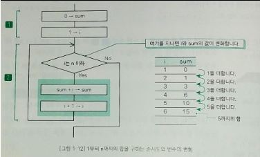
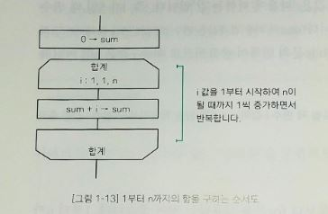
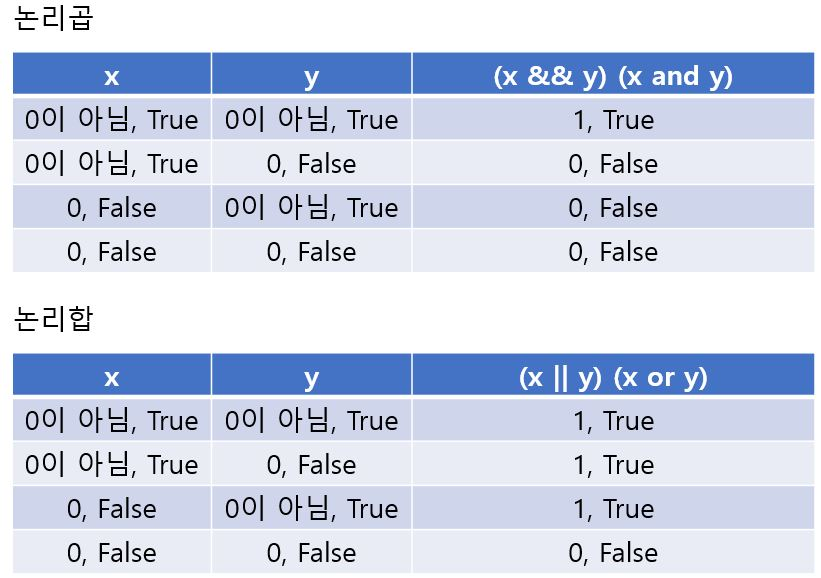
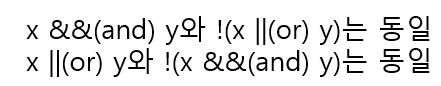

## 프로그램의 구조

변수 a, b, c의 최댓값을 구하는 방법은 다음과 같다.

1. max에 a 값을 넣는다.
2. b 값이 max보다 크면 max에 b 값을 넣는다.
3. c 값이 max보다 크면 max에 c 값을 넣는다. 

세 문장이 **위에서 아래로 나란히 있다면 문장은 이 순서대로 실행** 된다. 이렇게 여러 문장이 순차적으로 실행되는 구조를 **순차적(Concatenation)** 구조라고 한다. 또, 2와 3의 경우 b나 c 값이 max보다 큰지를 판단하게 된다. ( )안에 있는 평가 식의 결과에 따라 프로그램의 실행 흐름을 변경하는 구조를 **선택(Selection)** 구조라고 한다. 

## 연산자와 피연산자

프로그래밍 언어에서 +, -, > 등 어떤 목적을 가지고 연산을 수행하는 기호를 **연산자(Operator)** 라고 하고, 연산의 대상이 되는 식을 **피연산자(Operand)** 라고 한다. 연산자는 피연산자의 수에 따라 다음과 같이 3 종류로 분류된다.

- **단항 연산자(Unary operator)** - 피연산자가 1개
- **2항 연산자(Binary operator)** - 피연산자가 2개
- **3항 연산자(Ternary operator)** - 피연산자가 3개

### 관계 연산자와 등가 연산자

<, <=, >, >=와 같이 연산자 왼쪽과 오른쪽의 피연산자의 대소 관게를 판단하는 연산자를 **관계 연산자(Relational operator)** 라고 하고 ==, !=와 같이 값이 같은지의 관계를 판단하는 연산자를 등가 **연산자(Equivalence operat)** 라고 한다. 관계 연산자와 등가 연산자는 참이면 int형 1을 거짓이면 int형 0을 만든다. 파이썬에서는 참이면 bool형 True를 거짓이면 bool형 False를 만든다. 다만 C에서와 같이 1과 0을 bool형 대신 조건문에 쓸 수 있다.

## 식과 식의 평가

프로그램이 실행되면 식이 평가 된다. 

### 식

엄밀하지는 않지만 **식(Expression)** 이란 다음 요소를 통들어 말한다.

- **변수(Variable)** - 어떤 값이든 타입만 맞으면(Static binding)/타입 상관 없이(Dynamic binding) 들어갈 수 있는 공간. 관습적으로 소문자로 나타낸다.
- **상수(Constant)** -  타입만 맞으면(Static binding)/타입 상관 없이(Dynamic binding) 어떤 값을 초기화시키면 프로그램 진행 상에서 값이 바뀌지 않는 공간. 관습적으로 대문자로 나타낸다.
- 변수나 상수를 연산자로 결합한 것

### 식의 평가

원칙적으로 모든 수식에는 값이 있다(특별한 형태인 void 타입이나 Nan 등 제외). 값은 프로그램을 실행할 때 확인할 수 있으며 식의 값을 알아내는 것을 평가(Evaluation)라고 한다. 

## 매개변수

함수를 정의할 때 함수에 전달되는 값을 저장하기 위한 변수를 선언하는데, 이를 **매개변수(Parameter)** 또는 **형식매개변수(Formal parameter)** 라고 한다. 형식 매개변수를 가인수라고 하기도 하고 함수를 호출할 때 사용하는 매개변수의 값을 실인수(Actual argument)라고 하기도 한다. 

## 알고리즘

알고리즘은 다음과 같이 정의할 수 있다.

아무리 명확하게 알고리즘을 수행해도 변수의 값에 따라 결과가 맞기도 하고 틀리기도 한다면 올바른 알고리즘이라고 할 수 없다. 

## 함수의 반환 값과 함수 호출식의 평가

함수는 return 문에서 처리한 결과 값을 원래 호출한 곳으로 반환한다. 다만 반환 값의 자료형이 C에서의 void이거나 파이썬에서 구체적으로 명시되지 않을 경우 값을 반환하지 않는다.

## 조건 연산자

3개의 피연산자를 갖는 3항 연산자 ? :를 **조건 연산자(Conditional operator)** 라고 한다. **조건식(Conditional expression)** 을 평가하여 답을 반환한다. 

## 순서도

문제에 대한 정의, 분석, 해법을 그림으로 표현한 것을 **순서도(Flowchart)** 라고 한다. 대표적인 용어와 기호는 다음과 같다. 

[출처: Dream Archive - 순서도(Flowchart)](https://kitchu.tistory.com/13)

## 반복구조

어떤 조건이 성립하는 동안 처리(프로그램 명령문 또는 명령어의 집합)를 반복하여 실행하는 것을 반복(Repetition) 구조라 하며 일반적으로 루프(Loop)라고 부른다. 반복의 대상이 되는 명령문을 문법적으로 루프 본문이라고 하는데 루프 본문을 먼저 실행하기 전에 반복을 계속할지를 판단하는 구조를 사전 판단 반복 구조라고 한다. 이와 달리 루프 본문이 반드시 한 번은 실행되고 나서 반복을 계속할지 판단하는 구조를 사후 판단 반복이라고 한다. 반복을 계속할지를 조건식에서 판단할 때에 관여하는 변수를 Loop control variable 혹은 Counter라고 한다. 반복 구조는 Counter를 초기화 하는 등의 반복 구조에서 1번만 수행할 명령어들을 모아둔 초기식, 반복 여부를 판단하는 조건식, 반복이 일어나는 동안 수행될 루프 본문으로 구성되어 있고 특별히 루프 본문에는 반복 문제의 사이즈를 줄이기 위한(Counter의 증감시킨다든지) 식이 포함되어 있다. 

### while

끝이 정해져 있지 않은 사전 판단 반복 구조의 경우 while문을 사용한다. while 문에서는 보통 Counter를 while문 밖에서 초기화하고 조건식에 사용한다.  while 문의 형식은 "while(제어식) 명령문" 이다. 

### for

끝이 정해져 있는 사전 판단 반복 구조의 경우 for문을 사용한다. for문의 형식은 C의 경우, "for(초기식; 제어식; 명령문 후 식) 명령문"이고 파이썬의 경우, "for Counter in Iterable객체" 이다.  

## 0이 아니면 참이고 0이면 거짓

0이면 거짓이고 0이 아닌 모든 값은 참으로 간주한다. 

## 구조적 프로그래밍

하나의 입구와 하나의 출구를 가진 구성 요소만을 계층적으로 배치하여 프로그램을 구성하는 방법을 구조적 프로그래밍(Structured programming)이라고 한다. 구조적 프로그래밍은 순차, 선택, 반복이라는 3종류의 제어 흐름을 사용한다. 

## 논리곱과 논리합

## 논리 연산자의 단축 평가

왼쪽 피연산자와 오른쪽 피연산자 중 어느 하나라도 0이 아니면 논리합의 값은 1, True가 나오기 때문에 만약에 왼쪽 피연산자의 식이 1, True가 나오면 오른쪽 피연산자의 식은 평가하지 않는다. 이처럼 논리 연산의 식 전체를 평가한 결과가 왼쪽 피연산자의 평가 결과만으로 정확해지는 경우 오른쪽 피연산자의 평가를 수행하지 않는데, 이를 단축 평가(Short circuit evaluation)라고 한다. 

## 드모르간 법칙

드 모르간의 법칙(De Morgan's laws)은 수리 논리학이나 집합론에서 논리곱(집합의 공통 부분), 논리합(집합의 모든 부분), 부정(여집합) 연산간의 관계(드 모르간의 상대성이라고 부름)를 기술하여 정리한 것으로, 수학자 오거스터스 드 모르간의 이름을 따서 드 모르간의 법칙이라고 한다. 논리합과 논리곱에 대해서는 다음과 같이 적용된다.

## 다중 루프

반복 안에서 다시 반복을 중첩할 수 있는데 반복을 루프가 중첩되는 수준에 따라 이중 루프, 삼중 루프 등으로 부른다. 

## 개행 문자

'\n'은 개행 문자(Newline)로 텍스트의 한 행이 끝나고 새로운 행이 시작됨을 의미한다. 줄 바꿈 문자(Line break), EOL(End-Of-Line)이라고도 한다. 