## 자료구조

자료구조(Data structure)란 데이터 단위와 데이터 자체 사이의 물리적 또는 논리적인 관계를 말한다. 여기서 말하는 데이터 단위는 데이터를 구성하는 한 덩어리이다. 자료구조는 쉽게 말하면 자료를 효율적으로 이용할 수 있도록 컴퓨터에 저장하는 방법을 말한다. 

## 상수식의 계산

상수식(Constant expression)은 상수만을 포함하는 식으로, 실행 시점(Run-time)이 아닌 컴파일 시점(Compile-time)에 계산된다. 파이썬의 경우 소스 코드를 바이트 코드로 컴파일한 다음, 이 바이트 코드를 해석기(Interpreter)에 의해 수행된다. 여기서 말하는 바이트 코드란 해석기가 사용하는 명령어 세트로 처리된 코드이다. 자세한 사항은 밑 참조.

[파이썬은 인터프리터언어입니까?](https://soooprmx.com/archives/11330)

## 배열

배열은 같은 자료형의 변수로 이루어진 요소(Element)가 모여 직선 모양으로 줄지어 있는 자료구조이다. 배열 요소의 자료형은 어떤 형이든 상관없다. 배열은 다음과 같이 선언한다.

| C                        | Python                   |
| ------------------------ | ------------------------ |
| 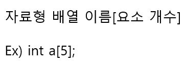 | 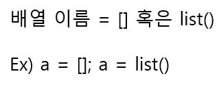 |
| 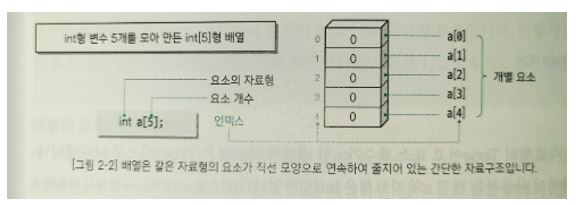 | 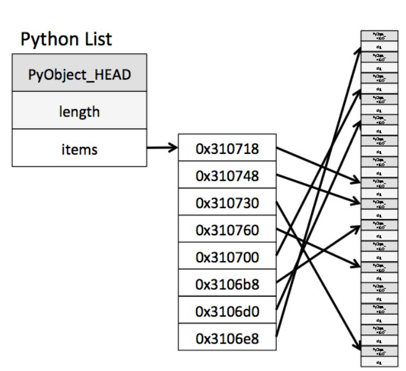 |

### 요소와 인덱스

C의 경우, 배열의 모든 요소는 직선 모양으로 줄지어 있다. 이러한 배열의 개별 요소에 접근하기 위해 사용하는 것이 연산자 [ ]안에 넣는 정수형 인덱스이다. 첫번째 배열 요소의 인덱스는 0으로 정해져 있다. 표현식 a[i]는 배열 a의 처음부터 i개 뒤의 요소에 접근한다. 

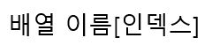

참고로 인덱스는 0부터 시작하므로 요소가 n개인 요소는 0부터 n-1까지의 인덱스로 접근 가능하다. a[n]은 존재하지 않는다. 배열 int a[5];의 모든 요소는 int형이고 각각의 요소는 배열로 선언한 것이 아닌, 단일로 선언한 int형 변수와 성질이 같다. 따라서 각 요소에 자유롭게 int형의 값을 대입하거나 제거할 수 있다. 

일반적으로 자료형이 Type이고 요소 개수가 n개인 배열의 자료형은 Type[n]으로 나타낸다. 즉 a의 자료형은 int[5]형이고 a[0]-a[4]의 자료형은 int형이다. 

Python의 경우 동적 바인딩의 특성으로 인해 인덱스로 변수가 가능하다. 예를 들어서 a = [1, 2, 3]; b = 0; a[b];와 같은 형태로 접근이 가능하다.  또한 요소들의 타입이 모두 같을 필요가 없다. a = [1, 1.0, 'b']가 가능하다. 여기서 a의 타입은 'list'로 통일되어 있다. 

### 배열의 요솟값을 초기화하며 배열 선언하기

배열의 각 요소에 넣을 값을 미리 알고 있다면 선언할 때 초기화(Initializer)할 수 있다. 

| C                        | Python                   |
| ------------------------ | ------------------------ |
| 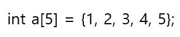 | 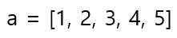 |

### 배열의 요소 개수 구하기

C의 경우 메모리에 배열의 공간이 할당될 경우, 요소 자료형 사이즈 x n만큼 일렬로 할당이 되기 때문에 배열의 전체 사이즈를 요소 자료형 사이즈로 나눠주면 요소의 개수를 구할 수 있다.  배열 요소의 개수는 sizeof(a) / sizeof(a[0]) 으로 구할 수 있다. 

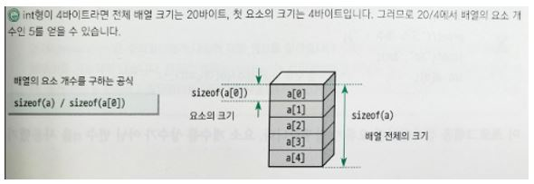

Python의 경우 list의 요소의 개수를 알 수 있는 내장함수 len()이 있다. len(a)로 요소개의 개수를 알 수 있다.  

## 메모리 할당 기간과 동적 객체 생성

메모리에서 공간을 동적으로 확보하기 위해 사용되는 함수에는 calloc, malloc과 같은 함수가 있다. 

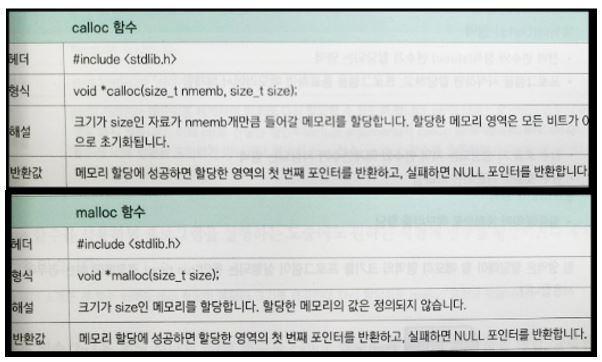

callloc, malloc 함수는 힙(Heap)이라는 특별한 빈 공간에 기억 장소를 확보한다. 이때 확보한 메모리가 불필요하면 그 공간을 해제해야 한다. 이를 위해 제공되는 함수가 free 함수이다.

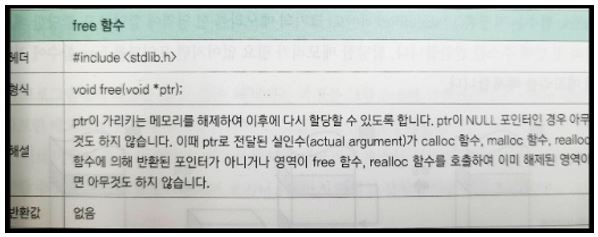

free 함수를 사용하면 프로그램을 실행하는 동중에도 원하는 시점에 변수를 생성하거나 제거할 수 있다. 

포인터에 할당한 메모리의 생성부터 해제까지의 흐름은 아래와 같다.

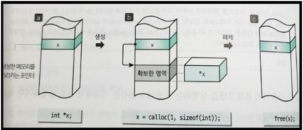

호출한 calloc 함수는 지정된 (1 * sizeof(int) 바이트) 크기의 메모리를 힙 영역에 할당하고, 할당한 메모리의 첫번째 주소를 반환한다. 할당한 메모리가 필요 없어지면 free 함수에 전달해 메모리를 해제한다. 보통 포인터 p가 가리키는 메모리 주소의 값은 간접 연산자 *를 사용한 식 *p를 사용하여 접근할 수 있다. 포인터 x가 메모리 영역을 가리키고 있으므로 확보한 메모리 영역은 *x로 접근할 수 있다. *x로 접근하여 값을 대입하거나 들어있는 값을 꺼낼수도 있다. 

파이썬의 경우, 메모리 관리는 Python Memory Manager에 의해서 관리된다. 파이썬은 모든 것이 객체이기 때문에 동적 메모리 할당이 파이썬 메모리 관리의 기초이다. 

[ 파이썬(Python)에서 메모리 관리하기](https://deepwelloper.tistory.com/130)

### NULL

NULL은 stdio.h 파일에 매크로로 정의되어 있고 값이 없음을 의미한다. 

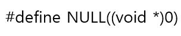

선언(Declaration)은 컴파일러에게 대상에 대한 정보를 알려준다. 다만 실제로 내용을 메모리에 할당하지 않는다. 하지만 정의(Definition)는 컴파일러에게 대상의 실제 내용을 생성하므로 메모리를 사용한다. 

파이썬에서는 None이라는 Singleton 객체로서 정의되어 있다. Singleton 객체이기 때문에 어떤 변수에 None을 할당한다면 이 객체가 할당되어 있는 메모리 주소 값을 변수에 할당하게 된다.

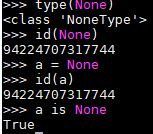

### C 언어의 메모리 구조

프로그램을 실행하면 운영체제는 프로그램이 사용할 메모리 영역을 할당한다. 할당하는 메모리 영역은 크게 데이터(Data), 스택(Stack), 힙(Heap) 영역으로 나누어진다.

- 할당시기: 프로그램이 실행될때마다 할당
- 할당장소: 메인메모리(RAM)
- 할당용도: 프로그램 실행에 필요한 메모리 영역(지역변수, 전역변수 선언을 위해) 할당

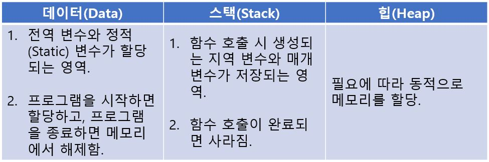

힙 영역은 할당해야 할 메모리의 영역의 크기를 Run time에 결정해야 하는 경우에 사용한다.

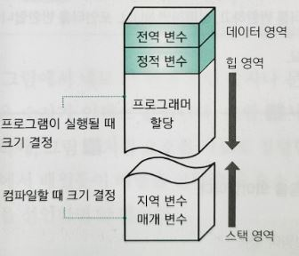

힙 영역은 관리가 가능한 데이터 외에 다른 형태의 데이터를 관리하기 위한 빈 공간이다. 즉, 동적할당(Dynamic allocation)을 통해 생성된 동적변수(Dynamic variables)를 관리하기 위한 영역이다. 힙 영역은 다른 영역을 모두 할당하고 남은 공간이다. 시스템의 메모리 영역의 여유 공간에 따라 크기가 달라진다. 데이터 영역과 스택 영역은 컴파일러가 미리 공간을 예측하고 할당할 수 있지만, 동적 변수는 어느 시점에 얼마만큼의 공간을 할당할지 정확하게 예측할 수 없다. 

파이썬의 메모리는 Python Memory Manager에 의해서 관리된다. 이에 대해서는 밑 참조.

[파이썬 메모리 영역](https://armontad-1202.tistory.com/entry/%ED%8C%8C%EC%9D%B4%EC%8D%AC%EC%9D%98-%EB%A9%94%EB%AA%A8%EB%A6%AC-%EC%98%81%EC%97%AD)

## 배열의 동적 생성

calloc 함수는 확보한 메모리의 첫 번째 주소를 반환하고, 이 주소는 포인터에 대입된다. 이때 포인터와 배열은 서로 바꾸어 쓸 수 있다. 따라서 확보한 메모리의 요소는 a[0], a[1] ... 등으로 접근이 가능하다. 이렇게 사용하면 포인터를 마치 배열인것처럼 사용할 수 있다. 

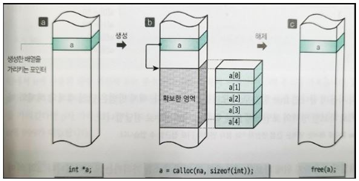

배열의 사용이 끝나면 free함수로 메모리를 해제한다. 해제 방법은 확보한 영역의 포인터를 free 함수의 매개변수로 전달한다. 

## void 포인터

calloc 함수, malloc 함수, free 함수는 char, int 형 객체, 배열, 구조체 등 모든 자료형의 메모리 확보 또는 해제에 사용한다. 이때 특정한 자료형의 포인터를 주고받을 때 자료형이 서로 맞지 않으면 문제가 발생하므로 void 포인터를 반환하거나 받는데 사용한다. void 포인터는 모든 형의 객체를 가리킬 수 있다. void 포인터의 값을 모든 자료형의 포인터에 대입할 수 있고, 거꾸로 모든 자료형의 포인터의 값을 void 포인터에 대입할 수 있다. 

## 포인터와 배열

### 포인터란?

포인터(Pointer)는 객체 또는 함수를 가리키는 것으로 정의할 수 있다. 

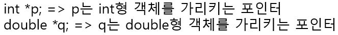

포인터의 자료형은 포인터가 가리키는 곳의 객체의 자료형을 따라간다. int형 객체를 가리키는 포인터는 int *형이고 double 형 객체를 가리키는 포인터는 double *형이다. n이 int형 객체라고 할 때, 포인터 p가 객체 n을 가리키기 위해서는 아래와 같이 해야 한다. 

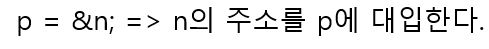

위에서 n에 사용한 단항 연산자&는 주소 연산자라고 하며 피연산자(n)의 주소를 가져온다. 포인터 p가 가리키는 객체의 값은 간접 연산자라고 하는 단항 연산자 *를 사용하여 접근할 수 있다. 

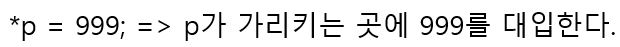

### 포인터와 배열

포인터와 배열에 관해서는 다음과 같다.

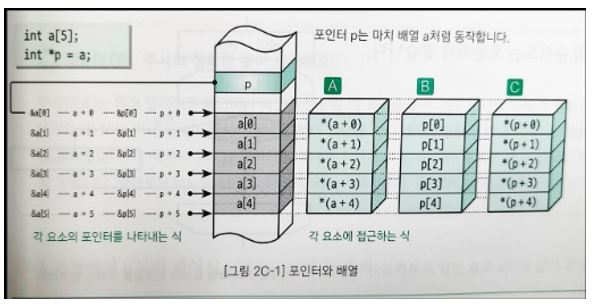

배열의 요소를 가리키는 포인터는 다음과 같은 규칙이 성립된다.

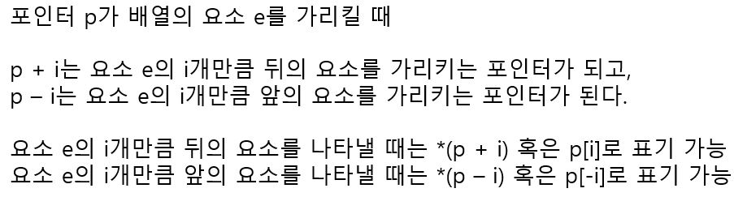

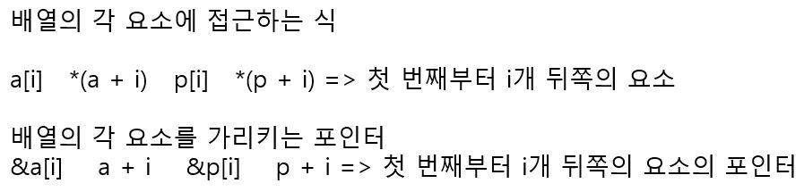

## 공백 포인터와 NULL

공백 포인터(Null pointer)는 객체 포인터, 함수 포인터와는 다른 포인터이다. 정수 값 0은 모든 포인터형으로 형 변환이 가능하고 그 결과는 NULL 포인터이다. 공백 포인터를 나타내는 것이 공백 포인터 상수(Null pointer constant)라고 하는 매크로 NULL이다. NULL의 정의는 값 0을 갖는 모든 정수, 상수 또는 상수식을 void*로 형 변환한 식이다. 

매크로 NULL은 <stddef.h> 헤더에 정의되어 있다. 또 <locale.h>, <stdio.h>, <stdlib.h>, <time.h> 가운데 어느 헤더를 포함해도 선언한 것과 마찬가지로 동작한다. 아래는 NULL을 정의한 예이다.

- #define NULL 0 (C/C++ 스타일)
- #define NULL(void *)0 (C 스타일)

## 배열 요소의 최댓값 구하기

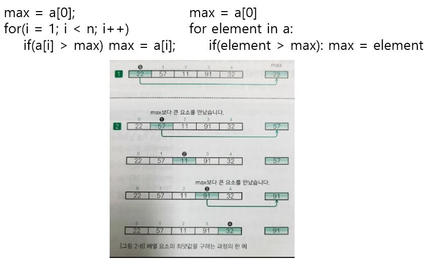

위처럼 배열의 요소를 하나씩 차례로 살펴보는 과정을 주사(走査, Traverse)라고 한다. 

## 함수의 매개변수로 배열 사용하기

C언어의 함수 선언에서 매개변수의 배열 표기(a[])는 배열이 아니라 포인터를 선언하는 것과 같다. 그러므로 매개변수 선언이 const int a[]는 const int *a로 해석된다. 이때 매개변수를 선언할 때 붙이는 const는 함수에서 그 인수가 가라키는 배열의 요소값에 직접적으로 쓰기를 할 수 없게 만든다. 이렇게 하면 함수 안에서 읽기만 가능하고 쓰기는 불가능하게 된다. 파이썬에서는 특별하게 상수를 만드는 공식적인 방법은 없다.

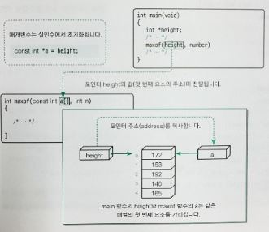

## 난수의 생성

난수를 생성하는 rand 함수가 반환하는 값은 0이상 RAND_MAX 이하의 값이다. 이때 <stdlib.h> 헤더에 정의된 RAND_MAX 값은 컴퓨터 환경에 따라 다르다(최소 32, 767). 생성되는 난수의 순서, 즉 프로그램에서 생성되는 난수는 그 순서가 정해져 있다. rand함수에 seed를 사용하여 난수를 생성할 경우, 매번 같은 순서의 난수를 생성한다. 이때 seed의 값을 변경하는 것이 srand함수이다. 

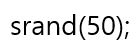

위와 같이 50을 매개변수로 전달하여 srand 함수를 호출하면 seed 값을 변경할 수 있다. 일반적으로 srand 함수에 현재 시간의 값을 주어 seed를 변경한다. rand함수는 난수처럼 보이지만 사실 seed에 따른 난수 생성 순서가 정해져 있으므로 의사난수(Pseudo random number)이다. 

## 배열 요소를 역순으로 정렬하기

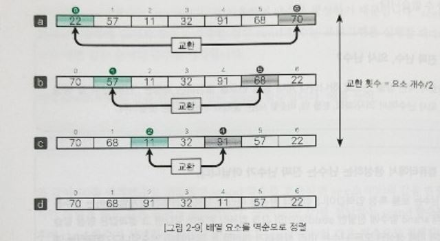

### 두 값의 교환

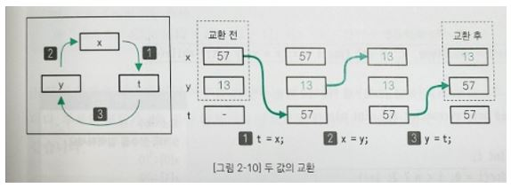

1. x 값을 t에 보관 
2. y 값을 x에 대입
3. t에 보관한 처음 x값을 y에 대입

파이썬은 위의 과정 필요없이 간단하게 swap이 가능하다.

| C                                             | Python                                        |
| --------------------------------------------- | --------------------------------------------- |
| 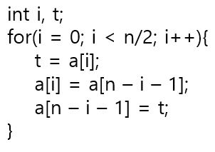 | 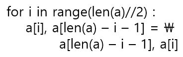 |

### 같은 자료형인 두 값을 교환하는 함수 형식 매크로

같은 자료형의 두 값을 교환하는 함수 형식 매크로 swap의 정의에서 {} 블록이 do 문으로 둘러싸인 이유는 다음과 같다.

| 잘못된 정의(블록을 do문으로 둘러싸고 있지 않은 경우) | 올바른 정의(블록을 do문으로 둘러싸는 경우) |
| ---------------------------------------------------- | ------------------------------------------ |
| 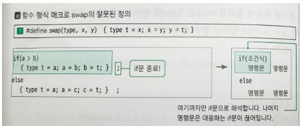              | 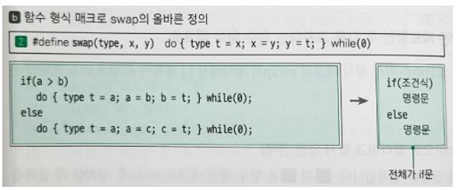    |

## 기수변환

10진수 정수 값을 2, 8, 16진수로 변환하는 방법은 다음과 같다.

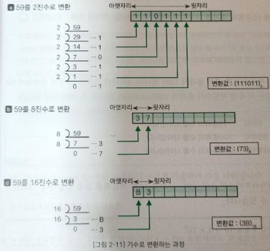

n진수는 n을 기수로 하는 수이다. 기수(基數, Cardinal number)는 수를 나타내는데 기초가 되는 수로, 10진법에서는 0에서 9까지의 정수, 16진법에서는 0~9, A-F까지의 알파벳을 쓴다. 

- 10진수(Decimal) 1234 = 1 x 10^3 + 2 x 10^2 + 3 x 10^1 + 4 x 10^0
- 8진수(Octal) 5306 = 5 x 8^3 + 3 x 8^2 + 0 x 8^1 + 6 x 8^0
- 16진수(Hexadecimal) 12A0 = 1 x 16^3 + 2 x 16^2 + A(10) x 16^1 + 0 x 16^0

### 정수 상수의 n진수 표현방법

정수 상수는 계열의 값을 나타내는 10진수, 8진수, 16진수이다. 정수 상수는 변경할 수 없는 값을 나타낼때 사용한다. 0x 혹은 0X로 시작하는 경우에는 16진수, 0으로 시작되는 경우 8진수이다. 나머지는 10진수로 간주한다. 파이썬의 경우, 16진수는 0x 혹은 0X 8진수는 0o 혹은 0O, 2진수는 0b 혹은 0B를 앞에 쓴다. 

## 전위형 증가 연산자와 후위형 증가 연산자

### 전위형 증가 연산자 ++a

++를 앞에 놓으면 식 전체를 평가하기 전에 피연산자의 값을 증가한다. 

### 후위형 증가 연산자 a++

++를 뒤에 놓으면 식 전체를 평가한 후에 피연산자의 값을 증가한다.

파이썬은 ++, -- 같은 연산자를 지원하지 않는다. 

## 소수의 나열

소수(Prime number)는 자신과 1 이외의 정수로 나누어떨어지지 않는 정수이다. 그러므로 어떤 정수 n에 대하여 2부터 n-1까지의 어떤 정수로도 나누어 떨어지지 않는다. 만약에 나누어 떨어지는 정수가 하나 이상 존재한다면 그 수는 합성수(Composite number)이다. 

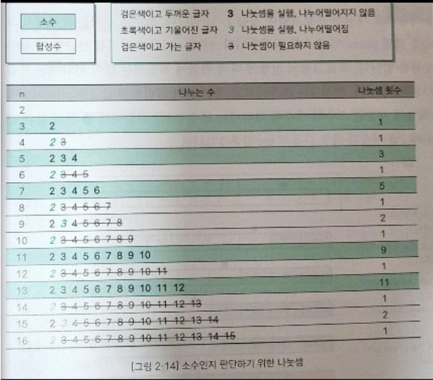

위 그림에서 알 수 있듯이 n이 소수인 경우 2부터 n보다 1 작은  값까지 순회해야 하고 n이 합성수인 경우는 끝까지 순회할 필요가 없다. 

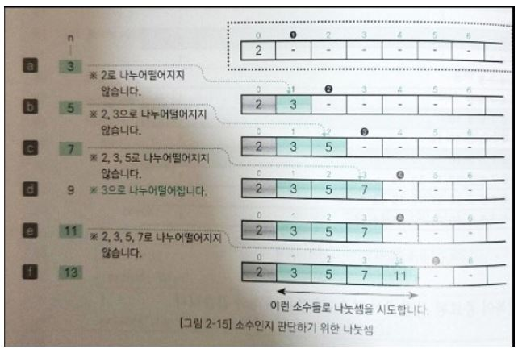

따라서 n이 소수인지를 판단할 때는 다음과 같이 소수를 삽입한 배열에서 요소를 하나씩 꺼내 검사해보면 된다. 특별히 짝수는 모두 2를 약수로 가지므로 3이상의 홀수만 검사하면 더욱 시간을 절약할 수 있다. 

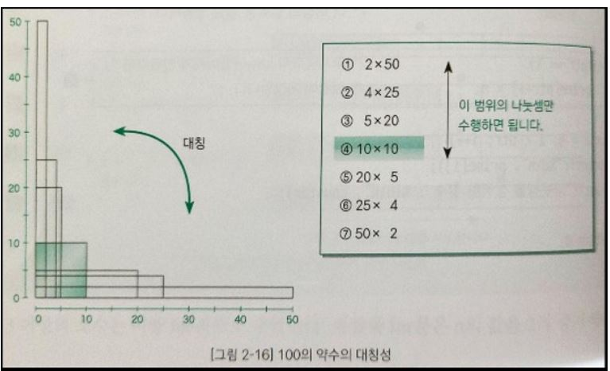

또, n의 약수를 두 변의 길이로 갖는 직사각형의 면적을 구하는 문제를 생각해보면 2x50이나 50x2나 같은 직사각형이라고 말할 수 있다. 즉 한변의 길이가 n의 제곱근인 정사각형을 기준으로 직사각형의 면적은 대칭이 된다. 따라서 최대 n의 제곱근까지만 검사를 해서 나누어 떨어지지 않으면 소수라고 판단할 수 있다. 

위의 예를 통해서 알 수 있는 사실은 

- 같은 답을 얻는 알고리즘은 하나가 아니다.
- 빠른 알고리즘은 메모리를 많이 요구한다(Time과 Space의 Trade-off).

## 다차원배열

2차원 이상의 배열을 다차원배열(Multidimensional array)라고 한다. 

- int형 - int 자료형으로 하는 단일 요소

- int[3]형 - int를 자료형으로 하는 단일 요소가 3개인 배열

- int[4]'[3] - int를 자료형으로 하는 단일 요소가 3개인 배열을 자료형으로 하는 요소 개수가 4개인 배열

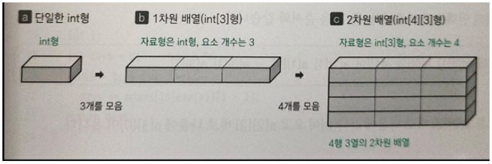

각 구성 요소에 접근하는 식은 첨자 연산자 []를 이어쓴 a[i]'[j]이다. 1차원 배열과 마찬가지로 다차원 배열도 모든 요소가 메모리에 일직선으로 나란히 줄지어 있다. 먼저 뒤쪽의 인덱스가 커지고 그런 다음 앞쪽의 인덱스가 커진다.

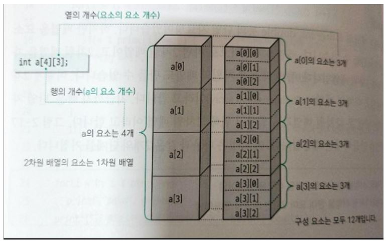

파이썬도 자료형을 선언하는 부분 빼고는 비슷하다. 그런데 몇몇 라이브러리의 자료구조(Numpy 등)는 원래의 파이썬과 다른 인덱싱을 지원하기도 한다. 

### 다차원 배열의 초기화

다차원 배열의 초기화는 {}를 겹치는 방식으로 한다. 

- int ma[2]'[3] = {{1, 2, 3}, {4, 5, 6}};
- int ma[]'[3] = {{1, 2, 3}, {4, 5, 6}};
- int ma[2]'[3] = {1, 2, 3, 4, 5, 6};
- int mc[2]'[3] = {{1, 2}, {4}};
- int mc[2]'[3] = {{1, 2, 0}, {4, 0, 0}};

파이썬은 []를 겹치는 방식으로 한다. 

## 윤년을 구하는 방법

윤년은 4의 배수 가운데 100의 배수를 제외하고, 제외한 100의 배수 가운데 400의 배수를 다시 포함시키면 된다. 윤년에는 2월의 날짜가 28일이 아니고 29일이다. 

## 구조체 

임의의 자료형의 요소를 조합하여 다시 만든 자료구조가 구조체(Struct)이다. 

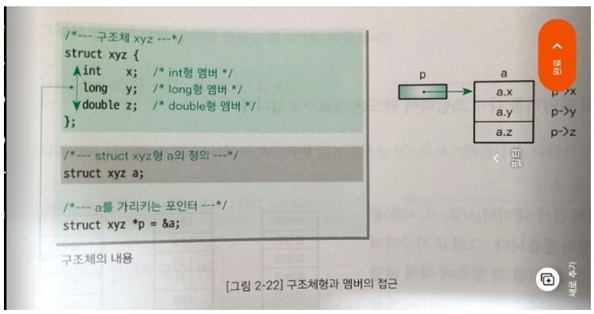

struct xyz와 같이 선언하며 구조체에 붙는 이름 앞의 xyz를 구조체 태그(Structure tag)라고 한다.  그리고 구조체를 구성하는 요소를 구조체 멤버(Structure member)라고 한다. {} 안에 선언한 x, y, z가 구조체 멤버이다. 구조체의 객체 안 멤버는 . 연산자를 사용하여 a.x와 같은 형식으로 접근한다. p가 struct xyz형에 대한 포인터일 때 p가 가리키는 객체의 멤버에 접근하는 형식은 -> 연산자를 사용한다. typedef struct xyz XYZ;와 같이 정의하면 struct xyz에 대하여 typedef 이름인 동의어 XYZ를 정의할 수 있다. 이렇게 하면 sturct xyz a;를 XYZ a;와 같이 짧은 형식으로 선언이 가능하다.  
