## 검색 알고리즘

### 검색과 키

- 국적이 일본인 사람을 찾는다.
- 나이가 21세이상 27세 미만인 사람을 찾는다.
- 어떤 낱말과 발음이 가장 비슷한 이름의 사람의 찾는다.

어떤 검색을 할때는 특정 항목에 주목하게 된다. 그 주목하는 항목을 키(Key)라고 한다. 국적을 검색하는 경우 국적이 키이고 나이를 검색하는 경우 나이가 키이다. 데이터가 단순한 정수 값일수도 있으나 대부분의 경우에서 키는 데이터의 일부이다. 

- 키 값과 일치하도록 지정한다(일본).
- 키 값의 구간을 지정한다(21세이상 27세 미만).
- 키 값과 비슷하도록 지정한다(발음이 가장 비슷한 이름).

이런 조건은 하나만 지정할 수도 있고 논리곱이나 논리합을 사용하여 복합해서 지정하기도 한다.

### 배열에서 검색하기

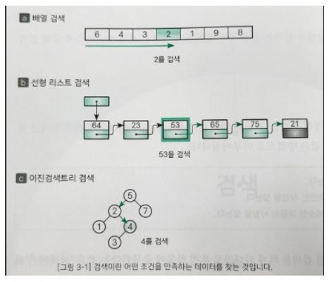

- 선형 검색: 무작위로 늘어놓은 데이터 모임에서 검색을 수행한다.
- 이진 검색: 일정한 규칙으로 늘어놓은 데이터 모임에서 아주 빠른 검색을 수행한다.
- 해시법: 추가, 삭제가 자주 일어나는 데이터 모임에서 아주 빠른 검색을 수행한다.
  - 체인법: 같은 해시 값의 데이터를 선형 리스트로 연결하는 방법.
  - 오픈 주소법: 데이터를 위한 해시 값이 충돌할 떄 재해시하는 방법

데이터 집합이 있을 때 검색만 하면 된다면 계산 시간이 가장 빠른 알고리즘을 선택한다. 그러나 데이터 집합에 대한 검색뿐 아니라 데이터의 추가, 삭제 등을 자주하는 경우라면 검색 이외의 작업에 소요되는 비용을 종합적으로 평가하여 알고리즘을 선택한다. 즉, 어떤 목적을 이루기 위해 선택할 수 있는 알고리즘이 다양하게 존재하는 경우에는 용도나 목적, 실행 속도, 자료 구조 등을 고려하여 알고리즘을 선택한다.

(예를 들어 배열은 검색은 비교적 빠르지만(C의 경우, 메모리에 데이터가 일직선으로 나열되어 있기 때문) 데이터를 추가하거나 삭제할 때는 비용이 많이 든다.)

## 선형 검색

### 선형 검색

요소가 직선 모양으로 늘어선 배열에서의 검색은 원하는 키 값을 갖는 요소를 만날 때까지 맨 앞부터 순서대로 요소를 검색한다. 이것이 선형 검색(Linear search) 또는 순차 검색(Sequential search)이다. 

- 검색에 성공했을 때

  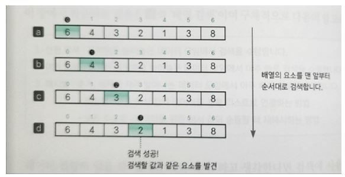

- 검색에 실패했을 때

  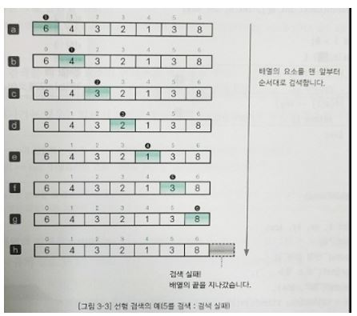

위의 두 예를 보면 배열 검색의 종료 조건은 2개임을 알 수 있다.

- 검색할 값을 발견하지 못하고 배열의 끝을 지나간 경우
- 검색할 값과 같은 요소를 발견한 경우

### 보초법

선형 검색은 반복할 때마다 다음의 종료 조건을 모두 체크한다.

- 검색할 값을 발견하지 못 하고 배열의 끝을 지나간 경우
- 검색할 값과 같은 요소를 발견한 경우

그러나 종료 조건을 검사하는 비용을 무시할 수 없다. 이 비용을 반(50%)으로 줄이는 방법이 보초법(Sentinel method)이다. 

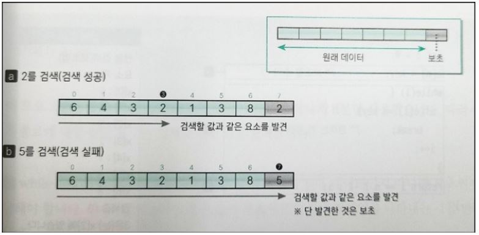

위에서 a[0]-a[6]까지는 초기에 준비해 놓은 데이터이다. 검색 하기 전에 검색하고자 하는 키 값을 맨 끝 요소 a[7]에 저장한다. 이때 저장하는 값을 보초(Sentinel)라고 한다. 이 보초법을 사용하면 원하는 키 값을 찾지 못해도 보초가 있기 때문에 종료조건 2를 만족하게 된다. 따라서 반복문에서 종료 판단 하는 횟수를 2회에서 1회로 줄이게 된다. 

## 이진 검색

이진 검색을 적용하는 전제 조건은 데이터가 키 값으로 이미 정렬되어 있다는 것이다. 이진 검색은 선형 검색보다 좀 더 빠르게 검색할 수 있다는 장점이 있다.

### 이진검색

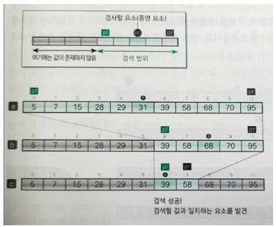

검색 범위의 맨 앞 인덱스를 pl, 맨 끝 인덱스를 pr, 중앙 인덱스를 pc라고 지정한다. 초기에 pl = 0, pr = n-1, pc =(n-1)/2로 초기화한다. c처럼 a[pc] 값이 key와 비교하여 같으면 검색 성공이고 그렇지 않으면 두 가지 경우로 나누어진다.

- a[pc] < key일 때 - a[pl]부터 a[pc]는 key보다 작은 것이 분명하므로 검색 대상에서 제외한다. 검색 범위는 a[pc+1]부터 a[pr]로 좁혀진다. 즉, pl의 값을 pc+1로 업데이트한다(a->b)
- a[pc] > key일 때 - a[pc] 부터 a[pr]은 key보다 큰 것이 분명하므로 검색 대상에서 제외한다. 검색 범위는 a[pl]에서 a[pc-1]로 좁혀진다. 즉, pr의 값을 pc-1로 업데이트 한다. 

다음은 이진 검색 알고리즘의 종료 조건이다.

- a[pc]와 key가 일치하는 경우
- 검색 범위가 더 이상 없는 경우

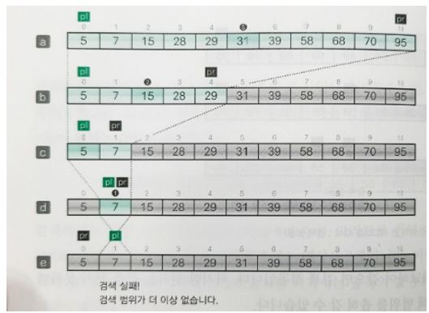

위는 종료 조건 중 검색 범위가 없는 경우를 나타낸 것이다. d에서 pr을 pc-1인 0으로 업데이트 했을 때 , pl이 pr보다 커지면서 검색 범위를 더이상 계산할 수 없게 된다. 

이진 검색은 검색을 반복할 때마다 검색 범위가 절반이 되므로 검색에 필요한 비교 횟수의 평균값은 log n이다. 

## 복잡도

프로그램의 실행 속도는 프로그램이 동작하는 하드웨어나 컴파일러 등의 조건에 따라 달라지기는 하나 알고리즘의 성능을 객관적으로 평가하기 위한 기준을 복잡도(Complexity)라고 한다. 

- 시간 복잡도(Time complexity) - 실행에 필요한 시간을 평가한 것
- 공간 복잡도(Space complexity) - 기억 영역과 파일 공간이 얼마나 필요한가를 평가한 것

### 

### 선형 검색의 시간 복잡도

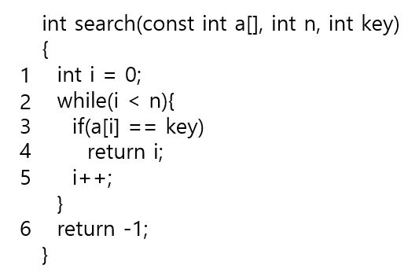

1, 4, 6과 같이 데이터 수 n과는 무방하게 함수 내에서 한 번 실행하고 마는 식을 복잡도 O(1)으로 표기한다. 배열의 맨 끝에 도달했는지를 평가하는 2와 현재 검사하고 있는 요소와 찾고자 하는 값이 같은지를 판단하는 3의 평균 실행 횟수는 n/2이다. 이처럼 n에 비례하는 횟수만큼 실행하는 경우의 복잡도를 O(n)으로 표기한다. 

(n/2번 실행했을 때 복잡도나 n번 실행했을 때 복잡도나 n의 값이 무한히 커진다고 가정하면 컴퓨터 입장에서 그 값의 차이가 무의미해지기 때문에 O(n)이라고 표현한다.)

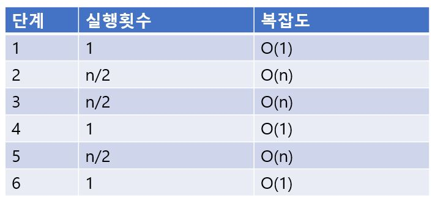

n이 커지면 O(n)에 필요한 계산 시간은 n에 비례하여 점점 길어진다. 이와 달리 O(1)에 필요한 계산 시간은 변하지 않는다. 일반적으로 2개 이상의 O(f(n))과 O(g(n))의 복잡도를 계산하는 방법은 다음과 같다.

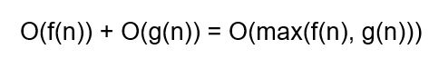

### 이진 검색의 시간 복잡도

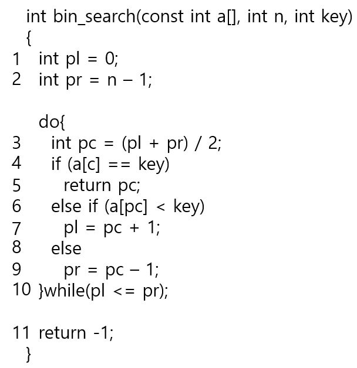

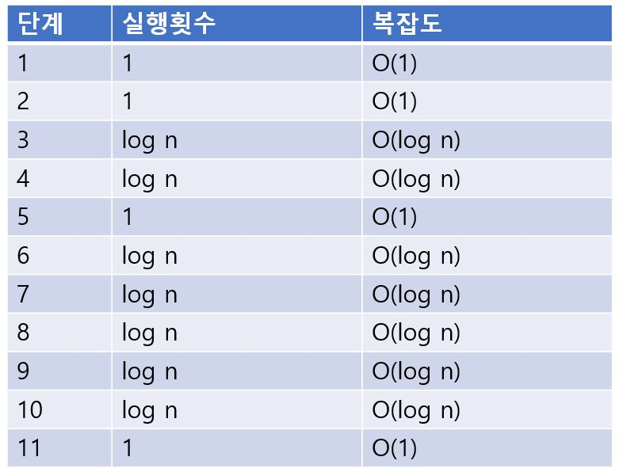

다음은 복잡도의 대소 관계를 개략적으로 나타낸 것이다.

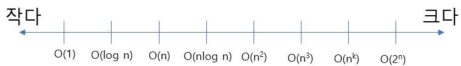

## bsearch 함수(정렬된 배열에서 검색하는 함수)

C 언어의 표준 라이브러리는 다양한 요소의 자료형을 가진 배열에서도 검색 가능한 bsearch 함수를 제공한다. 이 함수를 일반 유틸리티(Utility)함수라고 부른다. 

- 특징 1. 검색 대상의 배열은 항상 정렬되어 있어야 한다.
- 특징 2. 검색하는 값과 같은 요소가 여러 개 존재하는 경우, 항상 가장 앞쪽에 있는 요소를 찾아내지는 않는다. 

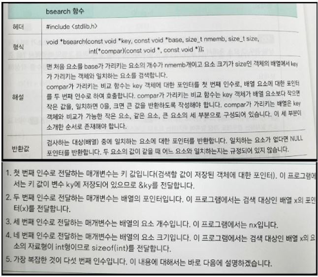

다섯번째 인수는 비교함수로서 두 값 중에 첫 번째 인수가 가리키는 값이 더 작으면 음수 값을 반환하고 같으면 0을, 더 크면 양수 값을 반환한다. 

### bsearch 함수의 호출

bsearch 함수가 받는 비교함수의 인수의 자료형은 void *이므로 bsearch 함수의 호출에 맞게 형 반환 해야 한다. 형 변환(Cast)는 특정한 형으로 자료형을 변환하는 연산자이다. 

### bsearch 함수의 반환값

bsearch 함수의 반환값은 검색을 통해 찾은 요소의 포인터이다. 따라서 그 요소의 인덱스는 반환된 포인터 p에서 첫 번째 요소의 포인터 x를 뺸 식 p - x로 얻을 수 있다. 검색에 실패한 경우에는 NULL 포인터를 반환한다. 

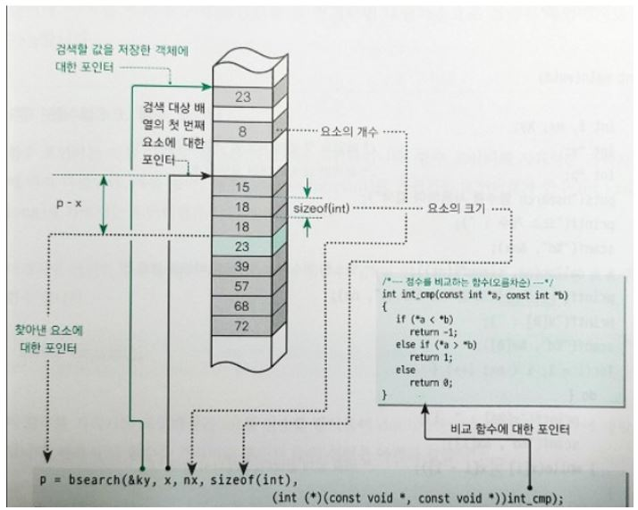

## 함수 포인터

함수 포인터는 함수를 가리키는 포인터로, 가리키는 함수에 따라 다르다. 

- double func(int); - int를 받아들여 double을 반환하는 함수 선언
- double (*fp)(int); - int를 받아들여 double을 반환하는 함수에 대한 포인터 fp의 선언
- double *fn(int); - int를 받아들여 double 포인터를 반환하는 함수 선언

함수에 대한 포인터는 매개변수 선언에서만 변수 이름 앞의 *와 ()를 생략한 형식으로 선언할 수 있다. 배열을 매개변수로 하는 함수에서 int *p를 int p[]로 선언하는 경우와 비슷하다.

일반적으로 함수 호출식의 왼쪽 피연산자는 함수 포인터가 아닌 함수 이름을 사용해도 된다. 다시 말해 간접 참조 연산자 *와 ()를 생략할 수 있다. 
