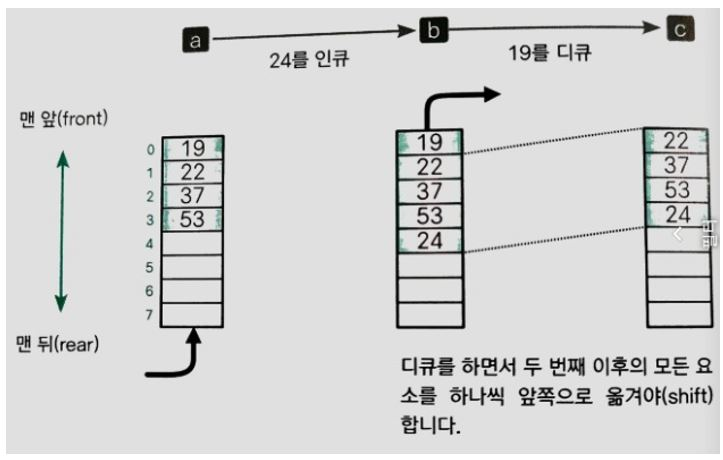

## 스택

스택(Stack)은 데이터를 일시적으로 저장하기 위해 사용되는 자료구조로, 데이터의 입력과 출력 순서는 후입선출(LIFO, Last In First Out - 가장 나중에 넣은 데이터를 가장 먼저 꺼낸다)이다. 스택에 데이터를 넣는 작업을 푸시(Push)라 하고, 스택에서 데이터를 꺼내는 작업을 팝(Pop)이라고 한다.  푸시, 팝을 하는 위치를 꼭대기(Top)라고 하고, 스택의 가장 밑바닥 부분을 바닥(Bottom)이라고 한다. 

C 언어 프로그램에서는 함수를 호출하고 실행할 때 프로그램 내부에서 스택을 사용한다.

파이썬에서 스크립트를 호출했을 때 작동 방식은 아래를 참조한다.

[파이썬 코딩 도장: 함수의 호출과정 알아보기](https://dojang.io/mod/page/view.php?id=2341)

기본적으로 작동 원리는 C에서와 유사하다. 메모리에 프레임(메모리에서 함수와 함수에 속한 변수가 저장되는 독립적인 공간)이 있고, 파이썬 스크립트 전체에서 접근할 수 있는 전역 프레임과 각 함수별 프레임이 할당된다. 

1. 
2. 
3. 
4. 
5. 

### 초기화 함수 Initialize

Initialize 함수는 스택의 메모리 공간(배열)을 확보하는 등의 준비 작업을 수행하는 함수이다. 배열을 위한 메모리 공간을 만들 때 스택은 비어 있어야 한다. 따라서 스택 포인터 ptr 값을 0, 요소의 개수가 max인 배열 stk를 생성한다. 또 매개변수 max로 받은 값을 스택 최대 용량을 나타내는 구조체의 멤버 max에 저장한다. 따라서 스택의 개별 요소는 바닥(Bottom)부터 stk[0], stk[1], ..., stk[max - 1]이 된다. 

(배열을 위한 메모리 공간을 확보하는 데 실패하면 max의 값을 0으로 해야 하는데, 이는 존재하지 않는 배열 stk에 다른 함수의 접근을 막기 위해서이다.)

### 푸시 함수 Push

Push 함수는 스택에 데이터를 추가하는 함수로, 스택이 가득 차서 푸시할 수 없는 경우에는 -1을 반환한다. 스택이 가득 차지 않았다면 새로 추가할 데이터(x)를 배열의 요소(stk[ptr])에 저장하고 스택 포인터(ptr)을 증가시킨다. 마지막으로 푸시에 성공하면 0을 반환한다. 

(여기서 스택 포인터 ptr은 포인터 변수를 의미하는 것이 아니라 새로운 데이터를 삽입할 인덱스를 기억하는 용도로 사용하는 변수로, 스택의 인덱스를 가리킨다라는 의미로 스택 포인터라고 한다.)

### 팝 함수 Pop

Pop 함수는 스택의 꼭대기에서 데이터를 제거하는 함수이다. 팝에 성공할 경우에는 0을 반환하고 스택이 비어 있어 팝을 할 수 없는 경우에는 -1을 반환한다. 먼저 스택 포인터 ptr의 값을 감소시키고 stk[ptr]에 저장된 값을 포인터 x가 가리키는 변수에 저장한다. 

### 피크 함수 Peek

Peek 함수는 스택 꼭대기의 데이터를 확인하는 함수이다. 피크에 성공하면 0을 반환하고 스택이 비어 있으면 -1을 반환한다. 스택이 비어 있지 않다면 꼭대기 요소 stk[ptr - 1]의 값을 포인터 x가 가리키는 변수에 저장한다. 데이터의 입출력이 없으므로 스택 포인터는 변화하지 않는다.

### 스택의 모든 요소를 삭제하는 함수 Clear

Clear 함수는 스택에 쌓여 있는 모든 데이터를 삭제하는 함수이다(스택에 대한 푸시와 팝 등 모든 작업은 스택 포인터를 바탕으로 이루어진다. 따라서 스택의 배열 요솟값을 변경할 필요가 없으므로 모든 요소의 삭제는 스택 포인터 ptr 값을 0으로 하면 된다).

### 용량을 확인하는 함수 Capacity

Capacity 함수는 스택의 용량(멤버 max의 값)을 반환하는 함수이다. 

### 데이터의 개수를 확인하는 함수 Size

Size 함수는 현재 스택에 쌓여 있는 데이터의 개수(멤버 ptr의 값)를 반환하는 함수이다.

### 스택이 비어 있는지 검사하는 함수 IsEmpty

IsEmpty 함수는 스택이 비어 있는지 검사하는 함수이다. 스택이 비어 있으면 1, 그렇지 않으면 0을 반환한다.

### 스택이 가득 찼는지 검사하는 함수 IsFull

IsFull 함수는 스택이 가득 찼는지 검사하는 함수이다. 스택이 가득 찼으면 1, 그렇지 않으면 0을 반환한다.

### 임의의 값을 검색하는 함수 Search

Search 함수는 임의의 값의 데이터가 스택의 어느 위치에 쌓여 있는지 검사하는 함수이다. 검색은 꼭대기에서 바닥으로 선형 검색을 수행한다(배열 인덱스가 큰 쪽에서 작은 쪽으로 스캔). 검색에 성공하면 찾은 요소의 인덱스를 반환하고 실패하면 -1을 반환한다(같은 값이 여러개 있을 때는 Top에 가장 가까운 값의 인덱스를 반환한다. Top에서부터 검색하는 이유는 먼저 팝되는 데이터를 찾기 위해서이다).

### 모든 데이터를 출력하는 함수 Print

Print 함수는 스택의 모든 데이터를 출력하는 함수이다. 스택에 쌓여 있는 ptr개의 모든 데이터를 바닥부터 순서대로 출력한다. 

### 종료 함수 Terminate

Terminate 함수는 뒤처리를 담당하는 함수로, Initialize 함수로 확보한 스택을 해제하고 용량 max와 스택 포인터 ptr의 값을 0으로 한다.

## 큐	

큐(Queue)는 데이터를 일시적으로 쌓아 놓기 위한 자료구조로 가장 먼저 넣은 데이터를 가장 먼저 꺼내는 선입선출(FIFO-First In First Out) 구조를 이루고 있다. 큐에 데이터를 넣는 작업은 인큐(Enqueue)라고 하고 데이터를 꺼내는 작업을 디큐(Dequeue)라고 한다. 데이터를 꺼내는 쪽을 프런트(Front)라 하고, 데이터를 넣는 쪽을 리어(Rear)라고 한다.

### 배열로 큐 만들기

큐는 배열을 사용하여 구현할 수 있다. 

a 상태에서는 배열의 프런트(Front)부터 4개(19, 22, 37, 53)의 데이터가 들어가 있다. b 상태에서 데이터 24을 인큐하면 리어(Rear)가 가리키는 공산 다음에 24를 저장한다. 이 처리의 복잡도는 O(1)이다. c 상태에서는 프런트가 가리키고 있는 19를 꺼낸 다음 두번째 이후의 모든 요소를 한칸씩 앞으로 옮긴다. 이 처리의 복잡도는 O(n)이며 데이터를 꺼낼 때마다 이런 처리를 하게 되면 효율이 떨어진다. 

### 링 버퍼로 큐 만들기

배열 요소를 앞쪽으로 옮기지 않는 큐를 구현하기 위해서 사용하는 자료 구조가 링 버퍼(Ring buffer)이다. 링 버퍼는 배열의 처음이 끝과 연결되어 있다고 보는 자료구조이다. 논리적으로 어떤 요소가 첫번째이고 어떤 요소가 마지막 요소인지 식별하기 위한 변수가 프런트(Front)와 리어(Rear)이다. 

- 프런트(Front) : 맨 처음 요소의 인덱스
- 리어(Rear) : 맨 끝 요소의 하나 뒤의 인덱스(다음 요소를 인큐할 위치를 미리 지정)

인큐와 디큐를 수행하면 다음과 같은 과정을 거친다.

7개의 데이터가 차례대로 저장된다. 이때 프런트의 값은 7이고 리어의 값은 2이다. 

82를 인큐하면 리어가 가리키고 있는 위치에 82를 저장하고 리어 값을 1만큼 증가시킨다.

35를 디큐하면 프런트가 가리키고 있는 요소의 값(35)을 빼고 프런트 값을 1만큼 증가시킨다. 이렇게 큐를 구현하면 프런트와 리어 값을 업데이트하며 인큐와 디큐를 수행하기 때문에 배열로 구현했을 때 발생한 요소 이동 문제를 해결할 수 있다. 처리의 복잡도는 O(1)이다. 

### 큐 구조체 IntQueue

큐 구조체 IntQueue는 큐를 관리하는 구조체로 다음과 같이 5개의 멤버로 구성된다.

- 큐로 사용할 배열(que) : 인큐하는 데이터를 저장하기 위한 큐로, 사용할 배열의 첫 번째 요소에 대한 포인터이다. 
- 큐의 최대 용량(max) : 큐의 최대 용량을 저장하는 멤버로, 이 값은 배열 que에 저장할 수 있는 최대 요소의 개수와 같다.
- 프런트(Front) : 인큐하는 데이터 가운데 첫 번째 요소의 인덱스를 저장하는 멤버이다.
- 리어(Rear) : 인큐한 데이터 가운데 맨 나중에 넣은 요소의 하나 뒤의 인덱스를 저장하는 멤버이다.(다음 인큐 시에 데이터가 저장될 요소의 인덱스를 미리 준비해둔다.)
- 현재 데이터 개수(num) : 큐에 쌓아 놓은 데이터 수를 나타내는 멤버이다. front와 rear 값이 같은 영우 큐가 비어 있는지, 가득 찼는지 구별할 수 없는 상황을 피하기 위해 이 변수가 필요하다. 큐가 비어 있을 때 num은 0이고, 가득 찼을 때는 max와 값이 같다. 

| 큐가 비어 있는 상태                       | 큐가 가득 찬 상태                         |
| ----------------------------------------- | ----------------------------------------- |
|  |  |

### 초기화 함수 Initialize

Initialize 함수는 큐를 구현하기 위한 배열의 메모리 공간 확보 등의 준비 작업을 하는 함수이다. 큐를 처음 만들면 큐는 비어 있으므로 num, front, rear 값을 모두 0으로 한다. 또 매개변수 max로 받은 큐의 최대 용량을 멤버 max에 저장한다. 그리고 저장할 수 있는 요소의 개수가 max인 배열 que의 메모리 공간을 확보한다. 배열의 메모리 공간 확보에 실패할 때 멤버 max에 0을 대입한다. 

### 인큐 함수 Enque

Enque 함수는 큐에 데이터를 인큐하는 함수이다. 인큐에 성공하면 0을 반환하지만 큐가 가득 차서 인큐 할 수 없으면(num > max) -1을 반환한다. 

데이터 82을 인큐하면 rear가 가리키는 곳에 82을 인큐하고 rear와 num 값을 1만큼 증가시키면 인큐 작업이 끝난다. 그런데 인큐하기 전에 rear 값이 11이면 Enque 수행 후 rear 값이 12가 되면서 max 값과 같아지는 문제가 발생한다. 

rear 값을 1만큼 증가하했을 때 큐의 최대 용량의 값인 max와 같아질 경우 rear를 배열의 처음인 0으로 변경해야 한다. 그래야 다음에 인큐할 데이터가 제대로 0번째 위치에 저장된다. 

### 디큐 함수 Deque

Deque 함수는 큐에서 데이터를 디큐하는 함수이다. 디큐에 성공하면 0을 반환하지만 큐가 텅 비어 디큐할 수 없으면 (num < 0) -1을 반환한다. 

front가 가리키고 있는 곳의 요소 값인 35를 디큐하고 나서 front 값을 1만큼 증가시키고 num 값을 1만큼 감소시키면 디큐 작업이 끝난다. 그런데 디큐 하기 전의 front 값이 배열의 끝(11)이라면 디큐 하고 나서 front 값이 max(12)가 되어 배열 마지막 요소의 인덱스를 초과한다. 

1만큼 증가한 front 값이 큐의 용량인 max와 같아지면 front 값을 배열의 처음인 0으로 변경한다. 이렇게 하면 다음에 디큐를 수행하더라도 제대로 0번쨰 위치에서 데이터를 꺼낸다. 

### 피크 함수 Peek

Peek 함수는 맨 앞의 데이터(디큐에서 꺼낸 데이터)를 알아보는 ㅎ마수로 front가 가리키는 요소의 값을 출력한다. 데이터를 꺼내지 않아 front, rear, num의 값이 변하지 않는다. 피크에 성공하면 0, 실패하면 -1을 반환한다. 

### 모든 데이터를 삭제하는 함수 Clear

Clear 함수는 큐의 모든 데이터를 삭제하는 함수이다. 

### 최대 용량을 확인하는 함수 Capacity

Capacity 함수는 큐의 최대 용량을 반환하는 함수로 멤버 max의 값을 그대로 반환한다.

### 데이터 개수를 확인하는 함수 Size

Size 함수는 현재 큐의 데이터 개수를 반환하는 함수로 멤버 num의 값을 그대로 반환한다.

### 큐가 비어 있는지 판단하는 함수 IsEmpty

IsEmpty 함수는 큐가 비어 있는지 판단하는 함수로 비어 있으면 1, 그렇지 않으면 0을 반환한다.

### 큐가 가득 찼는지 판단하는 함수 IsFull

IsFull 함수는 큐가 가득 찼는지 판단하는 함수로 비어 있으면 1, 그렇지 않으면 0을 반환한다. 

### 검색 함수 Search

Search 함수는 큐의 배열에서 x와 같은 데이터가 저장되어 있는 인덱스를 반환하는 함수이다. 검색에 성공하면 찾은 요소의 인덱스를 반환하고, 실패하면 -1을 반환한다. 다음과 같이 선형 검색을 수행한다. 

| i      | 0    | 1    | 2    | 3    | 4    | 5    | 6    |
| ------ | ---- | ---- | ---- | ---- | ---- | ---- | ---- |
| 인덱스 | 7    | 8    | 9    | 10   | 11   | 0    | 1    |

검색의 시작 지점은 배열의 첫 요소가 아니라 큐의 첫 요소이다. 현재 검색하는 위치의 인덱스를 구하는 식은 (i + q->front) % q->max이다. 

### 모든 데이터를 출력하는 함수 Print

Print 함수는 큐의 모든 데이터를 처음부터 끝까지 순서대로 출력하는 함수이다. 현재 검색하는 위치의 인덱스 계산 방법은 Search 함수와 같다.

### 종료 함수 Terminate

Terminate 함수는 메모리 공간에 할당한 배열(큐)을 해제하는 함수이다. 

### 덱(Deck)

덱(Deck)은 양방향 대기열(Deque/double ended queue) 구조로 시작과 끝 지점에서 양쪽으로 데이터를 인큐하거나 디큐하는 자료구조이다. 

### 링 버퍼의 활용

링 버퍼는 오래된 데이터를 버리는 용도로 사용할 수 있다. 예를 들어 요소의 개수가 n인 배열에 계속해서 데이터가 입력될 떄 가장 최근에 들어온 데이터 n개만 저장하고 오래된 데이터는 버리는 용도로 사용한다. 인큐는 무한히 할 수 있지만 배열에 저장되는 데이터는 가장 최근에 입력한 n개의 데이터만 링 버퍼에 남아 있다. 

