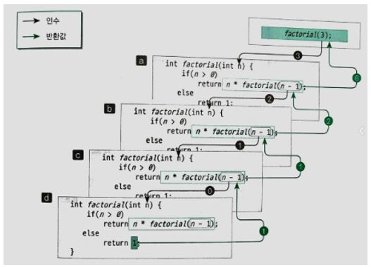
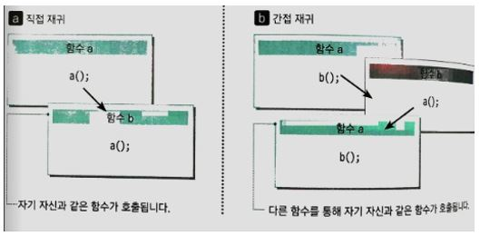
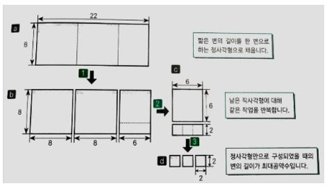
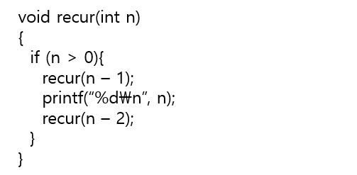
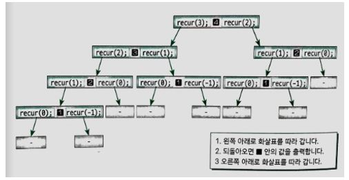
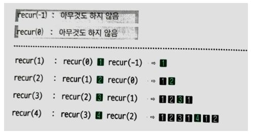

## 재귀의 기본

### 재귀란?

어떤 사건이 자기 자신을 포함하고 다시 자기 자신을 사용하여 정의될 때 재귀적(Recursive)이라고 한다. 이러한 재귀의 개념을 사용하면 1부터 시작하여 2, 3, ...과 같이 무한하게 이어지는 자연수를 다음과 같이 정의할 수 있다.

- 1은 자연수이다.
- 자연수 n의 바로 다음 수도 자연수이다.

재귀를 효과적으로 사용하면 프로그램도 간결하게 할 수 있다. 

### 순차곱셈 구하기

음이 아닌 정수의 순차곱셈(Factorial)을 구하는 프로그램은 아래와 같이 재귀적으로 정의할 수 있다.

1. 0! = 1
2. n > 0 이면 n! = n * (n - 1)!

a. 함수 호출식 factorial(3)을 실행하면 factorial 함수가 시작된다. 이 함수는 매개변수 n에 3을 전달받아 3 * factorial(2)을 반환한다. 그런데 이 곱셈을 수행하려면 factorial(2)의 값을 구해야 하므로 2를 매개변수로 전달하여 factorial 함수를 호출한다.

b. 호출된 factorial 함수는 매개변수 n에 2를 전달받아서 2 * factorial(1)을 수행하기 위해 factorial 함수를 호출한다.

c. 호출된 factorial 함수는 매개변수 n에 1를 전달받아서 1 * factorial(0)을 수행하기 위해 factorial 함수를 호출한다.

d. 호출된 factorial 함수는 매개변수 n에 전달 받은 값이 0이므로 1을 반환한다. 

c. 반환된 값 1을 전달받아 1 * 1을 반환한다.

b. 반환된 값 1을 전달 받아 2 * 1을 반환한다. 

a. 반환된 값 2를 전달 받아 3 * 2를 반환한다. 

이러한 함수 호출 방식을 재귀 호출(Recursive call)이라고 한다(자기 자신과 똑같은 함수를 호출한다).

### 직접 재귀와 간접 재귀

위에서 factorial 함수와 같이 자신과 같은 함수를 호출하면 직접(Direct) 재귀이다. 간접 재귀(Indirect)는 함수 a가 b를 호출하고, b가 a를 호출하는 구조로 이루어진다. 

### 유클리드 호제법

두 정수의 최대공약수(Greatest common divisor)를 재귀적으로 구하는 방법을, 두 정수가 직사각형의 두 변의 길이라고 생각하면 다음과 같이 생각해볼 수 있다. 

- 직사각형을 정사각형으로 완전히 채운다. 이렇게 만들 수 있는 정사각형의 가장 긴 변의 길이는?

1. a의 22 x 8 크기의 직사각형을, 짧은 변(8)을 한 변으로 하는 정사각형으로 분할한다. 이렇게 하면 b처럼 8 x 8 크기의 정사각형 2개와 8 x 6 크기의 직사각형 1개가 남는다.
2. 8 x 6 크기의 직사각형도 같은 과정을 수행하면 6 x 6 크기의 정사각형 1개와 6 x 2 크기의 직사각형 1개가 남는다.
3. 6 x 2 크기의 직사각형으로 같은 과정을 수행하면 2 x 2 크기의 정사각형 3개로 나누어 떨어진다. 여기서 얻은 2가 최대 공약수이다. 

두 정수가 주어질 경우 큰 값을 작은 값으로 나누었을 때 나누어 떨어지는 가장 작은 값이 최대 공약수이다. 나누어 떨어지지 않으면 작은 값(나머지)에 대해 나누어 떨어질 때까지 같은 과정을 재귀적으로 반복한다. 

## 재귀 알고리즘 분석

재귀 알고리즘을 분석하기 위한 분석 방법으로 하향식(Top bottom) 분석과 상향식(Bottom up) 분석 방법이 있다. 

- 하향식 분석 : 매개변수 n으로 4를 전달하면 recur 함수는 아래 과정을 순서대로 실행한다.

  1. recur(3)을 실행한다.  2. 4를 출력한다.  3.  recur(2)를 실행한다.

  

  recur(3)을 호출하면 어떤 과정을 거치게 되는지는 recur(3) 4 recur(2) 노드의 왼쪽 서브 트리를 살펴보면 된다. 4를 출력하려면 왼쪽 서브 트리에서의 모든 작업이 완료되어야 한다. 이처럼 가장 위쪽에 위치한 상자의 함수 호출부터 시작해 계단식으로 자세히 조사해 가는 분석 기법을 하향식 분석(Top-down analysis)이라고 한다. 그런데 트리를 자세히 보면 recur(1), recur(2) 등이 여러번 호출된다. 꼭대기부터 분석하면 이렇게 같은 함수의 호출이 여러번 나올 수 있기 때문에 하향식 분석이 반드시 효율적이다라고 말할 수는 없다. 

- 상향식 분석 : 하향식 분석과는 대조적으로 아래쪽부터 쌓아 올리며 분석하는 방법이 상향식 분석(Bottom-up analysis)이다. recur(1)이 수행하는 작업은 다음과 같다.

  - recur(0) 수행, 1을 출력, recur(-1)을 실행

  여기서 recur(0)과 recur(-1)은 출력할 내용이 없다. 따라서 1만 출력한다. recur(2)의 수행 내역은

  - recur(1) 수행, 2를 출력, recur(0) 수행 

  recur(1)은 1을 출력하고 recur(0)은 출력할 내용이 없다. 전체적으로 거치면 1과 2를 출력하게 된다. 이런 작업을 거쳐 다음과 같이 recur(4)가 출력된다. 

