## 재귀의 기본

### 재귀란?

어떤 사건이 자기 자신을 포함하고 다시 자기 자신을 사용하여 정의될 때 재귀적(Recursive)이라고 한다. 이러한 재귀의 개념을 사용하면 1부터 시작하여 2, 3, ...과 같이 무한하게 이어지는 자연수를 다음과 같이 정의할 수 있다.

- 1은 자연수이다.
- 자연수 n의 바로 다음 수도 자연수이다.

재귀를 효과적으로 사용하면 프로그램도 간결하게 할 수 있다. 

### 순차곱셈 구하기

음이 아닌 정수의 순차곱셈(Factorial)을 구하는 프로그램은 아래와 같이 재귀적으로 정의할 수 있다.

1. 0! = 1
2. n > 0 이면 n! = n * (n - 1)!

a. 함수 호출식 factorial(3)을 실행하면 factorial 함수가 시작된다. 이 함수는 매개변수 n에 3을 전달받아 3 * factorial(2)을 반환한다. 그런데 이 곱셈을 수행하려면 factorial(2)의 값을 구해야 하므로 2를 매개변수로 전달하여 factorial 함수를 호출한다.

b. 호출된 factorial 함수는 매개변수 n에 2를 전달받아서 2 * factorial(1)을 수행하기 위해 factorial 함수를 호출한다.

c. 호출된 factorial 함수는 매개변수 n에 1를 전달받아서 1 * factorial(0)을 수행하기 위해 factorial 함수를 호출한다.

d. 호출된 factorial 함수는 매개변수 n에 전달 받은 값이 0이므로 1을 반환한다. 

c. 반환된 값 1을 전달받아 1 * 1을 반환한다.

b. 반환된 값 1을 전달 받아 2 * 1을 반환한다. 

a. 반환된 값 2를 전달 받아 3 * 2를 반환한다. 

이러한 함수 호출 방식을 재귀 호출(Recursive call)이라고 한다(자기 자신과 똑같은 함수를 호출한다).

### 직접 재귀와 간접 재귀

위에서 factorial 함수와 같이 자신과 같은 함수를 호출하면 직접(Direct) 재귀이다. 간접 재귀(Indirect)는 함수 a가 b를 호출하고, b가 a를 호출하는 구조로 이루어진다. 

### 유클리드 호제법

두 정수의 최대공약수(Greatest common divisor)를 재귀적으로 구하는 방법을, 두 정수가 직사각형의 두 변의 길이라고 생각하면 다음과 같이 생각해볼 수 있다. 

- 직사각형을 정사각형으로 완전히 채운다. 이렇게 만들 수 있는 정사각형의 가장 긴 변의 길이는?

1. a의 22 x 8 크기의 직사각형을, 짧은 변(8)을 한 변으로 하는 정사각형으로 분할한다. 이렇게 하면 b처럼 8 x 8 크기의 정사각형 2개와 8 x 6 크기의 직사각형 1개가 남는다.
2. 8 x 6 크기의 직사각형도 같은 과정을 수행하면 6 x 6 크기의 정사각형 1개와 6 x 2 크기의 직사각형 1개가 남는다.
3. 6 x 2 크기의 직사각형으로 같은 과정을 수행하면 2 x 2 크기의 정사각형 3개로 나누어 떨어진다. 여기서 얻은 2가 최대 공약수이다. 

두 정수가 주어질 경우 큰 값을 작은 값으로 나누었을 때 나누어 떨어지는 가장 작은 값이 최대 공약수이다. 나누어 떨어지지 않으면 작은 값(나머지)에 대해 나누어 떨어질 때까지 같은 과정을 재귀적으로 반복한다. 

## 재귀 알고리즘 분석

재귀 알고리즘을 분석하기 위한 분석 방법으로 하향식(Top bottom) 분석과 상향식(Bottom up) 분석 방법이 있다. 

- 하향식 분석 : 매개변수 n으로 4를 전달하면 recur 함수는 아래 과정을 순서대로 실행한다.

  1. recur(3)을 실행한다.  2. 4를 출력한다.  3.  recur(2)를 실행한다.

  

  recur(3)을 호출하면 어떤 과정을 거치게 되는지는 recur(3) 4 recur(2) 노드의 왼쪽 서브 트리를 살펴보면 된다. 4를 출력하려면 왼쪽 서브 트리에서의 모든 작업이 완료되어야 한다. 이처럼 가장 위쪽에 위치한 상자의 함수 호출부터 시작해 계단식으로 자세히 조사해 가는 분석 기법을 하향식 분석(Top-down analysis)이라고 한다. 그런데 트리를 자세히 보면 recur(1), recur(2) 등이 여러번 호출된다. 꼭대기부터 분석하면 이렇게 같은 함수의 호출이 여러번 나올 수 있기 때문에 하향식 분석이 반드시 효율적이다라고 말할 수는 없다. 

- 상향식 분석 : 하향식 분석과는 대조적으로 아래쪽부터 쌓아 올리며 분석하는 방법이 상향식 분석(Bottom-up analysis)이다. recur(1)이 수행하는 작업은 다음과 같다.

  - recur(0) 수행, 1을 출력, recur(-1)을 실행

  여기서 recur(0)과 recur(-1)은 출력할 내용이 없다. 따라서 1만 출력한다. recur(2)의 수행 내역은

  - recur(1) 수행, 2를 출력, recur(0) 수행 

  recur(1)은 1을 출력하고 recur(0)은 출력할 내용이 없다. 전체적으로 거치면 1과 2를 출력하게 된다. 이런 작업을 거쳐 다음과 같이 recur(4)가 출력된다. 

### 재귀 알고리즘의 비재귀적 표현

#### 꼬리 재귀의 제거

함수의 꼬리에서 재귀 호출하는 함수 recur(n-2)라는 말은 인자로 n-2를 전달하여 recur 함수를 호출한다는 의미로 n의 값을 n-2로 업데이트하고 함수의 시작 지점으로 돌아간다라고 생각할 수 있다. 그래서 다음과 같이 goto 문을 사용해 함수의  시작 지점으로 돌아가게 만들어서 꼬리 재귀(Tail recursion)는 쉽게 제거할 수 있다. 

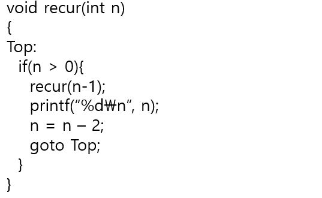

#### 재귀의 제거

꼬리 재귀와는 다르게 앞에서 호출한 재귀 함수의 제거는 쉽지 않은데 그 이유는 변수 n을 출력하기 전에 recur(n-1)을 먼저 수행해야하기 때문이다. n이 4인 경우 recur(3)의 처리가 완료되지 않으면 n의 값인 4를 저장해야한다. 이런 재귀 호출을 제거하기 위해서는 변수 n의 값을 잠시 저장해야하기 때문에 스택을 사용한다. 

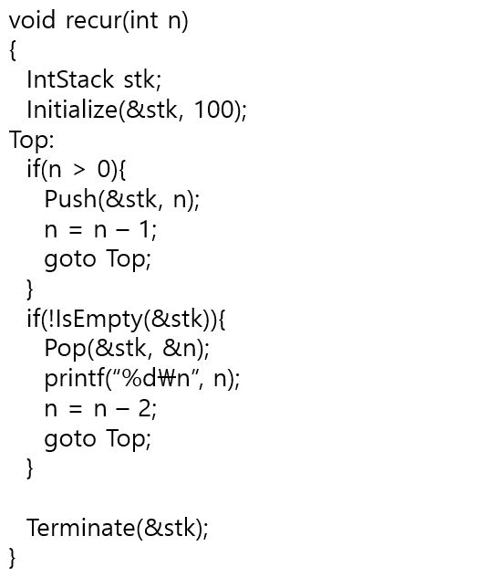

recur(4)를 호출하면 매개변수로 전달받은 값 4는 0보다 크므로 앞의 if 문에 의해 다음과 같은 과정이 진행된다. 

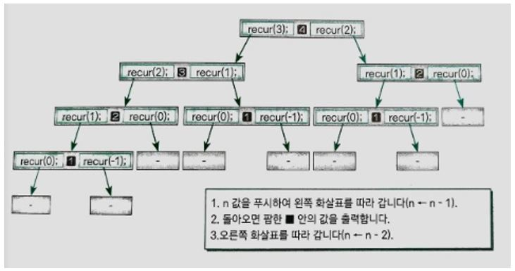

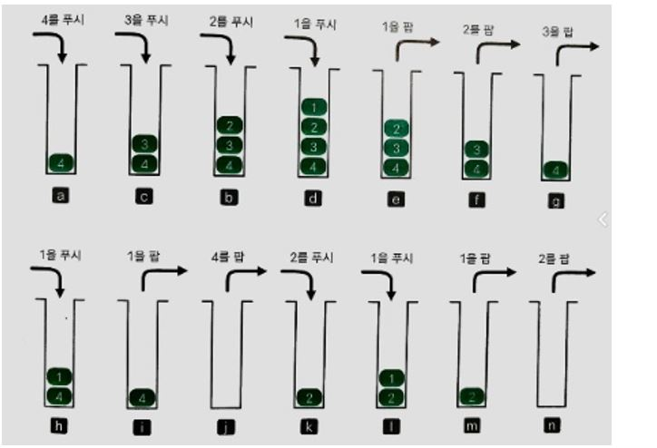

1. 4를 스택에 푸시한다. (a)
2. n의 값을 줄여 3으로 만든다.
3. goto문이 실행되어 레이블(Lable) Top으로 돌아간다.
4. 위 과정이 반복되어 스택에 4, 3, 2, 1이 쌓이게 된다. (c, b, d)
5. 마지막 스택에 1을 쌓은 뒤에 0이 되어 Top으로 돌아가면 앞쪽 if이 생략된다.
6. 뒤쪽 if문에 의해 스택에서 팝한 값 1을 n에 꺼내어 놓는다. (e)
7. n 값 1을 출력한다.
8. n 값을 2 줄여 -1로 만든다.
9. goto문이 실행되어 레이블 Top로 돌아간다. 

n이 0 이하가 되어 스택이 텅 비면 두 if문 모두 실행되지 않고 종료된다. 

## 하노이의 탑

### 하노이의 탑

하노이의 탑(Towers of Hanoi)은 작은 원반이 위에, 큰 원반이 아래에 위치할 수 있도록 원반 3개의 기둥 사이에서 옮기는 문제이다. 모든 원반은 크기가 다르고 처음에는 모든 원반이 이 규칙에 맞게 첫 번째 기둥에 쌓여 있다. 이 상태에서 모든 원반을 세 번째 기둥으로 최소의 횟수로 옮기면 된다. 원반은 1개씩만 옮길 수 있고 큰 원반을 작은 원반 위에 쌓을 수 있다.

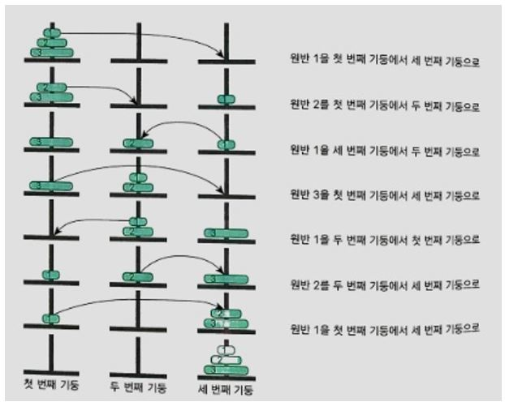

처음 원반이 놓인 기둥은 시작 기둥, 목적지의 기둥을 목표 기둥, 남은 중간 기둥을 중간 기둥이라고 하고, 원반 1과 원반 2가 겹친 것을 그룹이라고 한다면 다음과 같이 총 3단계로 작업이 완료된다. 

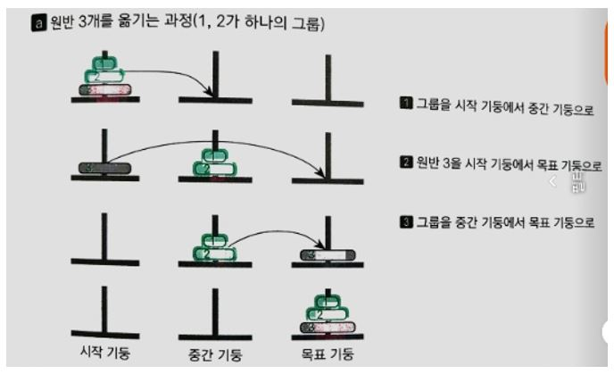

원반 1과 원반 2가 겹친 그룹을 옮기는 단계를 구체적으로 구현하는 방법은 원반 1을 그룹으로 보면 위와 똑같이 3단계로 구현할 수 있다. 

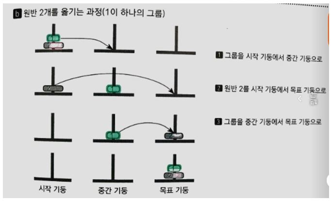

이 방법으로 원반이 N개인 하노이의 탑 문제를 해결할 수 있다.

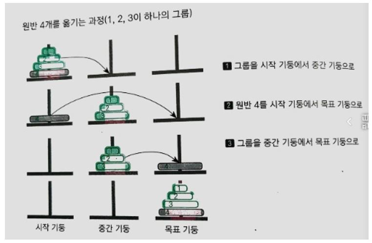

move(int no, int x, int y)는 원반[1] ~ 원반[no]를 x 기둥에서 y 기둥으로 옮긴다.

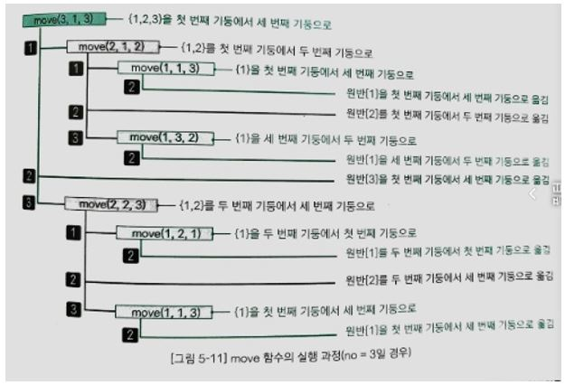

## 8퀸 문제

### 8퀸 문제란?

8퀸 문제(8-Queen problem)는 재귀 알고리즘에 대한 이해를 돕기 위한 예제로 자주 등장한다. 문제는 아래와 같다.

- 서로 공격하여 잡을 수 없도록 8개의 퀸을 8x8 체스판에 놓으시오.

다음은 하나의 해답을 나타낸다. 

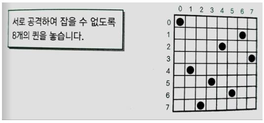

### 퀸 놓기

8개의 퀸을 놓는 모든 조합은 다음과 같다. 체스판은 64칸이므로 처음에 퀸을 1개 놓을 때는 64칸 중 아무 곳이나 선택할 수 있다. 다음 퀸을 놓을 때는 나머지 63칸에서 임의로 선택한다. 그렇게 8번째까지 생각하면 

- 64! / (64 - 8)! = 178,462,987,637,760

그런데 위의 모든 조합에 대해서 8퀸 문제의 조건을 만족하는지 검사하는 것은 현실적이지 않다. 퀸은 자신과 같은 열에 있는 다른 퀸을 공격할 수 있으므로 아래와 같은 규칙을 세울 수 있다.

- [규칙 1] 각 열에는 퀸을 1개만 배치한다. 

이렇게 하면 퀸을 놓는 조합의 수는 다음과 같다.

- 8 x 8C1 = 16,777,216

이렇게 해도 다음과 같이 8퀸 문제를 만족하는 경우의 수가 없다. 퀸은 자신과 같은 행에 있는 다른 퀸을 공격할 수 있기 때문이다. 

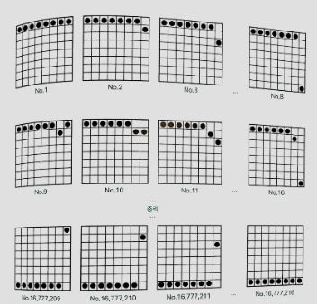

그래서 다음 규칙을 추가한다.

- [규칙 2] 각 행에 퀸을 1개만 배치한다. 

규칙 1과 규칙 2를 만족하는 경우의 일부는 다음과 같다. 

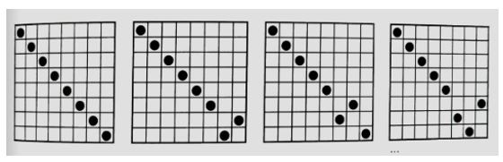

규칙 1을 만족하는 조합을 그림으로 나타내면 다음과 같다. 먼저 첫 번째 열에 놓을 수 있는 경우의 수는 8가지이고 첫 번째 줄의 첫 번째 열에 놓았을 때 다음 열에 놓을 수 있는 경우의 수는 8가지이므로 총 64가지 경우가 된다. 

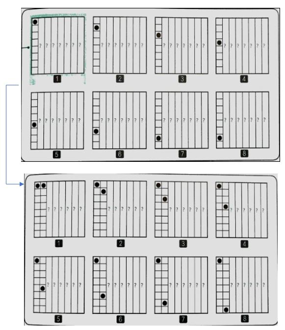

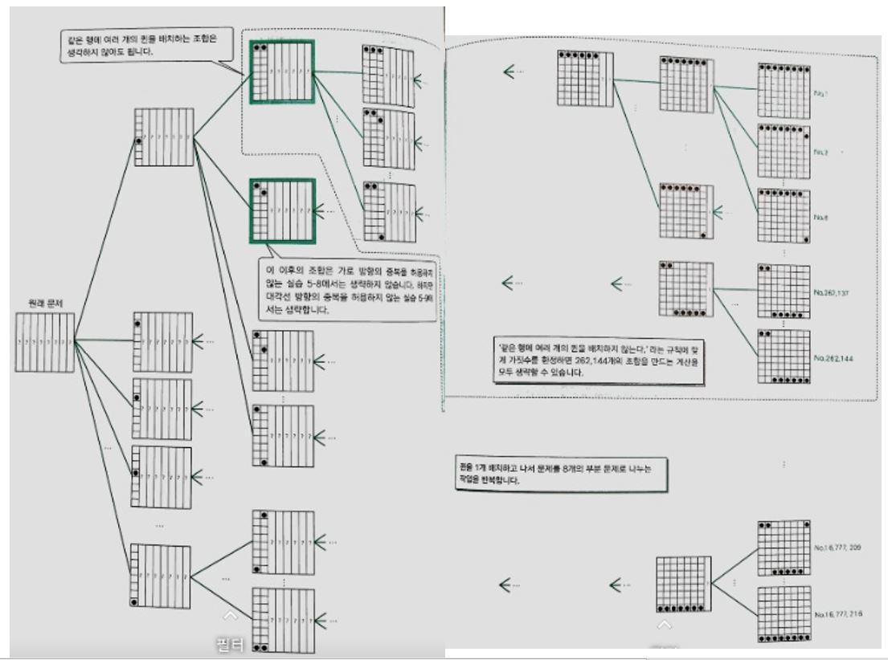

### 가지 뻗기

배열 pos는 퀸의 배치를 나타낸다. i열에 놓인 퀸의 위치가 j이면 pos[i]의 값을 j로 한다. 예를 들어 pos[0] = 0이면 0열의 퀸이 0행에 배치된 상태를 의미한다. 이때 set이라는, pos[i]에 0부터 7까지의 값을 순서대로 대입하여 i열에 퀸을 1개만 배치하는 8가지 조합을 만드는 재귀 함수를 정의한다. 매개변수 i는 퀸을 배치할 열이다. 

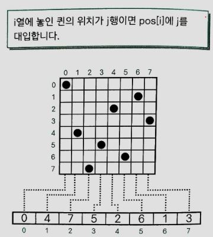

set(0)을 호출하면 0열에 1개의 퀸을 배치하는 8가지 조합을 for문으로 나열한다. j 값을 0부터 7까지 1씩 증가하며 set(i + 1)을 재귀 호출한다. i가 7이 되면 8개의 퀸이 모두 배치 되므로 print 함수를 호출하여 퀸이 배치된 위치를 출력한다. 이렇게 하면 규칙 1을 만족하는 모든 경우의 수(8 x 8C1)를 출력할 수 있다. 이렇게 가지를 뻗으며 퀸을 배치하는 방법을 가지 뻗기(Branching)라고 한다. 하노이의 탑이나 8퀸 문제처럼 문제를 세분하고 세분된 작은 문제의 풀이를 결합해 전체 문제를 풀이하는 기법을 분할 해결법(Divide and Conquer)이라고 한다.

### 분기 한정법

가지 뻗기로는 8퀸 문제의 답을 얻을 수 없다. 분기를 한정하기 위한 규칙 2를 적용해야 한다. flag라는 배열을 사용하는데 flag는 같은 행에 중복하여 퀸이 배치되는 것을 방지하기 위한 표시(flag)이다. j행에 퀸을 배치하면 flag[j]의 값을 1로 하고, 배치되지 않은 상태의 값은 0으로 한다. 0열에 퀸을 배치하기 위해 호출한 set 함수에서는 0행에 퀸을 배치한다. 0행에 퀸을 배치했기 때문에 flag[0]의 값을 1로 변경한다. 그런 다음 set 함수를 재귀적으로 호출한다. 이렇게 호출한 set 함수는 다음 1열에 퀸을 배치한다. 

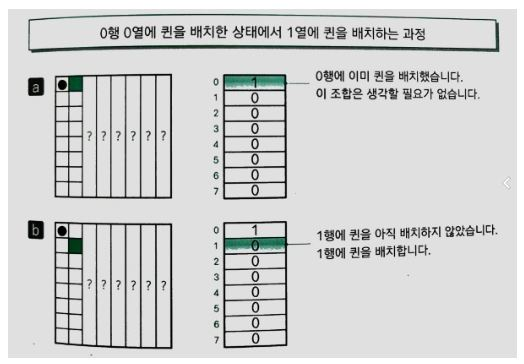

a. 0행에 퀸을 배치하는 방법으로 flag[0]의 값이 1이므로 이 행에는 더이상 배치하지 않는다. 그 결과 8 x 8C1의 모든 경우를 나타내는 그림의 점선으로 둘러쌓인 부분이 생략된다. 

b. 1행에 퀸을 배치하는 방법으로 flag[1]의 값이 0이므로 이 행에는 퀸을 배치한다. set 함수를 재귀 호출하여 다음 열인 2번째에 퀸을 배치한다. 

또 재귀 호출한 set(i + 1)함수가 끝나면 퀸을 j행에서 제거했기 때문에 flag[j]에 아직 배치하지 않았음르 나타내는 0을 대입한다. 이처럼 필요하지 않은 분기를 없애 불필요한 조합을 줄이는 방법을 한정(Bounding) 조작이라 하고, 가지 뻗기와 한정 조작을 조합하여 문제를 풀어 가는 방법을 분기 한정법(Branching and bounding method)이라고 한다. 

### 8퀸 문제를 푸는 프로그램

분기 한정법은 8룩 문제를 풀었다고는 할 수 있지만 8퀸 문제를 풀었다고 볼 수 없다. 퀸은 대각선 방향으로도 퀸을 1개만 배치해야 하기 때문에 이와 관련된 한정 조작을 추가해야 한다. flag_b와 flag_c는 '/' 방향과 '\\' 방향의 대각선 위에 퀸을 배치했는지 체크하는 배열이다.  

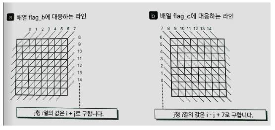

j행 i열에서 각각의 대각선 방행에 대해 퀸이 배치되었을 때 체크하는 배열의 인덱스는 flag_b[i + j]와 flag_c[i - j + 7]이다. 각 칸에 퀸의 배치를 체크할 때 같은 행에 배치했는지 판단하고 그런 다음 위 그림의 점선 위에 퀸을 배치했는지 검사한다. 