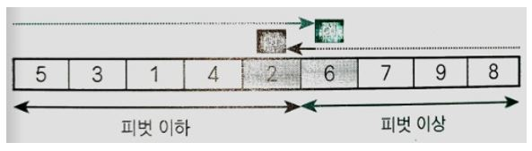

## 정렬	

### 정렬이란?

정렬(Sorting)은 데이터 집합을 핵심 항목(Key)의 대소관계에 따라 일정한 순서로 줄지어 늘어서도록 바꾸는 작업을 말한다. 이 알고리즘을 이용해 데이터를 정렬하면 검색을 더 쉽게 할 수 있다. 키 값이 작은 데이터를 앞쪽에 놓으면 오름차순(Ascending order) 정렬, 그 반대는 내림차순(Descending order) 정렬이라고 부른다. 

#### 정렬 알고리즘의 안정성

정렬 알고리즘은 안정된(Stable) 알고리즘과 그렇지 않은 알고리즘으로 나눌 수 있다. 안정된 정렬이란 같은 값의 키를 가진 요소의 순서가 정렬 전후에도 유지되는 것을 말한다. 안정되지 않은 알고리즘은 같은 값을 가진 요소인 경우 반드시 키값 순서대로 정렬되지는 않는다.

#### 내부 정렬과 외부 정렬

- 내부 정렬(Internal sorting) : 정렬할 모든 데이터를 하나의 배열에 저장할 수 있는 경우 사용.
- 외부 정렬(External sorting) : 정렬할 데이터가 너무 많아서 하나의 배열에 저장할 수 없을 때 사용.

#### 정렬 알고리즘의 핵심 요소

정렬 알고리즘의 핵심 요소는 교환, 선택, 삽입이며 대부분의 정렬 알고리즘은 이 세 가지 요소르 응용한다. 

## 버블 정렬

### 버블 정렬

오름차순으로 배열을 정렬하고자 할 때, 먼저 끝에 있는 두 요소 9와 8을 비교한다. 왼쪽의 값이 오른쪽의 값보다 작아야 하므로 9와 8의 위치를 바꿔준다. 그 다음으로 1과 8을 비교한다. 1은 8보다 작으므로 교환할 필요가 없다. 이렇게 이웃한 요소를 비교하고 교환하는 작업을 첫 번째 요소까지 계속한다. 요소의 개수가 n개인 배열에서 n-1회 비교, 교환을 하고 나면 가장 작은 요소가 맨 처음으로 이동한다. 이런 일련의 과정(비교, 교환 작업)을 패스(Pass)라고 한다.

이어서 배열의 2번째 이상의 요소에 대해서 패스를 수행한다. 이 패스를 수행하고 나면 3은 배열의 2번째 자리로 이동하고 두 요소의 정렬이 끝난다. 두 번째 패스의 비교 횟수는 첫 번째 패스보다 1회 적은 n-2회인데 패스를 수행할 때마다 정렬할 요소가 하나씩 줄어들기 때문이다. 모든 정렬이 끝나려면 n-1회의 패스가 수행되어야 한다(마지막 요소는 n-1번째 패스때 이미 끝에 놓이기 때문).

#### 버블 정렬 프로그램 

변수 i의 값을 0부터 n - 2까지 1씩 증가하며 n - 1회의 패스를 수행하는 프로그램은 위와 같다. 여기서 비교하는 두 인덱스를 j-1, j라 한다. 배열의 끝(오른쪽)부터 스캔하기 때문에 j의 시작 값을 n-1로 한다. 패스 과정을 수행하면서 j의 값을 1씩 감소시켜 맨 뒤부터 점점 앞의 요소를 조사한다. 각 패스에서 앞쪽 i개의 요소는 정렬이 끝난 상태라고 가정하기 때문에 한 번의 패스에서는 j의 값이 i + 1이 될 때까지 비교, 교환을 수행한다. 서로 한 칸 이상 떨어져 있는 요소를 교환하는 것이 아니라 서로 이웃한 요소에 대해서만 교환하므로 이 정렬 알고리즘은 안정적이라고 할 수 있다. 총 비교 횟수는 다음과 같다. 

- (n-1) + (n-2) + ... + 1 = n(n-1)/2

그러나 실제 요소를 교환하는 횟수는 배열의 요솟값에 더 많이 영향을 받기 때문에 교환 횟수의 평균 값은 비교횟수의 절반인 n(n-1)/4 이다. 또 C의 경우 swap을 하는 과정에서 값의 이동이 3회 발생하므로 이동 횟수의 평균은 3n(n-1)/4 회이다. 

#### 알고리즘 개선(1)

세 번째 패스를 마치고 나면 4가 3번째 자리에 위치한다.

네 번째 패스에서 비교는 하되, 교환하지는 않는다. 그 이유는 세 번째 패스에서 이미 6이 정렬을 마쳤기 때문이다. 마찬가지로 다섯 번째, 여섯 번째 패스에서도 요소 교환을 하지 않는다. 즉, 어떤 패스에서 요소의 교환 횟수가 0이면 더 이상 정렬할 요소가 없다는 뜻이기 때문에 정렬 작업을 멈추면 된다. 이는 각 패스를 시행하기 전에 교환 횟수를 카운트하는 변수를 0으로 초기화 하고 교환이 실행할 때마다 이 변수를 1씩 증가시킨다. 패스가 끝나고 이 변수의 값이 0이면 더이상 정렬할 요소가 없다는 뜻이기 때문에 정렬을 멈추는 것으로 구현할 수 있다. 

#### 알고리즘 개선(2)

9와 4를 교환하고 나서 {1, 3, 4} 요소는 정렬된 상태이다. 이렇게 각각의 패스에서 비교, 교환을 하다가 어떤 시점 이후에 교환이 수행되지 않는다면 그보다 앞쪽의 요소는 이미 정렬을 마찬 상태라고 볼 수 있다. 따라서 이 후의 패스에서는 두 번째 요소 이상에서 비교, 교환이 아니라 정렬된 요소 이후에 대해서 비교, 교환을 수행하면 된다. 

각 패스 이전에 마지막으로 교환한 두 요소 가운데 오른쪽 요소의 인덱스를 저장하기 위한 변수를 셋팅해 놓고 교환을 수행할 때마다 오른쪽 요소의 인덱스 값을 이 변수에 저장한다. 하나의 패스를 마치고 나면 이 인덱스 값 이후의 요소에 대해서만 비교, 교환을 진행하면 된다. 

## 단순 선택 정렬

단순 선택 정렬(Straight selection sort)은 가장 작은 요소부터 선택해 알맞은 위치로 옮겨서 순서대로 정렬하는 알고리즘이다.

### 단순 선택 정렬

단순 선택 정렬의 교환 과정은 아래와 같다.

- 아직 정렬하지 않은 부분에서 가장 작은 키의 값(a[min])을 선택한다.
- a[min]과 아직 정렬하지 않은 부분의 첫 번째 요소를 교환한다.

위 과정을 n - 1회 반복하면 된다. 단순 선택 정렬 알고리즘의 요솟값을 비교하는 횟수는 (n^2 - n) / 2회이다. 그런데 이 정렬 알고리즘은 서로 떨어져 있는 요소를 교환하는 것이기 때문에 안정적이지 않다. 아래 그림을 보면 값이 3인 요소가 중복해서(2개) 있을 때 두 요소의 순서가 뒤바뀌는 것을 알 수 있다(정렬 전 앞쪽 요소를 L, 뒤쪽 요소를 R이라고 했을 때).

## 단순 삽입 정렬

단순 삽입 정렬(Straight insertion sort)은 선택한 요소를 그보다 더 앞쪽의 알맞은 위치에 삽입하는 작업을 반복하여 정렬하는 알고리즘이다. 단순 선택 정렬과는 다르게 값이 가장 작은 요소를 선택해 알맞은 위치로 옮긴다. 

### 단순 삽입 정렬

정렬된 부분과 아직 정렬되지 않은 부분에서 배열이 다시 구성된다고 생각하면서 아래의 작업을 n - 1회 반복하면 정렬을 마치게 된다.

- 아직 정렬되지 않은 부분의 첫 번째 요소를 정렬된 부분의 알맞은 위치에 삽입한다.

즉 i를 1, 2, ..., n - 1로 1씩 증가시키며 인덱스가 i인 요소를 꺼내 알맞은 곳에 삽입한다. 

위 작업을 위해서 tmp에 a[i]를 대입(3을 선택)하고 반복 제어용 변수 j에 i - 1을 대입한 다음 아래의 두 조건 중 하나를 만족할 때까지 j를 1씩 감소하면서 대입하는 작업을 반복한다.

- 정렬된 열의 왼쪽 끝에 도달한다.
- tmp보다 작거나 같은 key를 갖는 항목 a[j]를 발견한다. 

이때 드모르간 법칙을 적용하면(반복문의 조건식을 위해서) 아래의 두 조건이 모두 성립할 때까지 반복한다. 

- j가 0보다 크다.
- a[j - 1]값이 tmp보다 크다.

위 과정을 마치고 난 다음에 요소 a[j]에 tmp를 대입하면 한 요소에 대한 단순 삽입 정렬을 마치게 된다. 이렇게 구현한 단순 삽입 정렬 알고리즘은 떨어져 있는 요소들이 서로 뒤바뀌지 않아 안정적이다. 요소의 비교횟수와 교환 횟수는 n^2/2회이다. 단순 삽입 정렬은 셔틀 정렬(Shuttle sort)이라고도 한다.

#### 단순 정렬의 시간 복잡도

세 가지 단순 정렬(버블, 선택, 삽입)의 시간 복잡도는 모두 O(n^2)이다(효율이 좋지 않다).

## 셸 정렬

### 단순 삽입 정렬의 특징

위의 그림을 보면 1~5까지는 정렬되어 있기 때문에 빨리 마칠 수 있지만 0을 삽입하려면 1~5를 옆으로 옮기는 작업이 필요하다. 다음은 단순 삽입 정렬의 특징을 정리한 것이다.

- 장점 : 정렬을 마쳤거나 정렬을 마친 상태에 가까우면 정렬 속도가 매우 빨라진다.
- 단점 : 삽입할 위치가 멀리 떨어져 있으면 이동(대입)해야 하는 횟수가 많아진다.

### 셸 정렬

셸 정렬(Shell sort)은 단순 삽입 정렬의 장점은 살리고 단점은 보완한 정렬 알고리즘으로, 도날드 셸(D. L. Shell)이 고안하여 셸 정렬이라고 한다.  먼저 정렬할 배열의 요소를 그룹으로 나눠 각 그룹별로 단순 삽입 정렬을 수행하고, 그 그룹을 합치면서 정렬을 반복하여 요소의 이동 횟수를 줄인다. 

먼저 배열을 4개의 그룹으로 ({8, 7}, {1, 6}, ...)으로 나누고 각 그룹별로 정렬한다. 위와 같이 4칸만큼 떨어진 요소를 모아 그룹을 4개로 나누어 정렬하는 방법을 4-정렬이라고 한다. 정렬을 완전히 마치지는 않았지만 정렬을 마친 상태에 가까워진다. 

다음으로 4-정렬을 마친 상태에서 2칸만큼 떨어진 요소를 모아 두 그룹({7, 3, 8, 4}, {1, 2, 5, 6})으로 나누어 2-정렬을 한다. 이렇게 해서 얻은 배열은 좀 더 정렬된 상태에 가까워진다. 마지막으로 1-정렬을 적용하면 정렬을 마치게 된다. 

셸 정렬 과정에서 각각의 정렬을 h-정렬이라고 한다. 위의 경우, h 값을 4, 2, 1로 감소하면서 7회의 정렬로 정렬을 마치게 된다.

1. 2개 요소에 대해 4-정렬을 한다(4개의 그룹).
2. 4개 요소에 대해 2-정렬을 한다(2개의 그룹).
3. 8개 요소에 대해 1-정렬을 한다(1개의 그룹).

이렇게 하면 정렬해야 하는 횟수는 늘지만 전체적으로는 요소 이동 횟수가 줄어들어 효율적인 정렬을 할 수 있다. 

#### 증분값(h 값)의 선택

h값은 n부터 감소하여 마지막에 1이 된다. 앞에서 했던 배열을 그룹으로 나누는 과정은 다음과 같다.

먼저 b처럼 학생을 2명씩 4개의 그룹으로 나누어 정렬하고 c처럼 학생을 4명씩 2개의 그룹으로 나누어 다시 정렬한다. 여기서 b의 2개의 그룹을 각각 합치면 c의 그룹이 된다. 즉 초록색 그룹과 회색 그룹은 섞이지 않는다. 그런데 이렇게 섞이지 않으면 c를 합쳤을 때 다시 처음 단계인 a와 동일해진다. 이런 문제를 해결하기 위해서는 h 값이 서로 배수가 되지 않도록 해야 한다. 이렇게 하면 요소가 충분히 섞여 효율적인 정렬으 기대할 수 있다. 다음의 수열을 사용하면 셸 정렬 알고리즘을 간단히 만들 수 있을 뿐만 아니라 효율적인 결과도 얻을 수 있다. 

- h = ..., 121, 40, 13, 4, 1 (1부터 시작하여 3배한 값에 1을 더하는 수열)

h의 초기값은 너무 크면 효과가 없기 때문에 배열의 요소 개수 n을 9로 나눈 값을 넘지 않도록 해야 한다. 셸 정렬의 시간 복잡도는 O(n^1.25)이지만 멀리 떨어져 있는 요소를 교환해야 하므로 안정적이지는 않다. 

## 퀵정렬

퀵 정렬(Quick sort)은 일반적으로 아주 빠른 정렬 알고리즘이다. 정렬 속도가 매우 빠른 데서 착안한 찰스 앤터니 리처드 호어(C. A. R. Hoare)가 직접 붙인 이름이다. 

학생 수가 8명인 그룹을 키순대로 정렬하기 위한 방법으로 먼저 어느 한 사람의 키를 선택한다. 키가 168cm인 학생 A를 선택할 경우 그 학생을 기준으로 학생 A의 키보다 작은 사람의 그룹과 큰 사람의 그룹으로 나눈다. 이때 이 학생 A를 피벗(Pivot)이라고 한다. 퀵 정렬은 각 그룹에 대해 피벗 설정과 그룹 나눔을 반복하며 모든 그룹이 1명이 되면 정렬을 마친다(피벗은 마음대로 선택할 수 있으며 왼쪽 그룹과 오른쪽 그룹 어디에 들어가도 상관 없다).

### 배열을 두 그룹으로 나누기

###  

위의 배열에서 피벗으로 6을 선택하여 나눈다고 가정한다. 피벗을 x, 왼쪽 끝 요소의 인덱스 pl을 왼쪽 커서, 오른쪽 끝 요소의 인덱스 pr를 오른쪽 커서라고 한다. 그룹을 나누려면 피벗 이하의 요소를 배열 왼쪽으로, 이상의 요소를 배열 오른쪽으로 옮겨야 한다. 이렇게 하려면 아래의 작업을 수행해야 한다.

1. a[pl] >= x가 성립하는 요소를 찾을 때까지 pl을 오른쪽으로 옮긴다.
2. a[pr] <= x가 성립하는 요소를 찾을 때까지 pr을 왼쪽으로 옮긴다.

여기서 pl과 pr 커서가 가리키는 요소의 값을 교환한다. 그러면 피벗 이하의 값은 왼쪽으로, 피벗 이상의 값은 오른쪽으로 이동한다.

마찬가지로 스캔을 진행하다가 pl과 pr이 가리키는 요소의 값을 교환한다.

스캔을 계속하다보면 위처럼 두 커서가 교차하게 된다. pl과 pr이 교차하면 그룹을 나누는 과정이 끝나고 배열은 아래처럼 나누어진다.

- 피벗 이하의 그룹: a[0], ..., a[pl - 1]
- 피벗 이상의 그룹: a[pr + 1], ..., a[n - 1]

또 아래와 같은 그룹이 생길 수 있다.

- 피벗과 일치하는 값을 가지는 그룹: a[pr + 1], ..., a[pl - 1]

e와 같이 동일한 요소를 교환하는 시도를 줄이기 위해서는 요소를 교환하기 전에 pl, pr이 동일한 요소 위에 있는지 매번 검사해야 한다. 

### 퀵 정렬

요소가 9개인 배열을 나누면 a처럼 두 그룹으로 나누어진다. 이 두 그룹을 같은 방법으로 나누면 역시 b와 c처럼 두 그룹으로 나누어진다. 요소가 1개인 그룹은 더 이상 그룹을 나눌 필요가 없으므로 요소의 개수가 2개 이상인 그룹만 나누면 된다. 따라서 아래처럼 배열을 반복해서 나누게 된다.

1. pr이 a[0]보다 오른쪽에 있으면(left < pr) 왼쪽 그룹을 나눈다.
2. pl이 a[n - 1]보다 왼쪽에 있으면(pl < right) 오른쪽 그룹을 나눈다.

이때 가운데 그룹은 나눌 필요가 없다. 즉, 분할 대상에서 제외된다. left < pr, pl < right는 모두 그룹의 개수가 2개 이상인 그룹만 나누기 위해 필요한 조건으로 1개인 경우에는 성립하지 않는 조건이다.

### 비재귀적인 퀵 정렬

비재귀적인 행렬에서 데이터를 임시 저장하기 위해서 스택을  사용한다. quick 함수는 2개의 스택을 사용한다.

- lstack - 나눌 범위의 왼쪽 끝 요소의 인덱스를 저장하는 스택
- rstack - 나눌 범위의 오른쪽 끝 요소의 인덱스를 저장하는 스택

1.  lstack에 left(0), rstack에 right(8) 값을 푸시한다. - a 
2. lstack에서 팝한 값을 left에 대입한 다음 그 left 값을 다시 pl에 대입한다(rstack도 비슷한 과정). left와 pl은 0, right와 pr의 값은 8이 된다. 이 값으로 정렬할 배열의 범위를 설정하면 왼쪽 그룹({0, 4})과 오른쪽 그룹({5, 8})로 나누어진다. - b
3. lstack, rstack에 0, 4를 푸시하고 나서 5, 8를 각각 푸시한다. - c
4. 위의 과정을 반복한다. 

#### 스택의 용량

비재귀적인 퀵 정렬에서 스택의 용량을 배열의 요소 개수로 초기화 한다. 

구현된 코드에 따르면 배열의 범위를 나누고나서 나눠진 왼쪽 범위를 먼저 스택에 푸시하게 된다.

스택에 쌓인 데이터가 가장 많을 때는 e와 h일때이다. 이때 배열을 나눈 뒤에 얻는 왼쪽 그룹, 오른쪽 그룹의 개수를 비교하여 그 많고 적음에 따라 푸시 순서를 바꾸면 스택에 쌓이는 데이터의 개수를 조절할 수 있다. 푸시 순서는 다음과 같이 두 가지 방법을 사용할 수 있다.

- 요소의 개수가 많은 그룹을 먼저 푸시
- 요소의 개수가 적은 그룹을 먼저 푸시

| 요소의 개수가 많은 그룹을 먼저 푸시  | 요소의 개수가 적은 그룹을 먼저 푸시  |
| ------------------------------------ | ------------------------------------ |
|  |  |

일반적으로 요소의 개수가 적은 배열일수록 적은 횟수로 분할을 종료할 수 있다. 따라서 1번과 같이 요소의 개수가 많은 그룹을 나누기보다는 요소의 개수가 적은 그룹을 먼저 나누면 스택에 쌓여 있는 데이터의 최대 개수를 줄일 수 있다. 두 가지 케이스 모두 스택에 넣고 꺼내는 횟수는 같지만 스택에 쌓이는 데이터의 최대 개수는 달라진다. 1번의 경우 배열의 요소 개수가 n이라고 하면 스택에 쌓이는 데이터의 최대 개수는 log n보다 적다. 

#### 피벗 선택하기

다음의 방법을 선택하여 피벗을 선택하면 적어도 최악의 경우는 피할 수 있다.

- 방법 1 : 나눌 배열의 요소 개수가 3 이상이면 임의로 3 요소를 선택하고 그 중에서 중앙값인 요소를 피벗으로 선택한다. 즉 중간 크기의 값을 피벗으로 한다. 

방법 1을 조금 더 발전시킨 아이디어는 다음과 같다.

- 방법 2: 나눌 배열의 처음, 가운데, 끝 요소를 정렬한 다음 가운데 요소와 끝에서 두 번째 요소를 교환한다. 피벗으로 끝에서 두 번째 요소 값(a[right - 1])을 선택하여 나눌 대상의 범위를 a[left + 1] ~ a[right - 2]로 좁힌다. 

- a - 정렬하기 전 상태에서 첫, 가운데, 끝 요소를 정렬한다. 
- b -  a에서 정렬한 상태에서 가운데 요소와 끝에서 두 번쨰 요소를 교환한다. 
- c - 끝에서 두 번째 요소를 피벗으로 한다. a[left]는 피벗 이하의 값이고 a[right - 1]과 a[right]는 피벗 이상의 값이다.

위의 과정을 거치면 커서의 시작 위치가 다음과 같이 바뀐다.

- 왼쪽 커서 pl의 시작 위치 : left -> left + 1
- 오른쪽 커서 pr의 시작 위치 : right -> right - 2

위의 방법은 나눌 그룹의 크기가 한쪽으로 치우치는 것을 피하면서도 나눌때 스캔할 요소를 3개씩 줄일 수 있다는 장점이 있다. 

#### 시간 복잡도

퀵 정렬은 배열을 조금씩 나누어 보다 작은 문제를 해결하는 과정을 반복하므로 시간 복잡도는 O(nlogn)이다. 다만 정렬할 배열의 초깃값이나 피벗의 선택 방법에 따라 시간 복잡도가 증가하는 경우가 있다. 예를 들어 매번 단 하나의 요소와 나머지 요소로 나누어지면 n번의 분할이 필요하므로 최악의 경우 O(n^2)이 된다. 

#### qsort 함수 사용해 정렬하기

qsort 함수는 bsearch 함수와 마찬가지로 int형이나 double 형 등의 배열뿐만 아니라 구조체형 배열 등의 모든 자료형의 배열에 적용할 수 있다. 함수 이름은 퀵 정렬을 연상시키나 내부적으로 항상 퀵 정렬 알고리즘을 사용하지는 않는다. 인자 중 비교 함수는 다음과 같으며 직접 작성해야 한다.

- 첫 번째 인수가 가리키는 값이 더 작은 경우 음수 값(-1)을 반환한다.
- 같은 경우 0을 반환한다.
- 클 경우 양수 값(1)을 반환한다. 

내림차순으로 정렬하고 싶다면 반환 값을 위와 반대로 한다. 

qsort함수는 같은 키 값을 가지고 있는 데이터가 2개 이상인 경우에 이름의 오름차순으로 정렬이 되기는 하지만 정렬 전후의 데이터가 같은 순서를 유지하지는 않는다(안정된 정렬은 아니다).

## 병합 정렬

병합 정렬(Merge sort)은 배열을 앞부분과 뒷부분으로 나누어 각각 정렬한 다음 병합하는 작업을 반복하여 정렬을 수행하는 알고리즘이다.

### 정렬을 마친 배열의 정합

정렬을 마친 두 배열의 병합(Merge)는 다음과 같다.

각 배열에서 선택한 요소의 값을 비교하여 작은 값의 요소를 꺼내 새로운 배열에 넣는 작업을 반복하여 정렬을 마치는 배열을 만든다. merge 함수는 요소의 개수가 na개인 배열 a와 요소의 개수가 nb개인 배열 b를 병합하여 배열 c에 저장한다. 배열 a, b, c를 스캔할 때 선택한 요소의 인덱스는 pa, pb, pc이다. 처음에는 첫 요소를 선택하므로 이 커서를 모두 0으로 초기화 한다. 

1.  b[pb]의 1이 a[pa]보다 작으므로 c[pc]에 b[pb]의 값을 대입하고 pb와 pc의 값을 1씩 증가시킨다. 이런 작업을 커서 pa 혹은 pb가 가각 배열의 끝에 도달할 때까지 시행한다.
2. 아직 남아있는(커서가 배열의 끝에 도달하지 못한) 원소들을 배열 c에 복사한다.

### 병합 정렬

정렬을 마친 배열의 병합을 응용하여 분할 정복법에 따라 정렬한다. 

이때 나눠지는 범위들은 더 작은 범위들의 병합으로 구성된다. 

#### 병합 정렬 알고리즘

병합 정렬 알고리즘의 순서는 배열의 요소 개수가 2개 이상인 경우 다음과 같다.

1. 배열의 앞부분을 병합 정렬로 정렬한다.
2. 배열의 뒷부분을 병합 정렬로 정렬한다.
3. 배열의 앞부분과 뒷부분을 병합한다.

정렬을 마친 앞부분과 뒷부분의 병합은 작업용 배열 buff를 사용해서 구현할 수 있다.

병합 순서는 다음과 같다.

|  |
| ------------------------------------ |
|  |
|  |

1. 배열의 앞부분(a[left] \~ a[center])을 buff[0] \~ buff[center - left]로 복사한다. for 문이 끝날 때 p의 값은 복사한 요소의 개수 center - left + 1이 된다(그림 a).
2. 배열의 뒷부분(a[center + 1]  \~ a[right])과 buff로 복사한 배열의 앞부분 p개를 병합한 결과를 배열 a에 저장한다(그림 b).
3. 배열 buff에 남아 있는 요소를 배열 a로 복사한다(그림 c).

배열 병합의 시간 복잡도는 O(n)이고 데이터의 요소 개수가 n개일 때, 병합 정렬의 단계는 log n만큼 필요하므로 전체 시간 복잡도는 O(n logn)이라고 할 수 있다. 병합 정렬은 서로 떨어져 있는 요소를 교환하는 것이 아니므로 안정적인 정렬 방법이라고 할 수 있다. 

### 힙 정렬

선택 정렬을 응용한 알고리즘인 힙 정렬(Heap sort)은 힙(heap)의 특성을 이용하여 정렬을 수행한다.

### 힙이란?

힙은 부모의 값이 항상 자식의 값보다 크다 혹은 부모의 값이 항상 자식의 값보다 작다는 조건을 만족하는 완전이진트리이다(부모와 자식 요소의 관계만 일정하면 된다). 

a의 완전이진트리를 b와 같이 최대 힙으로 만들 수 있다. 이때 부모의 값은 항상 자식의 값과 같거나 크므로 힙의 가장 위쪽에 있는 루트가 가장 큰 값이 된다.  힙에서 부모와 자식 관계는 일정하지만 형제 사이의 대소 관계는 일정하지 않다. 

힙의 요소를 배열에 저장하는 과정은 위와 같다. 먼저 가장 위쪽에 있는 루트 노드의 값을 a[0]에 넣는다. 그리고 한 단계 아래 요소를 왼쪽에서 오른쪽으로 따라 삽입한다. 이 과정을 거쳐 힙의 요소를 배열에 저장하면 부모와 자식의 인덱스 사이에 다음과 같은 관계가 성립한다.

- 부모는 a[(i -1)/2], 왼쪽 자식은 a[i\*2 + 1], 오른쪽 자식은 a[i\*2 + 2]

### 힙 정렬

힙 정렬은 가장 큰 값이 루트에 위치하는 특징을 이용하는 정렬 알고리즘이다. 힙에서 가장 큰 값이 루트를 꺼내는 작업을 반복하고 그 값을 늘어 놓으면 배열은 정렬을 마치게 된다. 즉, 힙 정렬은 선택 정렬을 응용하여 힙에서 가장 큰 값인 루트를 꺼내고 남은 요소에 다시 가장 큰 값을 구해야 한다. 따라서 큰 값을 꺼내고 나머지 요소로 만든 트리를 힙의 형태를 유지할 수 있도록 재구성해야 한다.

#### 루트를 없애고 힙 상태 유지하기

|  |
| ------------------------------------ |
|  |
|  |
|  |

1. 루트를 꺼낸다.
2. 마지막 요소를 루트로 이동한다.
3. 자기보다 큰(작은) 값을 가지는 가지는 자식 요소와 자리를 바꾸며 아래쪽으로 내려가는 작업을 반복한다. 이떄 자식의 값이 작거나(크거나) 잎에 다다르면 작업이 종룔된다. 

이때 2, 3번의 과정을 통해 완전이진트리를 힙의 형태로 바꾸는 과정을 Heapify라고 한다.

#### 힙 정렬 알고리즘 살펴보기

|  |
| ------------------------------------ |
|  |
|  |
|  |

1. 변수 i의 값을 n - 1로 초기화 한다.
2. a[0]과 a[i]를 바꾼다.
3. a[0], a[1], ..., a[i - 1]을 힙으로 만든다.
4. i의 값을 1씩 줄여 0이 되면 끝이 난다. 그렇지 않으면 2로 돌아간다.