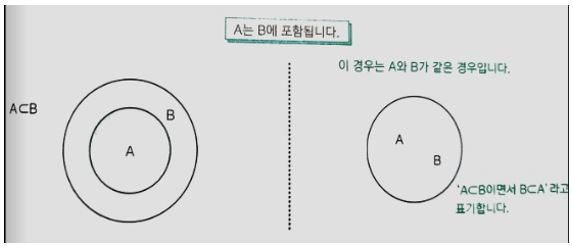
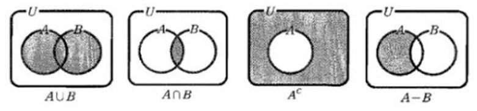
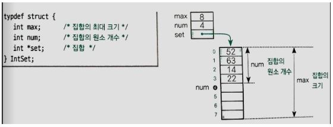
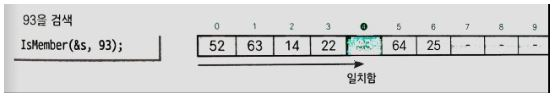
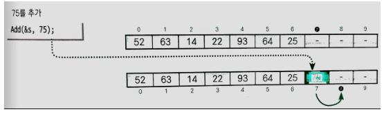
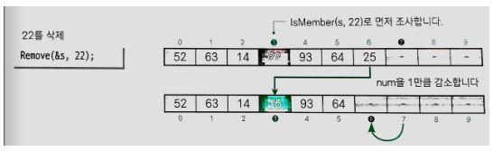

## 집합

### 집합과 원소

집합(Set)이란 객관적으로 범위를 규정하여 명확한 조건을 만족하는 자료의 모임을 의미한다. 집합도 자료구조로 표현할 수 있다. 집합 안에서 각각의 자료를 원소(Element)라고 부른다. 예를 들어 집합 X의 원소가 1, 5라면 다음과 같이 표현한다. 집합에는 순서가 없다.

- X = {1, 5} = {5, 1}

집합에 포함되는 원소는 유일해야하며 원소로 집합을 가질 수 없다(원소의 중복을 허용하는 집합은 다중 집합이라고 하며, 집합과 구별해서 부른다). 

a가 집합 X의 원소이면 a는 X에 포함된다 혹은 a는 X에 들어 있다 혹은 a는 X에 속한다라고 말하며 다음과 같이 표기한다.

- a ∈ X 또는 X ∋ a 

두 집합 X, Y가 같은 원소로 구성될 때 X와 Y는 서로 같다라고 말하고 다음과 같이 표기한다.

- X = Y 또는 Y = X

정수의 집합처럼 원소의 개수가 무한한 집합을 무한집합이라고 하고 이와 달리 원소의 개수가 유한한 집합을 유한집합이라고 한다. 유한집합 X(원소의 개수 n개)와 무한집합 Y의 원소의 개수는 다음과 같이 표기한다.

- n(X) = n
- n(Y) = ∞

원소가 없는 집합 X(n(X) = 0)도 집합이고 이런 집합을 공집합(Empty set)이라고 하며 ∅(파이)라는 기호로 표기한다.

### 부분집합과 진부분집합

#### 부분집합

A = {1, 3}, B = {1, 3, 5}와 같이 집합 A의 모든 원소가 집합 B의 원소이면 A는 B의 부분집합(Subset)이고 A는 B에 포함된다고 말하며 다음과 같이 표기한다.

- A ⊂ B 또는 B ⊃ A

A = {1, 3, 5}, B = {1, 3, 5}와 같이 A와 B가 서로 같은 경우 A와 B는 서로 부분집합 관계가 된다.

- A ⊂ B 그리고 B ⊂ A

#### 진부분집합

집합 A의 모든 원소가 집합 B의 원소이면서 집합 A와 B가 같지 않을 때 A는 B의 진부분집합(Proper subset)이다라고 하며 다음과 같이 표기한다.

- A ⊊ B

### 집합의 연산

#### 합집합

집합 A와 B 가운데 적어도 한쪽에 속하는 원소의 집합을 A와 B의 합집합이라고 하며 A ∪ B로 표기한다.

#### 교집합

집합 A, B 양쪽 모두에 속하는 원소의 집합을 A와 B의 교집합이라 하고 A ∩ B로 표기한다. A와 B 사이에 겹치는 원소가 없으면 A ∩ B = ∅(공집합)으로 표기한다.

#### 차집합

집합 A의 원소 가운데 집합 B의 원소를 제외한 원소의 집합을 차집합이라 하고 A - B로 표기한다. 

#### 여집합

집합 A의 원소를 제외한 모든 원소의 집합을 여집합이라고 하고 A^c로 표기한다. 

## 배열로 집합 만들기

### 배열로 집합 만들기

모든 원소가 같은 자료형으로 구성된 집합은 배열로 표현할 수 있다. 예를 들어 정수로 이루어진 {1, 2, 3, 4, 5, 6, 7, 8}은 요소의 개수가 8개인 int형 배열 안에 넣을 수 있다. 그런데 배열을 사용하여 집합을 표현하려면 집합의 원소 개수와 배열의 요소 개수는 항상 같아야 한다. 즉, 집합의 상태를 표현할 데이터가 필요하다. 따라서 다음과 같이 집합을 표현하는 배열과 이 배열의 정보(집합의 최대 크기, 집합의 원소 개수)를 담은 구조체를 함께 사용한다. 

#### 배열을 초기화하는 Initialize 함수

Initialize 함수는 집합을 표현할 배열을 만드는 등의 준비 작업을 수행한다. 초기 상태의 집합은 공집합이므로 num의 값을 0으로 한다. 그리고 요소의 최대 개수가 max개인 배열 본체(set)을 만들고 매개변수 max로 전달받은 값을 멤버 max에 복사한다.

#### 원소가 들어 있는지 확인하는 IsMember 함수

IsMember 함수는 배열 set에 n이라는 값을 가진 원소가 들어 있는지 확인한다. 배열을 처음부터 스캔해 검색에 성공하면 찾은 요소의 인덱스를 반환하고, 실패하면 -1을 반환한다. 

#### 원소를 추가하는 Add 함수

Add 함수는 집합에 원소 n을 추가하는 함수이다. 배열에 공간이 있고 집합에 같은 원소 n이 들어 있지 않은 경우에만 원소를 추가한다. 추가하는 과정은 간단히 set[num]에 n을 대입하고 num을 1만큼 증가시키면 된다.

#### 원소를 삭제하는 Remove 함수

Remove 함수는 집합에서 원소 n을 삭제하는 함수이다. 삭제는 집합에 n이 들어 있는 경우에만 수행한다. 예를 들어서 22를 삭제하려면 IsMember 함수로 22가 멤버인지 조사하고 반환 값을 idx에 대입한다. 그런 다음 num을 1만큼 감소시키고 끝 요소를 삭제한 위치로 복사한다. 

