## 집합

### 집합과 원소

집합(Set)이란 객관적으로 범위를 규정하여 명확한 조건을 만족하는 자료의 모임을 의미한다. 집합도 자료구조로 표현할 수 있다. 집합 안에서 각각의 자료를 원소(Element)라고 부른다. 예를 들어 집합 X의 원소가 1, 5라면 다음과 같이 표현한다. 집합에는 순서가 없다.

- X = {1, 5} = {5, 1}

집합에 포함되는 원소는 유일해야하며 원소로 집합을 가질 수 없다(원소의 중복을 허용하는 집합은 다중 집합이라고 하며, 집합과 구별해서 부른다). 

a가 집합 X의 원소이면 a는 X에 포함된다 혹은 a는 X에 들어 있다 혹은 a는 X에 속한다라고 말하며 다음과 같이 표기한다.

- a ∈ X 또는 X ∋ a 

두 집합 X, Y가 같은 원소로 구성될 때 X와 Y는 서로 같다라고 말하고 다음과 같이 표기한다.

- X = Y 또는 Y = X

정수의 집합처럼 원소의 개수가 무한한 집합을 무한집합이라고 하고 이와 달리 원소의 개수가 유한한 집합을 유한집합이라고 한다. 유한집합 X(원소의 개수 n개)와 무한집합 Y의 원소의 개수는 다음과 같이 표기한다.

- n(X) = n
- n(Y) = ∞

원소가 없는 집합 X(n(X) = 0)도 집합이고 이런 집합을 공집합(Empty set)이라고 하며 ∅(파이)라는 기호로 표기한다.

### 부분집합과 진부분집합

#### 부분집합

A = {1, 3}, B = {1, 3, 5}와 같이 집합 A의 모든 원소가 집합 B의 원소이면 A는 B의 부분집합(Subset)이고 A는 B에 포함된다고 말하며 다음과 같이 표기한다.

- A ⊂ B 또는 B ⊃ A

A = {1, 3, 5}, B = {1, 3, 5}와 같이 A와 B가 서로 같은 경우 A와 B는 서로 부분집합 관계가 된다.

- A ⊂ B 그리고 B ⊂ A

#### 진부분집합

집합 A의 모든 원소가 집합 B의 원소이면서 집합 A와 B가 같지 않을 때 A는 B의 진부분집합(Proper subset)이다라고 하며 다음과 같이 표기한다.

- A ⊊ B

### 집합의 연산

#### 합집합

집합 A와 B 가운데 적어도 한쪽에 속하는 원소의 집합을 A와 B의 합집합이라고 하며 A ∪ B로 표기한다.

#### 교집합

집합 A, B 양쪽 모두에 속하는 원소의 집합을 A와 B의 교집합이라 하고 A ∩ B로 표기한다. A와 B 사이에 겹치는 원소가 없으면 A ∩ B = ∅(공집합)으로 표기한다.

#### 차집합

집합 A의 원소 가운데 집합 B의 원소를 제외한 원소의 집합을 차집합이라 하고 A - B로 표기한다. 

#### 여집합

집합 A의 원소를 제외한 모든 원소의 집합을 여집합이라고 하고 A^c로 표기한다. 

## 배열로 집합 만들기

### 배열로 집합 만들기

모든 원소가 같은 자료형으로 구성된 집합은 배열로 표현할 수 있다. 예를 들어 정수로 이루어진 {1, 2, 3, 4, 5, 6, 7, 8}은 요소의 개수가 8개인 int형 배열 안에 넣을 수 있다. 그런데 배열을 사용하여 집합을 표현하려면 집합의 원소 개수와 배열의 요소 개수는 항상 같아야 한다. 즉, 집합의 상태를 표현할 데이터가 필요하다. 따라서 다음과 같이 집합을 표현하는 배열과 이 배열의 정보(집합의 최대 크기, 집합의 원소 개수)를 담은 구조체를 함께 사용한다. 

#### 배열을 초기화하는 Initialize 함수

Initialize 함수는 집합을 표현할 배열을 만드는 등의 준비 작업을 수행한다. 초기 상태의 집합은 공집합이므로 num의 값을 0으로 한다. 그리고 요소의 최대 개수가 max개인 배열 본체(set)을 만들고 매개변수 max로 전달받은 값을 멤버 max에 복사한다.

#### 원소가 들어 있는지 확인하는 IsMember 함수

IsMember 함수는 배열 set에 n이라는 값을 가진 원소가 들어 있는지 확인한다. 배열을 처음부터 스캔해 검색에 성공하면 찾은 요소의 인덱스를 반환하고, 실패하면 -1을 반환한다. 

#### 원소를 추가하는 Add 함수

Add 함수는 집합에 원소 n을 추가하는 함수이다. 배열에 공간이 있고 집합에 같은 원소 n이 들어 있지 않은 경우에만 원소를 추가한다. 추가하는 과정은 간단히 set[num]에 n을 대입하고 num을 1만큼 증가시키면 된다.

#### 원소를 삭제하는 Remove 함수

Remove 함수는 집합에서 원소 n을 삭제하는 함수이다. 삭제는 집합에 n이 들어 있는 경우에만 수행한다. 예를 들어서 22를 삭제하려면 IsMember 함수로 22가 멤버인지 조사하고 반환 값을 idx에 대입한다. 그런 다음 num을 1만큼 감소시키고 끝 요소를 삭제한 위치로 복사한다. 

#### 집합의 크기를 조사하는 Capacity 함수

Capacity 함수는 집합의 최대 원소의 개수를 반환하는 함수로, 멤버 max 값을 반환한다.

#### 집합의 원소 개수를 조사하는 Size 함수

Size 함수는 집합의 원소 개수를 반환하는 함수로, 멤버 num 값을 반환한다.

#### 집합을 복사하는 Assign 함수

Assign 함수는 한 집합을 다른 집합으로 복사하는 함수다. 

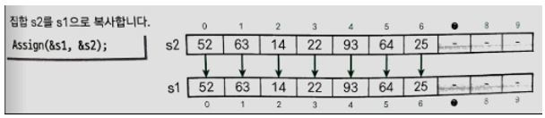

복사 원본(s2)의 원소 개수(s2->num)가 복사할 대상의 집합 크기(s1->num)보다 큰 경우에는 복사할 대상의 집합 크기(s1->max)에 대한 원소만큼만 복사한다. 실제로 복사할 원소의 개수는 다음과 같이 구할 수 있다.

- int n = (Capcity(s1) < size(s2)) ? Capacity(s1) : Size(s2);

#### 두 집합이 같은지 조사하는 Equal 함수

Equal 함수는 s1과 s2가 같은지 판단하는 함수이다. 같으면 1을, 그렇지 않으면 0을 반환한다. 

- 원소 개수가 같지 않은 경우 : 두 집합은 같지 않은 것으로 판단하고 0을 반환한다.
- 원소 개수가 같은 경우 : Counter variable을 1씩 증가시켜 집합 s1의 원소가 집합 s2에 들어 있는지 조사한다. 원소가 발견되지 않으면 두 집합은 서로 같지 않은 것으로 판단한다. 

#### 두 집합의 합집합을 구하는 Union 함수

Union 함수는 집합 s2, s3의 합집합을 구해 s1에 대입하는 함수다. 먼저 Assign 함수로 집합 s2를 s1에 복사한 다음 s3의 모든 원소를 하나씩 s1에 추가한다. Union 함수는 s1의 포인터를 반환한다. 

#### 두 집합의 교집합을 구하는 Intersection 함수

Intersection 함수는 집합 s2, s3의 교집합을 s1에 대입하는 함수이다. 먼저 s1을 공집합으로 초기화한다. 이떄 집합 s2의 모든 원소를 스캔하면서 s2의 원소가 s3에 있다면 s1에 추가한다. 끝나고 s1의 포인터를 반환한다. 

#### 두 집합의 차집합을 구하는 Difference 함수

Difference 함수는 집합 s2, s3의 차집합을 s1에 대입하는 함수이다. 먼저 s1을 공집합으로 초기화 한다. 이떄 집합 s2의 모든 원소를 스캔하면서 s2의 원소가 s3에 없다면 s1에 추가한다. 끝나고 s1의 포인터를 반환한다. 

#### 집합의 모든 원소를 출력하는 Print 함수

Print 함수는 집합의 모든 원소를 출력한다. 

#### 메모리를 정리하고 종료하는 Terminate 함수

Terminate 함수는 모든 과정을 정리하는 함수이다. 

## 비트 벡터로 집합 만들기

### 비트 벡터로 집합 만들기

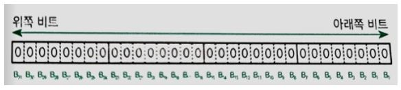

집합의 최대 요소의 개수인 max 값이 작을 경우 집합을 하나의 정수로 표현할 수 있다. 위와 같이 unsigned long형이 32 비트라고 가정하면 정수를 구성하는 비트의 나열을 비트 벡터(bit vector)라고 할 수 있다. 

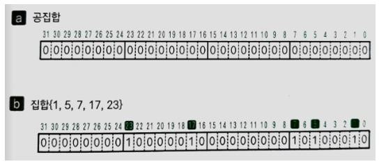

아래쪽 비트부터 B0, B1, ..., B31라고 하고 비트 벡터 안의 값은 각 원소의 유무에  따라 1, 0을 대입한다. 그러면 32비트의 부호가 없는 정수 하나로 {0, 1, ..., 31}을 전체 집ㅎ바(Universal set)으로 표현할 수 있다. 예를 들어 공집합은 a처럼 표현하고 {1, 5, 7, 17, 23}은 b와 같이 표현할 수 있다.

unsigned long형의 비트 벡터로 집합을 구현할 때, 이 프로그램에서 다음과 같이 자료형과 매크로를 정의할 수 있다.

- BitSet형 : BitSet는 비트 벡터를 나타내는 자료형이다. typedef 선언으로 unsigned long형과 동일하게 정의한다.

- BitSetNull : 객체형 매크로 BitSetNull은 공집합의 비트 벡터를 나타내는 정수이다. 모든 비트가 0이다.

- BitSetBits : 객체형 매크로 BitSetBits는 비트 벡터에서 유효한 비트 수를 나타내는 정수이다. unsigned long형 비트의 아래쪽 32비트만을 사용하므로 값을 32로 정의한다.

- SetOf(no) : 함수 형식의 매크로 SetOf는 유일한 원소가 no인 집합({no})을 표현하는 비트 벡터를 만든다. 

  - #define SetOf(no) ((BitSet)1 << (no))

  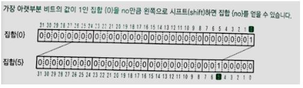

  위 그림은 SetOf(5)를 사용해 집합 {5}를 만드는 과정을 나타낸 것이다. 가장 아래쪽 비트의 값이 1인 집합 {0}에서 비트를 왼쪽으로 no만큼 시프트(shift)해 집합 {no}를 만든다. 

#### 원소가 들어 있는지 확인하는 IsMember 함수

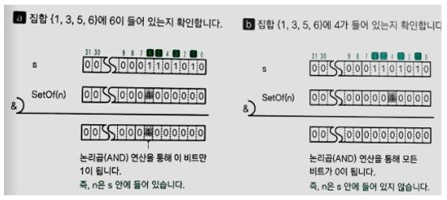

IsMember 함수는 집합 s에 n 값이 들어 있는지 확인하는 함수이다. 집합 s에 n값이 들어 있는지 확인하는 방법은 집합 s 비트 벡터와 {n} 비트 벡터를 논리곱(AND) 연산하면 된다. A처럼 집합에 n이 들어 있는 경우 비트 벡터 s와 n으로 논리 곱 연산을 하면 {n}이 나온다. b처럼 집합에 n이 들어 있지 않은 경우 논리곱 연산을 하면 공집합이 나온다. 

#### 원소를 추가하는 Add 함수

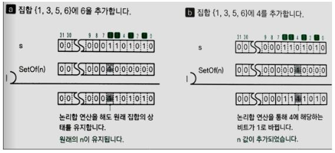

Add 함수는 집합 s에 n을 추가하는 함수이다. 집합 s에 n을 추가하는 방법은 집합 s 비트 벡터와 SetOf(n)으로 얻은 비트 벡터를 논리합(OR) 연산하면 된다. a처럼 집합에 n이 이미 들어 있는 경우에는 논리합 연산을 하더라도 집합 s는 업데이트 되지 않는다. b처럼 집합에 n이 없다면 논리합 연산에 의해 n에 대응하는 비트가 0에서 1로 변경된다(원소가 추가된다).

#### 원소를 삭제하는 Remove 함수

Remove 함수는 집합 s에서 n을 삭제하는 함수이다. 집합 s의 비트 벡터와 SetOf(n)으로 얻은 비트 벡터의 보수로 논리곱 연산을 하면 n이 삭제된다. 

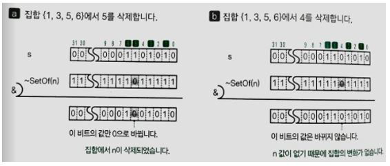

#### 집합의 원소 개수를 반환하는 Size 함수

Size 함수는 원소의 개수를 반환하는 함수이다. 집합의 원소 개수는 비트 벡터 안의 1인 비트가 몇 개인지 알아내면 된다. 

| 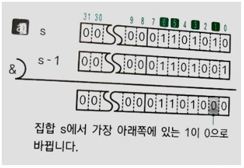 | a와 같이 s에서 1을 뺀 s-1과 논리곱 연산을 하면  s에서 가장 아래쪽의 비트가 0으로 바뀐다. 즉,  집합 {1, 3, 5, 6}에서 1이 삭제 된다. |
| ------------------------------------ | ------------------------------------------------------------ |
| 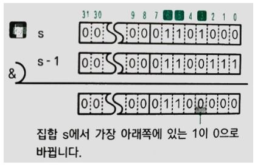 | 그런 다음 다시 s에 대해 같은 연산을 수행한다.  여기서도 가장 아래쪽의 비트가 1에서 0으로 바뀐다.  즉, 집합 {3, 5, 6}에서 3이 삭제된다. |
| 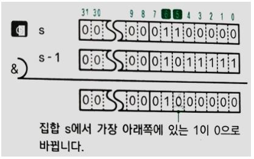 | c와 d도 마찬가지의 과정을 거친다. 그러면 모든 비트가 0이 된다. 이때 가장 아래쪽의 비트를 삭제하는 연산을  수행하면 집합의 원소가 1개씩 삭제되는데, 이 연산 횟수가 곧 집합의 원소개수가 된다. |
| 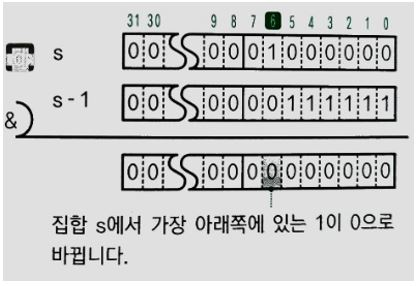 |                                                              |

#### 모든 원소를 출력하는 Print 함수

Print 함수는 집합의 모든 원소를 출력하는 함수이다. 

비트벡터로 집합을 표현하는 프로그램의 집합 연산을 위한 함수의 개수는 배열로 집합을 표현하는 프로그램보다 집합 연산을 위한 함수의 개수가 적다. 배열로 집합을 표현하는 프로그램보다 적은 개수의 함수로 다양한 연산을 수행할 수 있기 때문이다. 

- BitSet s1, s2;

#### 집합 s1과 s2가 같은지 확인하는 방법

두 집합 s1과 s2가 같은지 확인하려면 등가 연산자 ==, !=를 사용하면 된다. 이렇게 할 수 있는 이유는 두 집합이 같은 경우 정수 값이 같기 때문이다.

- s1 == s2 : 두 집합이 서로 같은지 확인
- s1 != s2 : 두 집합이 서로 다른지 확인

#### 교집합을 구하는 방법

두 집합 s1과 s2의 교집합은 비트 단위의 논리곱 연산자 &를 사용하면 구할 수 있다.

- s1 & s2 : 두 집합의 교집합

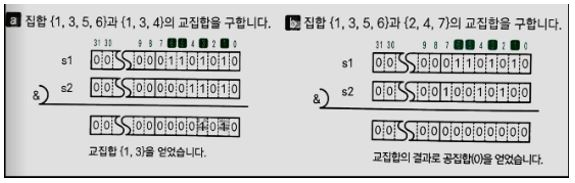

#### 합집합을 구하는 방법

집합 s1과 s2의 합집합은 비트 단위의 논리합 연산자 |로 구할 수 있다.

- s1 | s2 : 집합 s1과 s2의 합집합

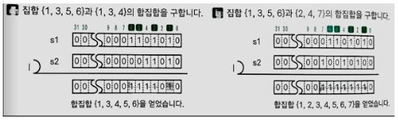

#### 차집합을 구하는 방법

집합 s1과 s2의 차집합은 보수 연산자 ~와 비트 단위의 논리곱 연산자 &를 조합해 구할 수 있다.

- s1 & ~s2 : 집합 s1과 s2의 차집합

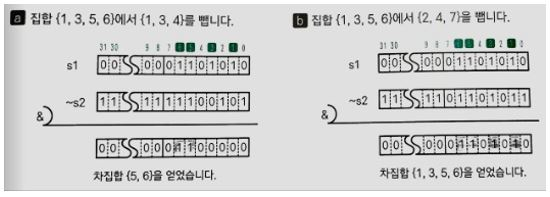

#### 대칭 차집합

대칭 차집합(Symmetric difference)은 두 집합 A, B가 있을 떄 공통 부분을 뺀 나머지 원소들의 집합이다. 대칭 차집합을 가단히 대칭차라고도 한다(합집합에서 교집합을 제외한 나머지).