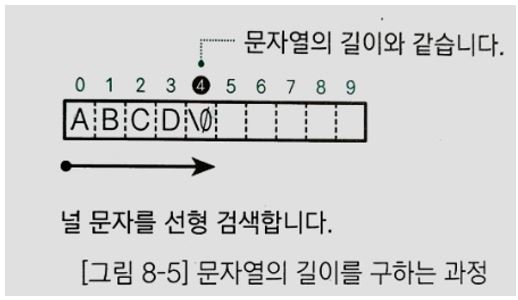

## 문자열의 기본

### 문자열이란?

프로그램에서 문자의 나열을 나타낸 것이 문자열(string)이다. 이때 문자의 나열은 어떤 문자가 항상 있어야 하는 것은 아니다. 문자가 하나만 있어도 좋고, 비어 있어도 상관없다. 빈 문자열도 문자열이다.

### 문자열 리터럴

C에서는 문자의 나열을 2개의 큰 따옴표로 묶은 것을 문자열 리터럴(string literal)이라고 한다. 문자열 안의 문자는 메모리 공간에 연속을 배치된다.

위 그림에서 볼 수 있듯이 컴퓨터에서 문자열 리터럴의 끝을 나타내기 위해 널 문자(null character)를 자동으로 추가한다. 널 문자 내부는 컴퓨터 환경이나 문자 코드에 관계없이 모든 비트의 값이 0이다. 

파이썬에서 문자열 리터럴은 따옴표로 묶은 일련의 문자이다. 문자열에 대해 단일, 이중 또는 삼중 따옴표를 모두 사용할 수 있다. 문자 리터럴은 큰 혹은 작은 따옴표로 묶인 단일 문자이다. 

(r 문자는 raw string으로 백슬래시 문자를 해석하지 않고 남겨두기 때문에 정규 표현식과 같은 곳에 유용하다.)

[WikiDocs - 03. 변수, 상수 그리고 리터럴](https://wikidocs.net/20562)

아래는 파이썬 3.7을 기준으로 문자열 리터럴을 어떻게 구현했는가에 대한 글이다.

[Nephtyw'S Programming Stash -  파이썬의 효과적인 메모리 재활용 방법 - Interning](https://nephtyws.github.io/python/interning/)

#### 문자열 리터럴의 특징

C에서 문자열 리터럴의 자료형은

- 문자열 리터럴의 자료형 : 문자열 리터럴의 자료형은 char형 배열이다. 그러나 문자열 리터럴의 표현식을 평가하여 얻는 자료형은 char *형이고, 그 값은 첫 번째 문자에 대한 포인터이다. 
- 문자열 리터럴의 메모리 영역 기간 : 문자열 리터럴의 메모리 영역 기간은 정적 메모리 영역의 기간과 같다. 그러므로 프로그램 시작부터 끝까지 메모리 영역이 유지된다.
- 같은 문자열 리터럴이 여러 개 있는 경우 컴퓨터에서 처리하는 방법 : 같은 문자열 리터럴이 여러 개 있는 경우에는 이를 각각 다른 메모리 영역에 넣어두는 컴퓨팅 환경도 있고 같은 영역에 넣어두고 공유하는 컴퓨터 환경도 있다.
- 상수의 성질을 갖는 문자열 리터럴 : 문자열 리터럴은 변수가 아니라 상수의 성질을 가지고 있다. 즉, 문자열 리터럴이 저장된 메모리 영역에 값을 대입할 수 없다. 

Python에서 문자열 리터럴은

- 문자열 리터럴의 자료형 : 문자열 리터럴의 자료형은 str 클래스이다. char형은 따로 존재하지 않는다. 

  

  또 chr, ord라는 내장함수가 아스키 코드 변환과 관련이 있다.

  

  문자열 리터럴의 레퍼런스와 문자열 리터럴의 첫 번째 문자의 레퍼런스는 관련이 없다.

  

- 같은 문자열 리터럴일 경우 레퍼런스가 똑같은 메모리 영역을 참조한다. 즉, 메모리 영역을 재활용한다. 

  

- 문자열 리터럴이 상수의 성질을 가지므로 요소의 값을 바꾸거나 새로운 요소를 추가할 수 없다.

  

  

### 배열에 문자열 저장하기

요소의 자료형이 char형이고 요소의 개수가 10인 배열 st의 요소에 문자열을 구성할 문자를 하나씩 순서대로 대입한다. 대입한 후 배열 st의 모습은 위와 같다. C 언어에서 널 문자는 문자열의 끝을 나타낸다. 따라서 5번째 이후에 어떤 문자를 대입해도 ABCD로 출력된다. 

파이썬에서는 각 요소가 str 타입인 리스트를 str 클래스의 내장 메소드인 join을 호출하고 인자로 넘겨서 새로운 str 타입 객체를 생성할 수 있다. 이때 따옴표 안에 들어가는 글자로 리스트의 각 요소 사이를 채울 수 있다.

#### 문자열 초기화

문자열을 선언하면서 동시에 초기화할 수도 있다. 

주의할 점은 초기화할 때 사용한 코드는 초기화에서만 사용해야 한다는 점이다. 다음과 같은 코드는 실행되지 않는다. 

요소의 개수를 생략하고 문자열을 선언하면 초기화할 때 입력한 문자열의 요소 개수가 배열의 요소 개수가 된다. 예를 다음 배열 st의 요소 개수는 \\0까지 5개이다.

- char st[] = "ABCD";

파이썬에서는 변수 선언이나 초기화라는 개념이 존재하지 않고 할당 혹은 네이밍이라는 개념만 존재한다.

#### printf 함수 사용해 문자열 출력하기

문자열 나타내는 형식 문자열(%s)의 's'는 string에서 따왔다. scanf 함수를 사용하여 읽어 들일 때도 형식 문자열(%s)을 사용한다.

파이썬에서는 문자열 출력하는 방법으로 3가지 정도 방법이 존재한다.

[lcat - Pros and cons of Python’s f-strings literal](https://lcat.dev/2019/05/07/pros-and-cons-of-pythons-f-strings-literal/)

이중에서 PEP 498에서 채택된 Literal String Interpolation, 줄여서 f-string을 쓰는 것이 권장되는데 가독성이 더 좋을뿐만 아니라 속도도 훨씬 빠르다. 다만 옛 파이썬 버전의 프로그램과는 호환이 되지 않는다. 

### 포인터와 문자열

위에서 선언한 포인터 pt는 초기화 요소로 문자열 "12345"를 준다. 문자열 리터럴을 평가하여 얻는 값은 그 문자열 리터럴의 첫 번째 문자에 대한 포인터이므로 pt는 "12345"가 들어 있는 메모리 영역의 첫 번째 문자 '1'이 들어 있는 영역의 주소값을 가리키며 초기화 된다. 문자열 리터럴 요소에 접근할 때는 pt[i]와 같이 인덱스를 이용해 접근이 가능하다. 

배열에 저장한 문자열은 6바이트의 메모리 영역을 갖는다(\\0까지 sizeof(char) * 문자갯수). 하지만 포인터로 표현한 문자열은 문자열 리터럴을 저장하기 위한 영역 외에도 pt가 갖는 메모리 영역이 더 필요하다. 

 

위의 그림은 문자열 리터럴을 가리키는 두 포인터의 값을 서로 교환하는 과정이다.  각각의 포인터가 가리키는 값을 바꾸면 포인터로 표현하는 문자열을 바꿀 수 있다. 

파이썬에서는 다음과 같이 Pythonic하게 swap이 가능하다.

### 문자열의 길이

컴퓨터는 배열에 저장된 문자열의 경우 널 문자까지 문자열로 인식한다. 즉, 배열 전체를 문자열로 사용하지 않는다. 배열에 들어 있는 요소의 개수가 항상 문자열의 길이를 의미하지는 않기 때문에 문자열의 길이를 구하려면 문자열의 길이만 구하는 알고리즘이 필요하다. 위 그림과 같이 선형 검색을 하되, 이때 문자열의 끝은 널 문자이므로 찾은 널 문자의 인덱스는 문자열의 길이와 같다. 

#### strlen 함수

C 언어 표준 라이브러리에는 문자열의 길이를 구하는 strlen 함수가 있다. 실제로는 위와 같은 strlen 함수를 사용한다. 

### 문자열에서 문자 검색하기

널문자가 아닌 문자를 문자열에서 검색하는 과정은 위와 같다. 문자열에서 찾고자 하는 문자를 검색한다. 검색에 성공하면 찾은 문자의 인덱스를 반환한다. 이떄 같은 문자가 여러 개 있는 경우 가장 앞쪽에 있는 문자의 인덱스를 반환한다. 검색에 실패할 경우 -1을 반환한다. 

#### strchr 함수와 strrchr 함수

C 언어 표준 라이브러리는 문자열 안에 들어 있는 문자를 검색하는 함수로, stchr 함수와 strrchr 함수를 제공한다. strchr 함수는 가장 앞쪽의 문자를 검색하지만 strrchr 함수는 검색할 문자가 문자열 안에 여러 개 있는 경우 가장 뒤쪽의 문자를 찾는다. 이 함수는 찾은 요소의 인덱스가 아니라 그 요소에 대한 포인터를 반환한다. 또 검색에 실패할 경우에는 널 포인터를 반환한다. 주의할 점은 모두 두 번째 인수를 char형이 아닌 int형으로 받고 있다는 점이다. 초기의 C 언어는 함수로 전달하는 매개변수로 char형이나 short형 등의 값을 먼저 int형으로 형 변환을 했기 때문에 표준 라이브러리 함수에서 문자를 주고 받을 때는 int으로 주고 받는다. 

### 문자열 비교

C 언어는 두 문자열의 대소 관계를 판단하는 표준 라이브러리 함수로 strcmp 함수와 strncmp 함수를 제공한다. 

#### strcmp 함수

위 그림을 보면 두 문자열을 처음부터 순서대로 비교하고 있다. 이때 a와 같이 모든 문자가 일치하면 0을 반환한다. 하지만 b와 같이 문자를 비교하는 도중에 하나의 문자라도 다르면 두 문자열은 일치하지 않음을 알 수 있다. 이때는 0이 아닌 값을 반환한다. 반환하는 값은 문자 코드 체계와 컴퓨터 환경에 따라 다르다. strcmp 함수는 문자 코드 체계에 따라 문자열을 비교한다. 그래서 strcmp 함수가 반환하는 값도 컴퓨터 환경에 종속적이다. 

#### strncmp 함수

stcmp 함수는 문자열의 길이를 지정하여 비교할 수 없지만 strncmp 함수는 3번째 인수로 지정한 문자열의 길이만큼만 비교할 수 있다. 또한 널 문자가 없는 문자 배열 간의 비교도 가능하다.

그림 a는 처음 3개의 문자를 비교한 경우이고 b는 처음 5개의 문자를 비교한 경우이다.

## 브루트-포스법

### 문자열 검색이란?

문자열 검색이란 어떤 문자열 안에 다른 문자열이 들어 있는지 조사하고 들어 있다면 그 위치를 찾아내는 것을 말한다. 여기서 문자열을 패턴(Pattern)이라고 하고 원본을 텍스트(Text)라고 한다. 

### 브루트-포스법

브루트-포스법(Brute force method)은 선형 검색을 확장한 알고리즘이므로 단순법, 소박법이라고도 한다.  다음은 위의 과정을 좀 더 자세히 나타낸 그림이다.

|  |
| -------------------------------------- |
|  |
|  |

이때 3번에서 텍스트의 검사 위치를 2까지 진행시켜도 4번에서는 다시 1부터 검사한다. 즉, 이미 검사를 진행한 위치를 기억하지 못하므로 브루트-포스법의 효율은 좋지 않다고 할 수 있다. 

## KMP법

### KMP법

브루트-포스법은 다른 문자를 만나면 패턴에서 문자를 검사했던 결과를 버리고 다음 텍스트의 위치로 1칸 이동한 다음 다시 패턴의 첫 번째 문자부터 검사한다. 이렇게 하면 패턴을 처음부터 다시 검사하기 때문에 비효율적이다. 하지만 KMP법은 검사했던 위치 결과를 버리지 않고 이를 효율적으로 활용한다. 

위에서 텍스트의 첫 번째 문자 Z는 패턴에 없는 문자이므로 일치하지 않는다고 판단한다.

패턴을 1칸 뒤로 이동시킨뒤에 처음부터 순서대로 검사하면 패턴의 마지막 문자가 D여서 일치하지 않는다고 판단한다. 여기서 텍스트의 뒷부분 AB가 패턴의 앞부분 AB와 일치한다는 점을 이용한다. 이 부분은 이미 검사를 마친 부분이므로 텍스트의 X 다음 문자부터 패턴의 CABD가 일치하는지만 검사하면 된다.  

그래서 위와 같이 AB와 X를 한 번에(3칸) 이동시키고 3번째 문자인 C부터 검사하면 된다. 이와 같이 KMP법은 텍스트와 패턴의 겹치는 부분을 찾아내어 검사를 다시 시작할 위치를 구한다. 이런 방법으로 패턴을 최소의 횟수로 옮겨 알고리즘의 효율을 높인다. 하지만 몇 번째 문자부터 다시 검색을 시작할지 패턴을 이동시킬 때마다 다시 계산한다면 높은 효율을 기대할 수 없으므로 몇 번째 문자부터 다시 검색할지에 대한 값을 미리 표로 만들어 이 문제를 해결한다. 

|  |
| -------------------------------------- |
|  |

- a \~ d : 패턴의 1 ~4번째 문자에서 검사에 실패한 경우에는 패턴을 옮긴 다음 1번쨰 문자부터 다시 검사한다.
- e : 패턴의 5번째 문자에서 검사에 실패한 경우에는 패턴을 옮긴 다음 1번째 문자가 일치하므로 2번째 문자부터 다시 검사한다. 
- f : 패턴의 6번째 문자에서 검사에 실패한 경우에는 3번째 문자부터 다시 검사할 수 있다. 

표를 작성할 때는 패턴 안에서 중복되는 문자의 나열을 먼저 찾아야 한다. 이 과정에서 KMP법을 사용한다. 패턴 안에서 중복되는 문자의 나열을 찾기 위해 패턴끼리 겹쳐 놓고 검사해본다. 패턴의 1번쨰 문자가 서로 다른 경우 아래의 패턴을 1칸 뒤로 옮기고 1번째 문자부터 다시 검사한다. 

위의 표에서 2번째 문자(B)의 값이 0인 이유는 아래에 위치시킨 패턴의 첫 번째 문자의 인덱스가 0이고 이 위치에서 다시 검사를 시작하기 때문이다. 

패턴을 1칸 뒤로 옮긴 뒤에도 문자가 일치하지 않으므로 3번째 문자(C)의 값을 0으로 한다. 그 다음 패패턴을 1칸 뒤로 옮기면 AB가 일치한다. 여기서 다음과 같은 사실을 알아낼 수 있다.

- 패턴의 4번째 문자 A까지 일치한다면 아래에 위치한 패턴을 1칸 옮긴 다음 A를 건너뛰고 2번째 문자부터 검사할 수 있다(아래 그림에서 e).  

  

- 패턴의 5번째 문자 B까지 일치한다면 아래에 위치한 패턴을 1칸 옮긴 다음 AB를 건너뛰고 3번째 문자부터 검사할 수 있다(위의 그림에서 f).

따라서 표에서 두 문자의 값을 1, 2로 할 수 있다.

이어서 아래에 위치한 패턴을 2칸 뒤로 옮기면 문자가 일치하지 않는다 따라서 표에서 패턴의 마지막 문자 D의 값을 0으로 한다.

