## 선형 리스트

### 선형 리스트란?

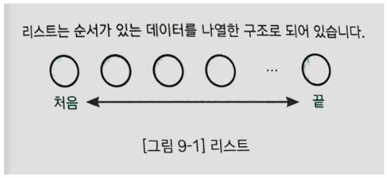

리스트는 위와 같이 데이터를 순서대로 나열해 놓은 자료구조를 말한다. 

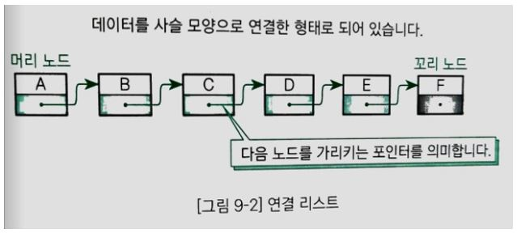

가장 단순한 구조를 가진 리스트를 선형 리스트(Linear list) 또는 연결 리스트(Linked list)라고 한다. 위의 그림을 보면 A부터 F까지 데이터가 순서대로 나열되어 있고 각각의 데이터가 화살표로 연결되어 있음을 알 수 있다. 이때 리스트의 데이터는 노드(Node) 또는 요소(Element)라고 한다. 각각의 노드는 데이터와 다음 노드를 가리키는 포인터를 가지고 있다. 처음과 끝에 있는 노드는 특별히 각각 머리 노드(Head node), 꼬리 노드(Tail node)라고 한다. 또한 하나의 노드에 대해 바로 앞에 있는 노드를 앞쪽 노드(Predecessor node), 바로 뒤에 있는 노드를 다음 노드(Successor node)라고 한다. 

### 배열로 선형 리스트 만들기

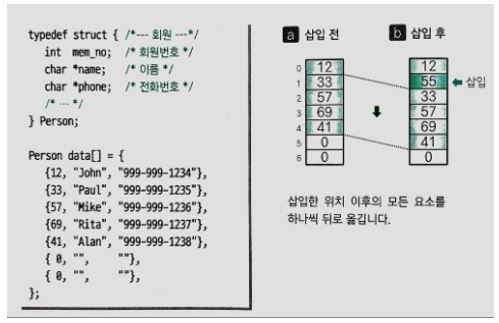

위와 같이 전화번호부를 선형 리스트로 저장하기 위해 배열로 구현할 수 있다. 

#### 다음 노드 꺼내기

배열의 각 요소에는 연락할 순서대로 데이터가 저장되어 있다. 전화를 걸기 위해 필요한 다음 노드 꺼내기는 1만큼 큰 인덱스를 갖는 요소에 접근하면 된다. 

#### 노드의 삽입과 삭제

새로운 데이터를 삽입하려면 b와 같이 삽입 요소 다음의 모든 요소를 하나씩 뒤로 밀어야 한다. 삭제하는 경우도 모든 요소를 뒤로 밀거나 앞으로 당겨야 한다. 이런 작업이 필요하기 때문에 배열로 구현한 선형 리스트는 다음과 같은 문제를 갖게 된다.

- 쌓이는 데이터의 크기를 미리 알아야 한다.
- 데이터의 삽입, 삭제에 따라 데이터를 모두 옮겨야 하기 때문에 효율이 좋지 않다. 

## 포인터로 연결 리스트 만들기

### 포인터로 연결 리스트 만들기

연결 리스트에 데이터를 삽입할 때 노드용 객체를 만들고, 삭제할 때 노드용 객체를 없애면 앞에서 제시한 데이터를 밀고 당기는 문제를 해결할 수 있다. 

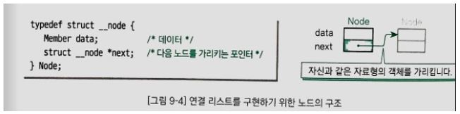

위의 구조체는 다음의 멤버로 구성되어 있다.

- data : 데이터를 저장하는 멤버
- next : 자기 자신과 같은 구조체를 가리키는 포인터

위와 같이 자기 자신과 같은 자료형의 객체를 가리키는 데이터를 가지고 있는 자료구조를 자기 참조(Self-referential)형이라고 한다. 멤버 next에 넣어두는 값은 해당 노드의 다음 노드를 가리키는 포인터이다. 다음 노드를 갖지 않는 꼬리 노드의 next 값은 널(NULL) 값을 대입한다. 

#### 연결리스트를 관리하는 구조체 List

헤더에 Node와는 별개로 List라는 구조체를 선언한다. List는 연결 리스트를 관리하며 두 멤버(머리 노드에 대한 포인터, 선택한 노드에 대한 포인터)로 구성되어 있고 Node에 대한 포인터 자료형을 가지고 있다.  이는 검색한 노드를 선택하고 삭제하는 용도로 사용한다.

#### 노드를 만드는 AllocNode 함수

AllocNode 함수는 Node형 객체를 만들고 만든 객체의 포인터를 반환한다.

#### 노드의 멤버 값을 설정하는 SetNode 함수

SetNode 함수는 Node형 객체의 두 멤버(data, next)의 값을 설정하는 함수이다. 첫 번째 매개변수 n으로 전달받은 포인터가 가리키는 Node형 객체에 x가 가리키는 값을 대입하고 n의 next에 세 번째 매개변수로 전달받은 next를 대입한다.

#### 연결 리스트를 초기화하는 Initialize 함수

Initialize 함수는 연결 리스트를 사용하기 전에 초기화하는 함수이다.  머리 노드를 가리키는 list->head에 널(NULL)값을 대입하여 노드가 하나도 없는 텅 빈 연결 리스트를 만든다. 빈 연결 리스트는 노드가 하나도 없는 상태이기 때문에 head가 가리키는 노드도 없다. 

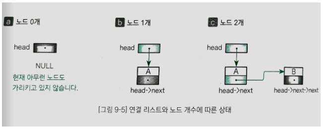

#### 연결 리스트가 비어 있는지 판단하는 방법

위 그림에서 a는 노드가 하나도 없는 상태이다. 이때 리스트가 비어 있는지 판단하는 방법은 다음과 같다.

- list->heat == NULL

#### 노드가 1개인 연결 리스트를 판단하는 방법

b는 연결 리스트에 노드가 1개만 있는 상태이다. 변수 list->head가 가리키는 노드는 머리 노드 A이다. 이떄 연결 리스트에는 1개의 노드만 있기 때문에 머리 노드 A는 리스트의 꼬리 노드이기도 하다. 따라서 next의 값은 널이다. list->head가 가리키는 노드 안의 뒤쪽 포인터 next 값이 널이므로 연결 리스트의 노드가 1개인지 판단하는 방법은 다음과 같다.

- list->next->head == NULL

#### 노드가 2개인 연결 리스트를 판단하는 방법

c는 노드가 2개 있는 상태이다. 머리 노드는 A, 꼬리 노드는 B이다. 이때 list->head가 가리키는 노드 A의 next는 노드 B를 가리킨다. 꼬리 노드 B의 next는 널 값을 가지고 있기 때문에 연결 리스트의 노드가 2개인지 판단하는 방법은 다음과 같다.

- list->head->next->next == NULL

#### 머리 노드인지 판단하는 방법

자료형이 Node *형인 변수 p는 리스트의 노드 중 하나를 가리킨다. 변수 p가 가리키는 노드가 연결 리스트의 머리 노드인지 판단하는 방법은 다음과 같다.

- p == list->head

#### 꼬리 노드인지 판단하는 방법

자료형이 Node *형인 변수 p는 리스트의 노드 중 하나를 가리킨다. 변수 p가 가리키는 노드가 연결 리스트의 꼬리 노드인지 판단하는 방법은 다음과 같다.

- p->next == NULL

#### 검색을 수행하는 Search 함수

Search 함수는 어떤 조건을 만족하는 노드를 검색한다. 반환하는 값은 찾은 노드에 대한 포인터이다. 만약 검색에 실패하면 널을 반환한다. 검색에 사용하는 알고리즘은 선형 검색이고 검색할 노드를 만날때까지 머리 노드부터 스캔한다. 

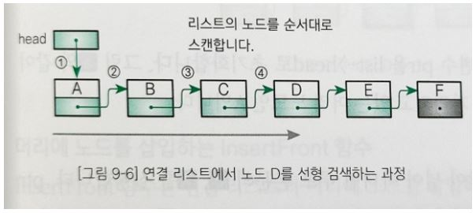

노드 스캔은 다음 조건 중 하나만 성립하면 종료된다.

- 검색 조건을 만족하는 노드를 찾지 못하고 꼬리 노드를 지나가기 직전인 경우
- 검색 조건을 만족하는 노드를 찾은 경우

이 함수가 전달받는 매개변수는 다음과 같다.

- list - 검색 대상인 연결 리스트를 가리키는 포인터
- x - 검색하는 키 값을 저장한 데이터를 가리키는 포인터
- compare - 두 번째 매개변수 x가 가리키는 객체와 연결 리스트의 노드와 데이터를 비교하는 함수를 가리키는 포인터. 검색에 성공하면 0을 반환한다. 

| 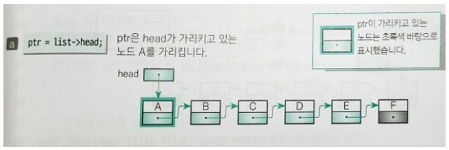 |
| ------------------------------------- |
| 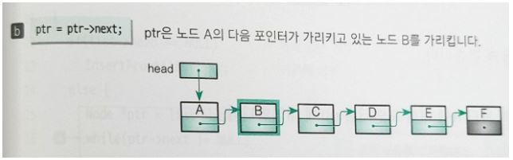 |
| 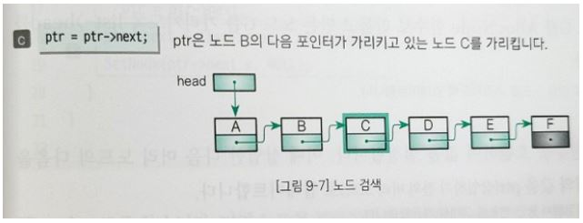 |

#### 머리에 노드를 삽입하는 InsertFront 함수

InsertFront 함수는 연결 리스트의 머리에 노드를 삽입하는 함수이다. 

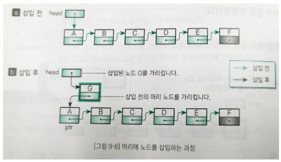

1. 삽입 전의 머리 노드 A에 대한 포인터를 ptr에 대입한다.
2. 삽입할 노드 G를 AllocNode 함수로 만들고 만든 노드 G를 가리키도록 list->head를 업데이트 한다. 
3. SetNode 함수를 호출하여 값을 설정한다. 이때 삽입한 다음 머리 노드의 다음을 가리키는 포인터의 값을 ptr(삽입하기 전의 전의 머리 노드)로 업데이트 한다. 

#### 꼬리에 노드를 삽입하는 InsertRear 함수

InsertRear 함수는 연결 리스트 꼬리에 노드를 삽입하는 함수이다. 리스트가 비어 있는지 아닌지 먼저 확인(list->head == NULL)하고 경우에 따라 다음의 작업을 수행한다.

- 리스트가 비어 있는 경우 : 머리에 노드를 삽입하는 처리와 같다. InsertFront 함수로 처리한다.
- 리스트가 비어 있지 않은 경우 : 리스트 꼬리에 노드 G를 삽입한다. 

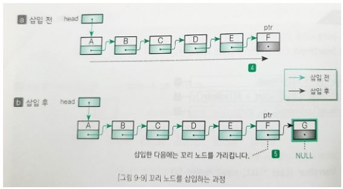

#### 머리 노드를 삭제하는 RemoveFront 함수

RemoveFront 함수는 머리 노드를 삭제하는 함수이다. 리스트가 비어 있지 않은 경우(list->head != NULL)에만 삭제를 실행한다. 

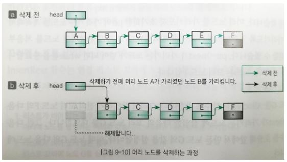

a의 리스트에서 머리 노드 A를 삭제하고 나면 b상태가 된다. 머리 노드에 대한 포인터 list->head에 두 번째 노드 B에 대한 포인터 list->head->next를 대입하여 list->head가 가리키는 노드를 B로 업데이트 한다. 그리고 삭제하기 전의 머리 노드 A의 메모리 영역을 해제한다. 만약 리스트에 노드가 1개만 있어도 오류 없이 삭제할 수 있다. 삭제하기 전의 머리 노드는 꼬리 노드이기 때문에 다음 노드를 가리키는 list->head->next의 값은 널이다. 널을 list->head에 대입하면 리스트는 빈 상태가 된다. 

#### 꼬리 노드를 삭제하는 RemoveRear 함수

RemoveRear 함수는 꼬리 노드를 삭제하는 함수이다. 리스트에 노드가 몇 개 있는지에 따라 그 경우에 해당하는 작업을 수행한다.

- 리스트에 노드가 1개만 있는 경우 : 머리 노드를 삭제하는 것과 같으므로 RemoveFront 함수로 처리한다.
- 리스트에 노드가 2개 이상 있는 경우 : 아래 참조

1. 먼저 꼬리 노드와 꼬리 노드로부터 두 번째 노드를 찾는다. 스캔하는 방법은 InsertRear함수와 비슷하지만 현재 스캔하고 있는 노드의 앞에 있는 노드를 가리키는 변수를 추가한점이 다르다.
2. 꼬리 노드로부터 두 번째 노드 E의 다음을 가리키는 포인터에 널을 대입하고 꼬리 노드의 메모리 영역을 해제한다. 

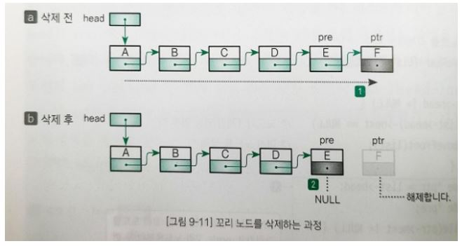

#### 선택한 노드를 삭제하는 RemoveCurrent 함수

RemoveCurrent 함수는 현재 선택한 노드(list->crnt)가 가리키는 노드를 삭제하는 함수이다. 선택한 노드가 머리 노드인지 아닌지에 따라 다음의 작업을 수행한다.

- crnt가 머리 노드인 경우 : 머리 노드를 삭제하면 된다. RemoveFront 함수로 처리한다.
- crnt가 머리 노드가 아닌 경우 : 아래 참조.

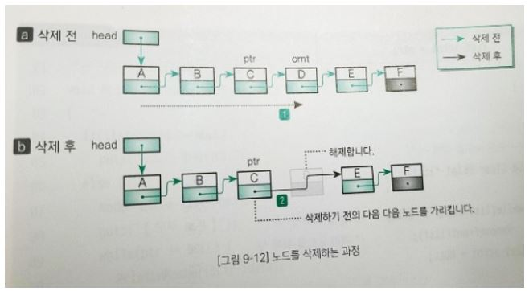

1. 선택한 노드의 앞 노드를 찾는다. while 문은 머리 노드부터 스캔을 시작한다. 선택한 노드 ptr의 다음 노드를 가리키는 포인터 ptr->next가 list->crnt와 같을때까지 반복한다. while문이 종료되고 난 다음 ptr이 가리키는 노드는 삭제하기 위해 선택한 노드의 앞쪽 노드가 된다. 
2. 삭제하기 위해 선택한 노드의 다음 노드 포인터 list->crnt->next를 노드 위에서 ptr이 가리키는 노드의 다음 노드 포인터 ptr->next에 대입한다. 그러면 이 노드의 다음 노드 포인터가 가리키는 노드가 노드 삭제하고자 하는 노드의 다음 노드로 업데이터된다. 그런 다음 삭제하고자 하는 노드의 메모리 영역을 해제한다. 

#### 모든 노드를 삭제하는 Clear 함수

Clear 함수는 연결 리스트의 모든 노드를 삭제하는 함수이다. 연결 리스트가 완전히 텅 빈 상태(head == NULL)가 될 때까지 머리 요소의 삭제 작업을 반복한다. 이에 따라 crnt의 값도 NULL로 업데이트 된다.

#### 선택한 노드의 데이터를 출력하는 PrintCurrent 함수

PrintCurrent 함수는 선택한 노드의 데이터를 출력하는 함수이다. 선택한 노드가 없는 경우(list->crnt == NULL)에는 선택한 노드가 없습니다라고 출력한다. 

#### 리스트의 모든 노드를 출력하는 Print 함수

Print 함수는 리스트의 모든 노드를 순서대로 출력하는 함수이다. 머리 노드부터 꼬리 노드까지 포인터 ptr이 가리키는 데이터를 출력한다.

#### 연결 리스트를 종료하는 Terminate 함수

Terminate 함수는 연결 리스트를 종료하는 함수이다. 모든 노드를 삭제하는 Clear 함수를 호출한다. 

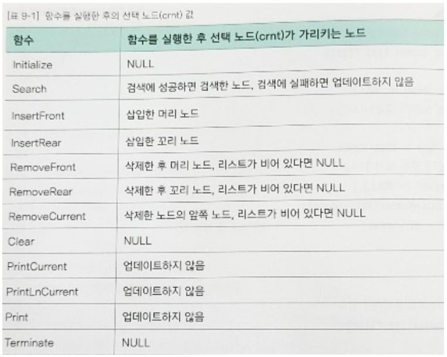

위의 표는 각 함수를 실행하고 난 후의 crnt 값이다.

#### 자기 참조 구조체와 typedef 선언

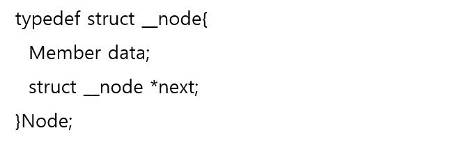

구조체 Node는 자기 참조형이고 멤버 next는 struct \_\_node형 객체를 가리키는 포인터이다. 자기 참조 구조체란 자기 자신과 같은 자료형의 객체를 가리키는 포인터(struct\_\_node)를 멤버로 가지고 있다는 뜻이다.

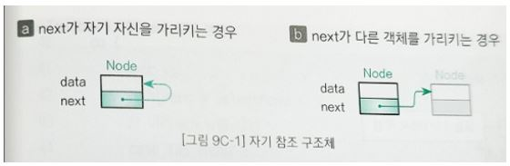

a처럼 포인터 next가 자기 자신을 가리키는 경우와 다르게 b는 자기 자신과 같은 자료형을 가진 다른 객체를 가리키는 경우도 있다. 이때 Node를 선언하면서(태그 이름인 __node를 부여하면서) typedef 선언도 동시에 하고 있다. 위의 구조체 선언문을 다시 보면 구조체 자료형의 이름인 struct \_\_node에 대해 typedef로 Node라고 이름을 다시 정의하고 있다. 그러면 구조체는 typedef로 정의한 이름도 주어진다. 이때 구조체를 정의하는 부분에서 멤버 next는 struct \_\_node \*형이 아니고 Node\*으로 선언할 수 있다는 실수를 저지를 수 있다. 그러나 이렇게 컴파일 하면 컴파일 오류가 발생한다. 멤버 next를 선언하는 순간에는 아직 Node형의 typedef 선언이 종료되지 않았기 때문이다. 

## 커서로 연결 리스트 만들기	

### 커서로 연결 리스트 만들기

연결 리스트는 노드의 삽입, 삭제를 데이터 이동 없이 수행한다는 특징이 있었지만 삽입, 삭제를 수행할 때마다 노드용 객체를 위한 메모리 영역을 만들고 해제하는 과정이 필요했다. 메모리 영역을 만들고 해제하는데 필요한 비용은 무시할수 없다. 이때 프로그램 실행 중에 데이터의 개수가 크게 바뀌지 않고  데이터 개수의 최댓값을 미리 알 수 있다고 가정하면 배열을 사용해 효율적으로 연결 리스트를 운용할 수 있다.

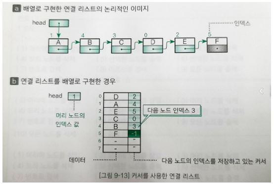

커서를 사용하는 연결 리스트는 데이터 개수의 최대값을 미리 계산하여 모든 노드를 저장하기에 충분한 크기의 배열을 만들어야 한다. 배열의 커서에 해당하는 값은 다음 노드에 대한 포인터가 아니라 다음 노드가 들어 있는 요소의 인덱스에 대한 값이다. 여기서 포인터 역할을 하는 인덱스를 커서(Cursor)라고 한다. 예를 들어 노드 B의 커서 3은 다음 노드 C가 인덱스 3인 위치에 저장되어 있음을 의미한다. 꼬리 노드의 커서는 배열의 인덱스로는 있을 수 없는 값인 -1로 하면 된다. 머리 노드를 나타내는 head도 커서이기 때문에 머리 노드 A가 들어 있는 곳인 인덱스 1인 head의 값이 된다. 이와 같은 방법을 사용하면 노드의 삽입, 삭제 시 요소를 옮길 필요가 없다. 예를 들어서 아래 그림처럼 연결 리스트의 머리에 노드 G를 삽입하면 head를 1에서 6으로 업데이트하고 노드 G의 커서에 1을 대입하게 된다. 

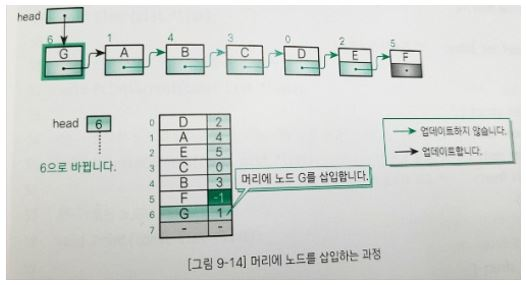

#### 커서의 자료형 Index

Index는 커서의 자료형이다. 단순한 정수 값을 가지기 떄문에 int형과 동일하게 정의한다.

#### 노드의 자료형 Node

연결 리스트의 노드를 의미하는 구조체 Node에서 커서 next의 자료형은 커서의 자료형인 Index이다. 

#### 연결 리스트를 관리하는 구조체 List

구조체 List는 연결 리스트를 관리하는 구조체이다.