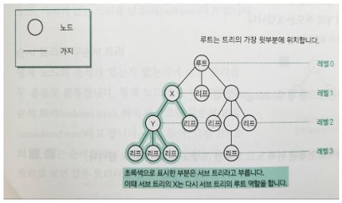
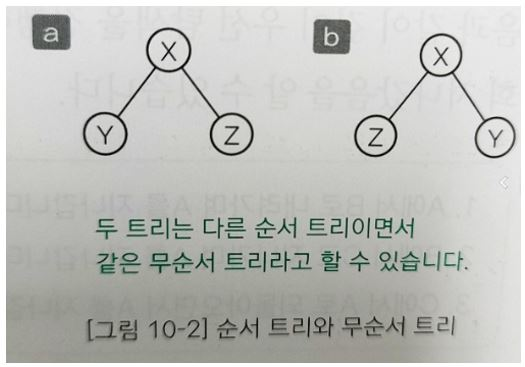
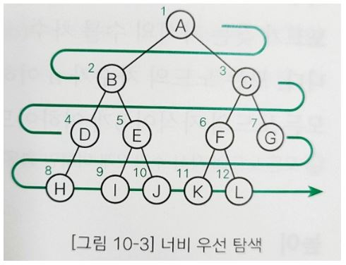
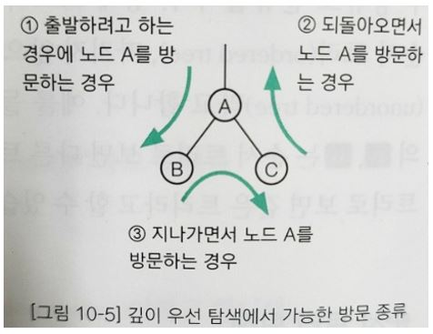
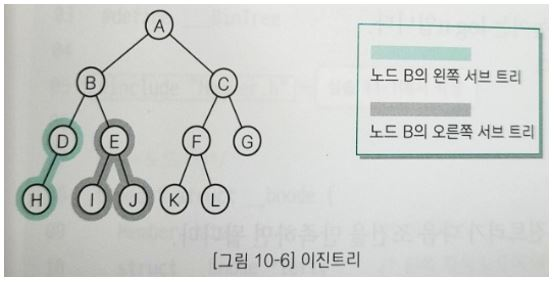
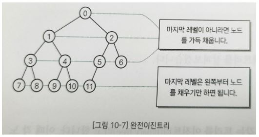
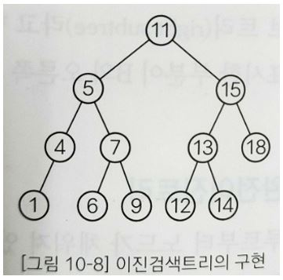
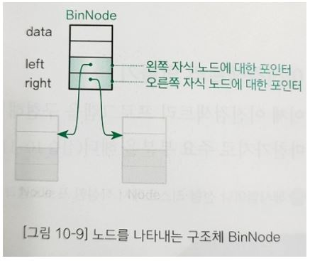
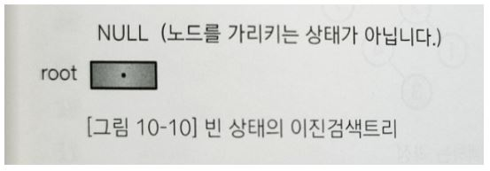
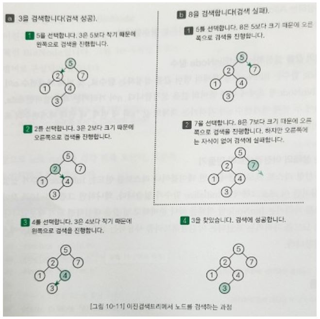

## 트리

트리는 데이터 사이의 계층 관계를 나타내는 자료구조이다.

### 트리란?

#### 트리 관련 용어

트리를 구성하는 요소는 노드(Node)와 가지(Edge)이다. 각각의 노드는 가지를 통해 다른 노드와 연결되어 있다. 

#### 루트 

트리의 가장 윗부분에 위치하는 노드를 루트(Root)라고 한다. 하나의 트리에는 하나의 루트가 있다. 

#### 리프

트리의 가장 아랫부분에 위치하는 노드를 리프(Leaf)라고 한다. 이때 가장 아래에 위치한다는 말은 물리적으로 가장 아랫부분에 위치한다는 의미가 아니라 더 이상 뻗어나갈 수 없는 마지막에 노드가 위치한다는 의미이다(다른 용어로는 끝 노드(Terminal node) 또는 바깥 노드(External node)).

#### 안쪽 노드

루트를 포함하여 리프를 제외한 노드를 안쪽 노드라고 한다(다른 용어로는 끝이 아닌 노드(Non-terminal node)).

#### 자식

어떤 노드로부터 가지로 연결된 아래쪽 노드를 자식(Child)이라고 한다. 노드는 자식을 여러 개 가질 수 있다. 리프는 자식을 가질 수 없다.

#### 부모

어떤 노드에서 가지로 연결된 위쪽 노드를 부모(Parent)라고 한다. 노드는 1개의 부모를 가진다. 루트는 부모를 가질 수 없다.

#### 형제

같은 부모를 가지는 노드를 형제(Sibling)라고 한다. 

#### 조상

어떤 노드에서 가지로 연결된 위쪽 노드 모두를 조상(Ancestor)이라고 한다.

#### 자손

어떤 노드에서 가지로 연결된 아래쪽 노드 모두를 자손(Descendant)이라고 한다.

#### 레벨

루트로부터 얼마나 떨어져 있는지에 대한 값을 레벨(Level)이라고 한다. 루트의 레벨은 0이고 루트로부터 가지가 하나씩 아래로 뻗어나갈 때마다 레벨이 1씩 늘어난다.

#### 차수

노드가 갖는 자식의 수를 차수(Degree)라고 한다. 모든 노드의 차수가 n 이하인 트리를 n진 트리라고 한다. 모든 노드의 자식 수가 2개 이하인 경우는 이진 트리라고 한다.

#### 높이

루트부터 가장 멀리 떨어진 리프까지의 거리(리프 레벨의 최댓값)를 높이(Height)라고 한다. 

#### 서브 트리

트리 안에서 다시 어떤 노드를 루트로 정하고 그 자손으로 이루어진 트리를 서브 트리(Subtree)라고 한다. 

#### 널 트리

노드, 가지가 없는 트리를 널 트리(Null tree)라고 한다.

#### 순서 트리와 무순서 트리

형제 노드의 순서가 있는지 없는지에 따라 트리를 두 종류로 분류한다. 형제 노드의 순서를 따지면 순서 트리(Ordered tree), 따지지 않으면 무순서 트리(Unordered tree)라고 한다. 

### 순서 트리 탐색

순서 트리의 노드를 스캔하는 방법은 두 가지이다. 

#### 너비 우선 탐색

너비 우선 탐색(Breadth-first search)은 낮은 레벨에서 시작해 왼쪽에서 오른쪽 방향으로 검색하고 한 레벨에서의 검색이 끝나면 다음 레벨로 내려 간다. 

#### 깊이 우선 탐색

깊이 우선 탐색(Depth-first search)은 리프까지 내려가면서 검색하는 것을 우선순위로 하는 탐색 방법이다. 리프에 도달해 더 이상 검색을 진행할 곳이 없는 경우네는 부모에게 돌어간다. 드런 다음 다시 자식 노드로 내려 간다. 

위 그림과 같이 깊이 우선 탐색을 진행하면서 노드 A를 3회 지나갔음을 알 수 있다.

1. A에서 B로 내려가면서 A를 지나간다.
2. B에서 C로 지나가며 A를 지나간다.
3. C에서 A로 되돌아오며 A를 지나간다.

다른 노드의 경우도 마찬가지로 두 자식 가운데 한쪽(또는 양쪽)이 없으면 노드를 지나가는 횟수가 줄어들겠지만 노드를 지나가는 최댓값은 3회이다. 깊이 우선 탐색을 진행하면서 언제 노드를 방문할지는 다음과 같이 세 종류로 구분한다.

#### 전위 순회(Preoder)

아래와 같은 방법으로 깊이 우선 탐색을 진행한다.

- 노드 방문 -> 왼쪽 자식 -> 오른쪽 자신 
- A -> B -> C
- A -> B -> D -> H -> E -> I -> J -> C -> F -> K -> L -> G

#### 중위 순회(Inorder)

아래와 같은 방법으로 깊이 우선 탐색을 진행한다.

- 왼쪽 자식 -> 노드 방문 -> 오른쪽 자식
- B -> A -> C
- H -> D - > B -> I -> E -> J -> A -> K -> F -> L -> C -> G

#### 후위 순회(Postorder)

아래와 같은 방법으로 깊이 우선 탐색을 진행한다.

- 왼쪽 자식 -> 오른쪽 자식 -> 노드 방문
- B -> C -> A
- H -> D ->I -> J -> E -> B -> K -> L -> F -> G -> C -> A

## 이진트리와 이진검색트리

### 이진트리

노드가 왼쪽 자식과 오른쪽 자식을 갖는 트리를 이진트리(Binary tree)라고 한다. 이때 각 노드의 자식은 2명 이하만을 유지해야 한다.

이진트리의 특징은 왼쪽 자식과 오른쪽 자식을 구분한다는 점이다. 위에서 노드 B의 왼쪽 자식은 D, 오른쪽 자식은 E이다. 이때 왼쪽 자식을 다시 루트로 하는 서브 트리를 왼쪽 서브 트리 (Left subtree), 오른쪽 자식을 다시 루트로 하는 서브 트리를 오른쪽 서브 트리(Right subtree)라고 한다. 

### 완전이진트리

루트부터 노드가 채워져 있으면서 같은 레벨에서는 왼쪽에서 오른쪽으로 노드가 채워져 있는 이진트리를 완전이진트리(Compete binary tree)라고 한다. 

위 그림과 같이 완전이진트리에서 너비 우선 탐색을 하며 각 노드에 0, 1, 2, ... 값을 주면 배열에 저장하는 인덱스와 일대일로 대응한다는 것을 알 수 있다. 높이가 k인 완전이진트리가 가질 수 있는 노드의 최댓값은 2^(k+1) - 1개이다. 따라서 n개의 노드를 저장할 수 있는 완전이진트리의 높이는 log n이다. 

### 이진검색트리

이진검색트리(Binary Search tree)는 이진트리가 다음 조건을 만족하면 된다.

- 어떤 노드 N을 기준으로 왼쪽 서브 트리 노드의 모든 키 값은 노드 N의 키 값보다 작아야 한다.
- 오른쪽 서브 트리 노드의 키 값은 노드 N의 키 값보다 커야 한다.
- 같은 키 값을 갖는 노드는 없다.

위의 이진검색 트리를 중위 순회(Inorder)하면 다음과 같은 키 값의 오름차순으로 노드를 얻을 수 있다.

- 1 -> 4 -> 5 -> 6 -> 7 -> 9  -> 11 -> 12 -> 13 -> 14 -> 15 -> 18

이와 같이 이진 검색 트리는 중위 순회를 하면 키 값의 오름차순으로 노드를 얻을 수 있다는 점과 구조가 단순하다는 점, 이진검색과 비슷한 방식으로 검색이 가능하다는 점, 노드의 삽입이 쉽다는 점 등의 특징이 있어 폭넓게 사용된다. 

### 이진검색트리 만들기

#### 노드를 표현하는 구조체 BinNode

이진검색트리의 개별 노드는 자기 참조형 구조체인 BinNode이다. 이 구조체는 3개의 멤버로 구성되어 있다. 

- data : 회원 데이터 
- left : 왼쪽 자식 노드에 대한 포인터
- right : 오른쪽 자식 노드에 대한 포인터

#### 노드를 생성하는 AllocBinNode 함수

AllocBinNode 함수는 BinNode형 객체를 만드는 함수이다.

#### 노드 멤버의 값을 설정하는 SetBinNode 함수

SetBinNode 함수는 BinNode형 객체의 멤버 값을 설정하는 함수로, 첫 번째 매개변수 n이 가리키는 BinNode형 객체에 대해 멤버의 값을 설정한다. n이 가리키는 객체 멤버인 data, left, right에 두 번째 매개변수 x가 가리키는 객체의 값 *x와 세 번째, 네 번째 매개변수의 포인터 값 left, right를 각각 대입한다. 

#### 비어 있는 상태의 이진검색트리 만들기

해시법과 선형 리스트 프로그램에는 빈 테이블이나 리스트를 만드는 Initialize 함수가 있었으나 이진검색트리의 경우에는 루트 노드를 가리키는 BinNode형 객체를 하나 준비하고 널 값을 대입만 하면 된다. 

#### 키 값으로 검색하는 Search 함수

##### 검색에 성공한 경우(a)

이진검색트리에서 키 값이 3인 노드를 검색하는 과정은 다음과 같다. 

1. 루트를 선택한다(5). 3은 5보가 작기 때문에서 왼쪽으로 검색을 진행한다. 
2. 선택한 노드는 2로, 3은 2보다 크기 때문에 오른쪽으로 검색을 진행한다.
3. 선택한 노드는 4로, 3은 4보다 작기 때문에 왼쪽으로 검색을 진행한다.
4. 3에 도착해 검색에 성공한다.

##### 검색에 실패한 경우(b)

이진검색트리에서 8을 검색하는 과정은 다음과 같다.

1. 루트를 선택한다(5). 8은 5보다 크기 때문에 오른쪽으로 검색을 진행한다.
2. 7을 선택한다. 7은 리프이고 오른쪽 자식 노드가 없다. 더 이상 검색할 수 없기 때문에 검색에 실패한다.

전체적인 알고리즘은 다음과 같다.

1. 루트부터 선택하여 검색을 진행한다. 여기서 선택하는 노드를 p라고 한다.
2. p가 널이면 검색에 실패한다.
3. 검색하는 값 key와 선택한 노드 p의 키 값을 비교하여 
   - 값이 같으면 검색에 성공(검색 종료)한다.
   - key가 작으면 선택한 노드에 왼쪽 자식 노드를 대입한다(왼쪽으로 검색 진행).
   - key가 크면 선택한 노드에 오른쪽 자식 노드를 대입한다(오른쪽으로 검색 진행).
4. 2번 과정으로 되돌아 간다. 

