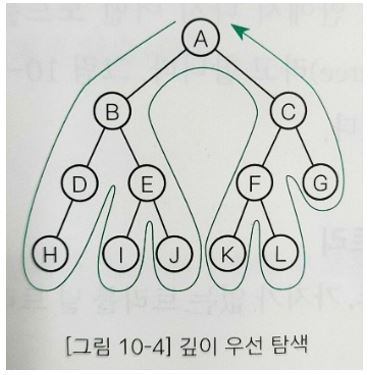

## 트리

트리는 데이터 사이의 계층 관계를 나타내는 자료구조이다.

### 트리란?

#### 트리 관련 용어

트리를 구성하는 요소는 노드(Node)와 가지(Edge)이다. 각각의 노드는 가지를 통해 다른 노드와 연결되어 있다. 

#### 루트 

트리의 가장 윗부분에 위치하는 노드를 루트(Root)라고 한다. 하나의 트리에는 하나의 루트가 있다. 

#### 리프

트리의 가장 아랫부분에 위치하는 노드를 리프(Leaf)라고 한다. 이때 가장 아래에 위치한다는 말은 물리적으로 가장 아랫부분에 위치한다는 의미가 아니라 더 이상 뻗어나갈 수 없는 마지막에 노드가 위치한다는 의미이다(다른 용어로는 끝 노드(Terminal node) 또는 바깥 노드(External node)).

#### 안쪽 노드

루트를 포함하여 리프를 제외한 노드를 안쪽 노드라고 한다(다른 용어로는 끝이 아닌 노드(Non-terminal node)).

#### 자식

어떤 노드로부터 가지로 연결된 아래쪽 노드를 자식(Child)이라고 한다. 노드는 자식을 여러 개 가질 수 있다. 리프는 자식을 가질 수 없다.

#### 부모

어떤 노드에서 가지로 연결된 위쪽 노드를 부모(Parent)라고 한다. 노드는 1개의 부모를 가진다. 루트는 부모를 가질 수 없다.

#### 형제

같은 부모를 가지는 노드를 형제(Sibling)라고 한다. 

#### 조상

어떤 노드에서 가지로 연결된 위쪽 노드 모두를 조상(Ancestor)이라고 한다.

#### 자손

어떤 노드에서 가지로 연결된 아래쪽 노드 모두를 자손(Descendant)이라고 한다.

#### 레벨

루트로부터 얼마나 떨어져 있는지에 대한 값을 레벨(Level)이라고 한다. 루트의 레벨은 0이고 루트로부터 가지가 하나씩 아래로 뻗어나갈 때마다 레벨이 1씩 늘어난다.

#### 차수

노드가 갖는 자식의 수를 차수(Degree)라고 한다. 모든 노드의 차수가 n 이하인 트리를 n진 트리라고 한다. 모든 노드의 자식 수가 2개 이하인 경우는 이진 트리라고 한다.

#### 높이

루트부터 가장 멀리 떨어진 리프까지의 거리(리프 레벨의 최댓값)를 높이(Height)라고 한다. 

#### 서브 트리

트리 안에서 다시 어떤 노드를 루트로 정하고 그 자손으로 이루어진 트리를 서브 트리(Subtree)라고 한다. 

#### 널 트리

노드, 가지가 없는 트리를 널 트리(Null tree)라고 한다.

#### 순서 트리와 무순서 트리

형제 노드의 순서가 있는지 없는지에 따라 트리를 두 종류로 분류한다. 형제 노드의 순서를 따지면 순서 트리(Ordered tree), 따지지 않으면 무순서 트리(Unordered tree)라고 한다. 

### 순서 트리 탐색

순서 트리의 노드를 스캔하는 방법은 두 가지이다. 

#### 너비 우선 탐색

너비 우선 탐색(Breadth-first search)은 낮은 레벨에서 시작해 왼쪽에서 오른쪽 방향으로 검색하고 한 레벨에서의 검색이 끝나면 다음 레벨로 내려 간다. 

#### 깊이 우선 탐색

깊이 우선 탐색(Depth-first search)은 리프까지 내려가면서 검색하는 것을 우선순위로 하는 탐색 방법이다. 리프에 도달해 더 이상 검색을 진행할 곳이 없는 경우네는 부모에게 돌어간다. 드런 다음 다시 자식 노드로 내려 간다. 

위 그림과 같이 깊이 우선 탐색을 진행하면서 노드 A를 3회 지나갔음을 알 수 있다.

1. A에서 B로 내려가면서 A를 지나간다.
2. B에서 C로 지나가며 A를 지나간다.
3. C에서 A로 되돌아오며 A를 지나간다.

다른 노드의 경우도 마찬가지로 두 자식 가운데 한쪽(또는 양쪽)이 없으면 노드를 지나가는 횟수가 줄어들겠지만 노드를 지나가는 최댓값은 3회이다. 깊이 우선 탐색을 진행하면서 언제 노드를 방문할지는 다음과 같이 세 종류로 구분한다.

#### 전위 순회(Preoder)

아래와 같은 방법으로 깊이 우선 탐색을 진행한다.

- 노드 방문 -> 왼쪽 자식 -> 오른쪽 자신 
- A -> B -> C
- A -> B -> D -> H -> E -> I -> J -> C -> F -> K -> L -> G

#### 중위 순회(Inorder)

아래와 같은 방법으로 깊이 우선 탐색을 진행한다.

- 왼쪽 자식 -> 노드 방문 -> 오른쪽 자식
- B -> A -> C
- H -> D - > B -> I -> E -> J -> A -> K -> F -> L -> C -> G

#### 후위 순회(Postorder)

아래와 같은 방법으로 깊이 우선 탐색을 진행한다.

- 왼쪽 자식 -> 오른쪽 자식 -> 노드 방문
- B -> C -> A
- H -> D ->I -> J -> E -> B -> K -> L -> F -> G -> C -> A