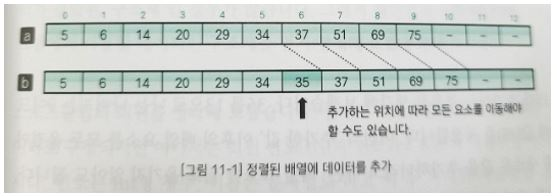
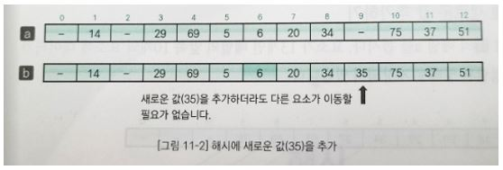
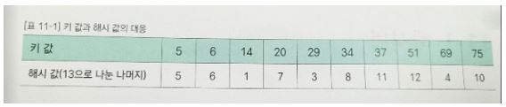
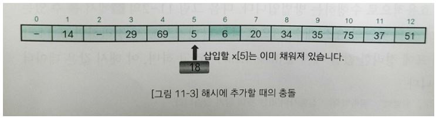
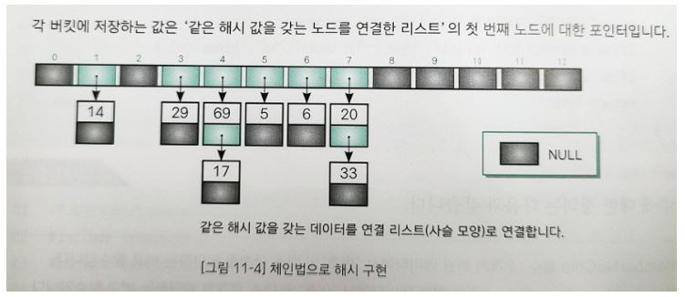

## 해시법

해시법은 검색과 더불어 데이터의 추가와 삭제도 효율적으로 수행할 수 있는 방법이다.

### 정렬된 배열에 새로운 값 추가하기

위의 그림 중 a는 요소가 13개인 배열의 앞쪽 10개의 요소에 데이터가 오름차순으로 정렬된 상태로 저장되어 있다. 이 배열에 35를 추가하려면 아래와 같은 작업이 필요하다.

1. 삽입할 위치가 a[5]와 a[6] 사이임을 이진검색법으로 조사한다.
2. 그림 b와 같이 a[6] 이후의 모든 요소를 하나씩 뒤로 이동한다.
3. a[6]에 35를 대입한다. 

요소 이동에 필요한 복잡도(Time-complexity)는 O(n)이다. 데이터를 삭제할 때도 같은 비용 O(n)이 발생한다. 

### 해시법

해시법(Hashing)은 데이터를 저장할 위치(인덱스)를 간단한 연산으로 구하는 것으로, 검색뿐만 아니라 추가, 삭제도 효율적으로 수행하는 방법이다. 

|  |
| :---------------------------------: |
|  |

위의 첫번째 그림에서 볼 수 있는 배열의 키 값(각 요소의 값)을 배열의 요소 개수 13으로 나눈 나머지로 정리하면 위의 두번째 그림과 같다. 이렇게 표에 정리한 값을 해시 값(Hash value)이라고 하며, 이 해시 값은 데이터에 접근할 때 사용한다. 해시 값이 인덱스가 되도록 원래의 키 값을 저장한 배열이 해시 테이블(Hash table)이다. 배열에 35를 추가하려고 하면 35를 13으로 나눈 나머지가 9이므로 b처럼 a[9]에 값(35)을 저장한다. 이전의 추가한 값 이후의 배열 요소를 모두 옮겼던 경우와는 다르게 새로운 값을 추가하더라도 다른 배열 요소를 뒤로 옮기지 않아도 된다. 이렇게 키 값(35)을 가지고 해시 값(9)을 만드는 과정을 해시 함수(Hash function)라고 한다. 보통 해시함수는 나머지를 구하는 연산 또는 이런 나머지 연산을 다시 응용한 연산을 사용한다. 그리고 해시 테이블의 각 요소를 버킷(Bucket)이라고 한다. 

### 충돌

배열에 새로운 값 18을 추가하는 경우 18을 13으로 나눈 나머지인 해시 값은 5이고 저장할 곳은 버킷 a[5]이다. 그런데 이 버킷은 이미 채워져 있다. 이 경우에서 볼 수 있듯이 키 값과 해시 값의 대응 관계가 반드시 1대1이라는 보증이 없다. 이렇게 저장할 버킷이 중복되는 현상을 충돌(Collision)이라고 한다. 해시 함수는 가능하면 해시 값이 중복되지 않도록 고르게 분포된 값을 만들어야 한다. 

#### 충돌에 대한 대처

충돌이 발생할 경우의 대처 방법으로 두 가지가 있다.

- 체인법 : 같은 해시 값을 갖는 요소를 연결 리스트로 관리한다.
- 오픈 주소법 : 빈 버킷을 찾을 때까지 해시를 반복한다. 

#### 키 값과 데이터

해시법을 사용하는 프로그램에서 다루는 데이터는 단순한 정수나 실수가 아니라 여러 데이터가 결합된 구조체인 경우가 많다. 

- MemberNoCmp 함수 : 2개의 회원 데이터에서 번호의 대소 관계를 판단하는 비교 함수
- MemberNameCmp 함수 : 2개의 회원 데이터에서 이름의 대소 관계를 판단하는 비교 함수
- PrintMember 함수 : 번호와 이름을 출력하는 함수
- ScanMember 함수 : 번호와 이름 가운데 하나 혹은 둘 모두를 대화형으로 읽어 들이는 함수

### 체인법

체인법(Chaining)은 같은 해시 값을 갖는 데이터를 쇠사슬(Chain) 모양으로 연결 리스트에서 연결하는 방법으로, 오픈 해시법(Open hashing)이라고도 한다. 

#### 같은 해시 값을 갖는 데이터 저장하기

체인법은 같은 해시 값을 갖는 데이터를 연결 리스트에 의해 사슬 모양으로 연결한다. 배열의 각 버킷(해시 테이블)에 저장하는 값은 그 인덱스를 해시 값으로 하는 연결 리스트의 첫 번째 노드(node)에 대한 포인터이다. 해시 값(인덱스) 0과 2처럼 데이터가 하나도 없는 버킷의 값은 널(NULL) 포인터 값을 저장한다. 

#### 버킷용 구조체 Node

개별 버킷을 나타내는 것이 구조체 Node형이다. 이 구조체는 두 멤버 data, next로 구성된다. 

- data : 버킷에 담을 Member형 데이터이다(두 멤버로 구성된다).
- next : 체인법을 구성하는 연결 리스트의 다음 노드에 대한 포인터이다. 다음 노드가 없으면 NULL이 된다. 