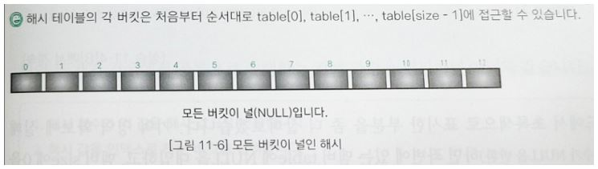
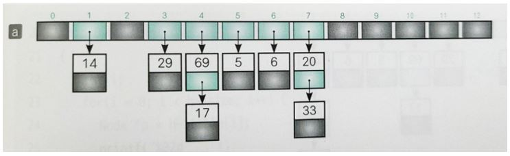
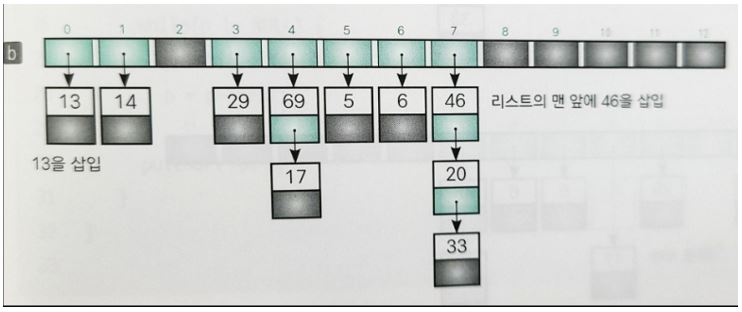
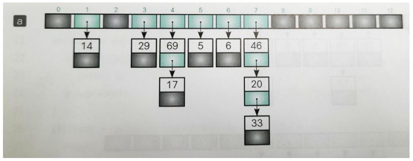
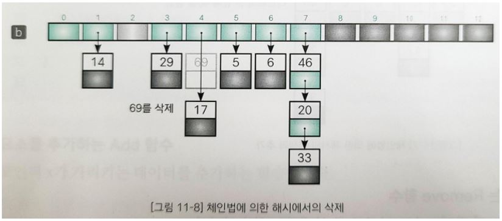
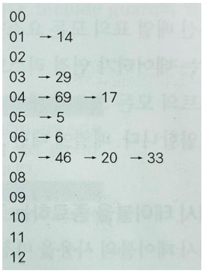

## 해시법

해시법은 검색과 더불어 데이터의 추가와 삭제도 효율적으로 수행할 수 있는 방법이다.

### 정렬된 배열에 새로운 값 추가하기

위의 그림 중 a는 요소가 13개인 배열의 앞쪽 10개의 요소에 데이터가 오름차순으로 정렬된 상태로 저장되어 있다. 이 배열에 35를 추가하려면 아래와 같은 작업이 필요하다.

1. 삽입할 위치가 a[5]와 a[6] 사이임을 이진검색법으로 조사한다.
2. 그림 b와 같이 a[6] 이후의 모든 요소를 하나씩 뒤로 이동한다.
3. a[6]에 35를 대입한다. 

요소 이동에 필요한 복잡도(Time-complexity)는 O(n)이다. 데이터를 삭제할 때도 같은 비용 O(n)이 발생한다. 

### 해시법

해시법(Hashing)은 데이터를 저장할 위치(인덱스)를 간단한 연산으로 구하는 것으로, 검색뿐만 아니라 추가, 삭제도 효율적으로 수행하는 방법이다. 

|  |
| :---------------------------------: |
|  |

위의 첫번째 그림에서 볼 수 있는 배열의 키 값(각 요소의 값)을 배열의 요소 개수 13으로 나눈 나머지로 정리하면 위의 두번째 그림과 같다. 이렇게 표에 정리한 값을 해시 값(Hash value)이라고 하며, 이 해시 값은 데이터에 접근할 때 사용한다. 해시 값이 인덱스가 되도록 원래의 키 값을 저장한 배열이 해시 테이블(Hash table)이다. 배열에 35를 추가하려고 하면 35를 13으로 나눈 나머지가 9이므로 b처럼 a[9]에 값(35)을 저장한다. 이전의 추가한 값 이후의 배열 요소를 모두 옮겼던 경우와는 다르게 새로운 값을 추가하더라도 다른 배열 요소를 뒤로 옮기지 않아도 된다. 이렇게 키 값(35)을 가지고 해시 값(9)을 만드는 과정을 해시 함수(Hash function)라고 한다. 보통 해시함수는 나머지를 구하는 연산 또는 이런 나머지 연산을 다시 응용한 연산을 사용한다. 그리고 해시 테이블의 각 요소를 버킷(Bucket)이라고 한다. 

### 충돌

배열에 새로운 값 18을 추가하는 경우 18을 13으로 나눈 나머지인 해시 값은 5이고 저장할 곳은 버킷 a[5]이다. 그런데 이 버킷은 이미 채워져 있다. 이 경우에서 볼 수 있듯이 키 값과 해시 값의 대응 관계가 반드시 1대1이라는 보증이 없다. 이렇게 저장할 버킷이 중복되는 현상을 충돌(Collision)이라고 한다. 해시 함수는 가능하면 해시 값이 중복되지 않도록 고르게 분포된 값을 만들어야 한다. 

#### 충돌에 대한 대처

충돌이 발생할 경우의 대처 방법으로 두 가지가 있다.

- 체인법 : 같은 해시 값을 갖는 요소를 연결 리스트로 관리한다.
- 오픈 주소법 : 빈 버킷을 찾을 때까지 해시를 반복한다. 

#### 키 값과 데이터

해시법을 사용하는 프로그램에서 다루는 데이터는 단순한 정수나 실수가 아니라 여러 데이터가 결합된 구조체인 경우가 많다. 

- MemberNoCmp 함수 : 2개의 회원 데이터에서 번호의 대소 관계를 판단하는 비교 함수
- MemberNameCmp 함수 : 2개의 회원 데이터에서 이름의 대소 관계를 판단하는 비교 함수
- PrintMember 함수 : 번호와 이름을 출력하는 함수
- ScanMember 함수 : 번호와 이름 가운데 하나 혹은 둘 모두를 대화형으로 읽어 들이는 함수

### 체인법

체인법(Chaining)은 같은 해시 값을 갖는 데이터를 쇠사슬(Chain) 모양으로 연결 리스트에서 연결하는 방법으로, 오픈 해시법(Open hashing)이라고도 한다. 

#### 같은 해시 값을 갖는 데이터 저장하기

체인법은 같은 해시 값을 갖는 데이터를 연결 리스트에 의해 사슬 모양으로 연결한다. 배열의 각 버킷(해시 테이블)에 저장하는 값은 그 인덱스를 해시 값으로 하는 연결 리스트의 첫 번째 노드(node)에 대한 포인터이다. 해시 값(인덱스) 0과 2처럼 데이터가 하나도 없는 버킷의 값은 널(NULL) 포인터 값을 저장한다. 

#### 버킷용 구조체 Node

개별 버킷을 나타내는 것이 구조체 Node형이다. 이 구조체는 두 멤버 data, next로 구성된다. 

- data : 버킷에 담을 Member형 데이터이다(두 멤버로 구성된다).
- next : 체인법을 구성하는 연결 리스트의 다음 노드에 대한 포인터이다. 다음 노드가 없으면 NULL이 된다. 

#### 해시 테이블을 관리하는 구조체 ChainHash

해시 테이블을 관리하기 위한 구조체가 ChainHash이며, 이 구조체는 두 멤버로 구성된다.

- size : 해시 테이블의 크기(table(배열)). 
- table : 해시 테이블을 저장하는 배열의 첫 번째 요소에 대한 포인터.

#### 해시 값을 구하는 Hash 함수

해시 값을 구하는 함수. 여기서는 int형 회원 번호가 키이므로 실인수 key로 받은 회원 번호 값을 해시 테이블의 크기 size로 나눈 나머지를 반환한다.

#### 노드에 값을 설정하는 SetNode 함수

버킷의 노드에 값을 설정하는 함수. 두 번째 인수가 가리키는 데이터를 data에 저장하고 세 번째 인수로 전달받은 다음 노드에 대한 포인터를 next에 저장한다.  

hash, SetNode 함수는 ChainHash.c 안에서만 사용하므로 다음과 같은 특징이 있다.

- 헤더 부분 ChainHash.h에 함수 선언을 할 필요가 없다.
- static을 붙여 함수를 정의하여 내부 결합을 한다.

#### 해시 테이블을 초기화하는 Initialize 함수

해시 테이블을 초기화하여 공백인 해시 테이블을 만드는 함수. 매개변수 size로 받은 값은 해시 테이블의 크기이다. 요소의 자료형이 Node형이고 요소의 개수가 size인 배열 table의 본체를 생성하고 매개변수 size로 받은 값을 멤버 size에 복사한다. 배열 table의 모든 요소에 공백 포인터 NULL을 대입했기 때문에 모든 버킷이 공백 상태가 된다. 

#### 요소를 추가하는 Add 함수

포인터 x가 가리키는 데이터를 추가하는 함수

13을 추가하는 경우: 13의 해시 값은 0이고 table[0]은 NULL이다(그림 a).  b와 같이 13을 저장하는 노드를 새로 만들고 그 노드에 대한 포인터를 table[0]에 대입한다(그림 b).

46을 추가하는 경우 : 46의 해시 값은 7이고 table[7]의 버킷에는 20과 33을 연결하는 리스트의 포인터가 저장되어 있다(그림 a). 이 리스트에는 추가할 값(46)이 존재하지 않으므로 리스트의 맨 앞에 46을 삽입한다. 즉, 추가할 값(46)을 저장하는 노드를 새로 만들고 그 노드에 대한 포인터를 table[7]에 대입한다. 그리고 삽입한 노드가 갖는 다음 노드에 대한 포인터(next)가 20을 저장한 노드를 가리키도록 업데이트 한다(그림 b).

요소를 추가하는 과정을 정리하면 다음과 같다.

1. 해시 함수가 키 값을 해시 값으로 변환한다.
2. 해시 값을 인덱스로 하는 버킷을 선택한다.
3. 버킷에 저장된 포인터가 가리키는 연결 리스트를 처음부터 순서대로 검색한다. 키 값과 같은 값을 찾으면 키 값이 이미 등록된 상태이므로 추가에 실패한다. 끝까지 스캔하여 찾지 못하면 리스트의 맨 앞 위치에 노드를 삽입한다.

#### 요소를 삭제하는 Remove 함수

Remove 함수는 키 값이 x->no인 요소를 삭제하는 함수이다.

69를 삭제하는 경우 : 69의 해시 값은 4이고 table[4]의 버킷에 저장된 포인터의 리스트를 연결 검색하면 69를 찾을 수 있다. 그런데 69를 저장한 노드의 다음 노드는 17을 저장한 노드이다(그림 a). 그래서 17을 저장한 노드에 대한 포인터를 table[4]의 버킷에 대입하고 69를 저장하는 노드의 메모리를 해제한다.

요소를 삭제하는 과정을 정리하면 다음과 같다.

1. 해시 함수가 키 값을 해시 값으로 변환한다.
2. 해시 값을 인덱스로 하는 버킷을 선택한다.
3. 선택한 버킷의 포인터가 가리키는 연결 리스트를 처음부터 순서대로 검색한다. 키 값과 같은 값을 찾으면 그 노드를 리스트에서 삭제한다. 그렇지 않으면 삭제에 실패한다.

#### 해시 테이블의 내용을 출력하는 Dump 함수

해시 테이블의 내용을 통쨰로 출력하는 함수. 

해시 테이블의 모든 요소(table[0] \~ table[size - 1])에 대히여 다음에 오는 노드를 끌어당기면서 각 노드의 키 값과 데이터를 출력하는 작업을 반복한다. 같은 해시 값을 갖는 데이터는 화살표(->)로 연결한다. 이 함수를 실행하면 같은 해시 값을  갖는 버킷이 화살표로 연결된 것을 확인할 수 있다. 